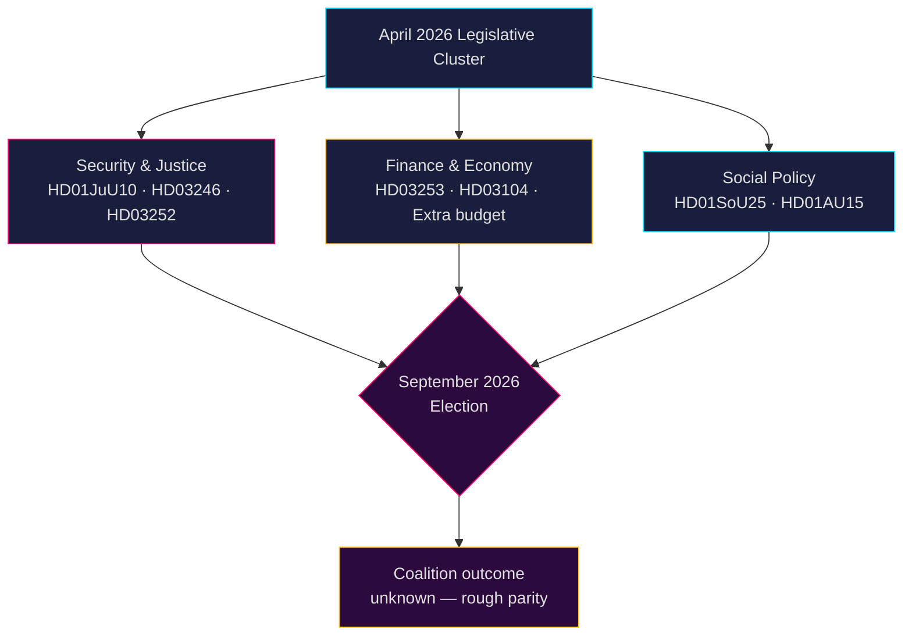

# Svensk politisk underrättelse: Månadsöversikt — Maj–Juni 2026

**Författare**: James Pether Sörling  
**Datum**: 2026-04-26  
**Klassificering**: OFFENTLIG — GDPR Art. 9(2)(e,g) tillämpat  
**Konfidensgrad**: B2 (tillförlitlig källa, troligen sant)  
**Analysdjup**: standard  

---

## 🎯 BLUF

Sveriges riksdag träder in i maj–juni 2026 i ett slutskede av lagstiftningsarbete inför **riksdagsvalet i september 2026**, där Tidökoalitionen (M-SD-KD-L) driver igenom ett tätt säkerhets-, rättsväsende- och finanspaket. Perioden domineras av: (1) en ny vapenlags om inför förbud mot halvautomatiska gevär (HD01JuU10); (2) skärpt straffrätt via reform av ungdomspåföljder (HD03246) och begränsning av sociala förmåner för fångvårdade (HD03252); (3) implementering av EU:s bankpaket (HD03253); och (4) skarp oppositionskritik om bränsleskattesänkningar, polisbemanningen och nedskärningar i välfärden. **Den övergripande risken är lagstiftningströtthet kombinerat med oppositionens valrörelseaktivism mot upplevda "tuffa men ihåliga" säkerhetsnarrativ inför september 2026.**

---

## 🧭 3 Beslut som detta underlag stöder

1. **Prioritering av policybevakn ing**: Bevaka samtliga fyra Justitieutskottet (JuU) lagstiftningsärenden — HD01JuU10 (ny vapenlag), HD01JuU31 (polisreform), HD03246 (ungdomsbrott) och HD03252 (fångars förmåner) — som de tydligaste indikatorerna på koalitionens budskapskapacitet om lag och ordning inför valperioden.

2. **Riskbedömning**: Eskalerande interpellationer från S-oppositionen om arbetsgivaravgiftssänkningar (HD10444), sjukskrivningskostnader (HD10447) och felaktiga dödsförklaringar (HD10446) signalerar en samordnad socialdemokratisk förvalskampanj mot administrativa välfärdsbrister. Bevaka eventuella politiska skador för finansminister Svantesson.

3. **Koalitionsbevakning**: Den extra ändringsbudgeten (prop. 2025/26:236 — bränsleskattesänkning) möter aktivt motstånd från MP och V (HD024098, HD024092). Tvärpolitisk finansiell oenighet mellan KD/L (miljöhänsyn) och SD/M (levnadskostnadsprioritet) skapar ett potentiellt koalitionskohesionstest.

---

## 60-sekundersinformation

- **4 stora JuU-betänkanden** antagna eller under behandling i april 2026 — det största rättsreformklustret under detta riksmöte
- **276 propositioner** inlämnade 2025/26 (flest i modern parlamentshistoria)
- **448 interpellationer** — oppositionen maximalt aktiv, 90 % från S och V inför valet
- **Extra ändringsbudget** för 2026 (bränsleskatt) utlöser en tväroppositionell koalition (MP+V+C+S)
- Ny vapenlag förbjuder vissa halvautomatiska jaktvapen — första sådana begränsningen sedan 1990-talet, politiskt känslig
- Granskning av polisreformen (Riksrevisionen): reformen uppnådde **inte** avsedda effektivitetsvinster — politiskt skadligt för koalitionen
- Valprognos: september 2026, opinionsundersökningar visar S+MP+V+C i ungefär samma läge som M+SD+KD+L; koalitionsutfall mycket osäkert

---

## ⚡ Ledande framåtblickande trigger

**Bevakningsdatum 2026-05-06**: Riksdagsdebatt om extra ändringsbudget (bränsleskatt, prop. 2025/26:236). Om SD bryter partidisciplinen i voteringen ställs Tidökoalitionen inför sin allvarligaste interna spricka sedan regeringsbildningen.

---

## 🔮 Konfidensgrad

| Domän | Konfidensgrad | Motivering |
|--------|-----------|-----------|
| Lagstiftningskalender | A1 — mycket tillförlitlig, bekräftad | Publicerat riksdagsschema |
| Oppositionsstrategi | B2 — tillförlitlig, troligen sant | Interpellationsmönsteranalys |
| Valprognos | C3 — ganska tillförlitlig, möjligen sant | Opinionsdata med systematisk osäkerhet |
| Koalitionskohesion | B3 — tillförlitlig, möjligen sant | Tvärsektoriell röstningsanalys |

