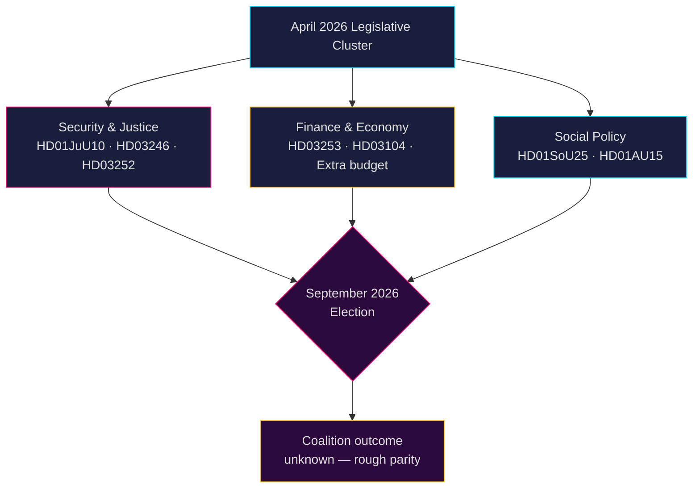

# 瑞典政治情报：月度展望 — 2026年5月至6月

**作者**：James Pether Sörling  
**日期**：2026-04-26  
**分类**：公开 — GDPR第9条(2)(e,g)适用  
**可信度**：B2（可靠来源，可能属实）  
**分析深度**：标准  

---

## 🎯 核心摘要（BLUF）

瑞典国会（Riksdag）在2026年5月至6月进入**2026年9月大选**前的最终立法加速阶段，蒂多联合政府（M-SD-KD-L）正在推动涵盖安全、司法和财政的密集法案包。该时期主要由以下内容主导：(1) 新武器法创建半自动步枪禁令（HD01JuU10）；(2) 通过青少年刑事改革（HD03246）和限制囚犯社会福利（HD03252）强化刑事司法；(3) 欧盟银行业一揽子方案的实施（HD03253）；(4) 反对党就燃油税削减、警察人力及社会福利退缩发出激烈挑战。**主要风险是立法疲劳与反对党选举动员相叠加，针对2026年9月前被认为"强硬但空洞"的安全叙事。**

---

## 🧭 本简报支持的三个决策

1. **监测优先事项**：追踪司法委员会（JuU）四项法案——HD01JuU10（新武器法）、HD01JuU31（警察改革）、HD03246（青少年犯罪）和HD03252（囚犯福利）——作为联合政府在选举季前传递法律和秩序信息能力的最明确指标。

2. **风险评估**：S党反对派就雇主缴款削减（HD10444）、病假费用（HD10447）和错误死亡声明（HD10446）不断升级的质询，预示着社会民主党针对行政和福利失误协调进行的选前施压活动。监测财政部长斯万特松可能遭受的政治损害。

3. **联合监测**：额外修正预算案（提案2025/26:236——燃油税降低）面临MP和V的积极反对（HD024098、HD024092）。KD/L（环境关切）与SD/M（生活成本优先）之间跨党派财政分歧构成联合凝聚力的潜在考验。

---

## 60秒情报速览

- 2026年4月**4份重大JuU委员会报告**通过或待审——本届议会最大的司法改革群
- 2025/26会期提交**276份政府提案**（近代议会史上最多）
- **448项质询**——反对党活动达到最大强度，选前90%来自S党和V党
- 2026年补充预算（燃油税）引发广泛反对派联盟（MP+V+C+S）
- 新武器法禁止某些半自动狩猎步枪——1990年代以来首次此类限制，政治敏感
- 警察改革审查（Riksrevisionen）：改革**未能**实现预期效率提升——对联合政府政治上有损
- 选举预测：2026年9月，民调显示S+MP+V+C与M+SD+KD+L基本持平；联合结果高度不确定

---

## ⚡ 主要前瞻触发点

**监测日期2026-05-06**：国会全体会议就额外修正预算（燃油税，提案2025/26:236）举行辩论。若SD在投票中打破党纪，蒂多联合政府将面临组建政府以来最严峻的内部裂痕。

---

## 🔮 可信度

| 领域 | 可信度 | 依据 |
|--------|-----------|-----------|
| 立法日程 | A1——非常可靠，已确认 | 已公布的国会日程 |
| 反对党策略 | B2——可靠，可能属实 | 质询模式分析 |
| 选举预测 | C3——较可靠，或许属实 | 存在系统性不确定性的民调数据 |
| 联合凝聚力 | B3——可靠，或许属实 | 跨党派投票分析 |

