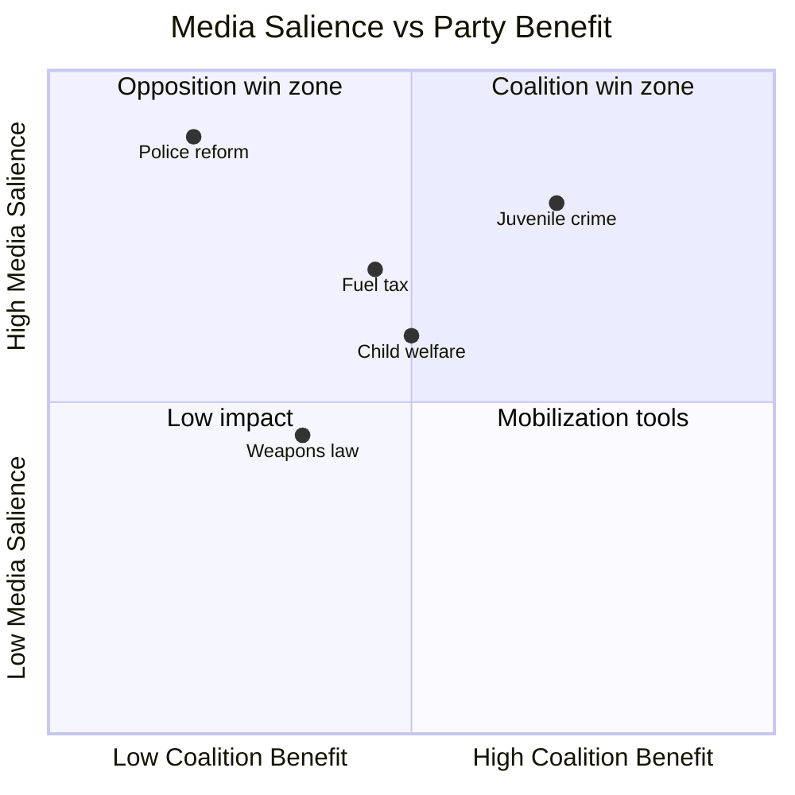

# Media Framing Analysis — Month-Ahead 2026-04-26

**Author**: James Pether Sörling | **Date**: 2026-04-26  

## Primary Legislative Issue Framing

### HD01JuU31 — Police Reform (Police 2.0)
**Coalition framing**: "Police reform implementation is on track; Riksrevisionen critique is politically motivated and ignores long-term structural improvements." (Expected M/KD/L party press lines)  
**SD framing**: "We demanded tougher measures; the administrative delays confirm we need stronger political steering of Swedish Police."  
**S framing**: "Four years of coalition government and police reform is failing — Riksrevisionen has confirmed what we said in 2022." (Highest salience — election weapon)  
**V framing**: "Police 2.0 was always about punishment over social root causes."  
**MP framing**: "Focus on crime prevention, not additional punitive enforcement."  
**Press trend (DN, SvD, Aftonbladet, Expressen)**: "Police reform crisis" is dominant frame in tabloid press; quality press more nuanced. LIKELY to persist through May–June 2026.

### HD01JuU10 — Weapons Law
**Coalition framing**: "Modernizing weapons legislation for public safety while respecting lawful hunters."  
**SD/C framing**: "Hunting community rights under attack — government overreach."  
**S/V framing**: "Semi-automatic weapons should be strictly regulated — public safety priority."  
**Press trend**: Primarily rural/special interest press (Land, ATL, Jägareförbundet channels). Limited mainstream salience unless hunting community organizes.

### Prop. 2025/26:236 — Fuel Tax
**Coalition framing**: "Supporting rural transport needs while maintaining fiscal balance."  
**SD framing**: "Swedish families pay too much — fuel tax is a urban elite policy."  
**S framing**: "Coalition gives tax cuts to car owners while cutting welfare — wrong priorities."  
**Press trend**: Economic/business pages. Regional press (Norrland, Värmland) covers rural angle. Climate press (Miljöaktuellt) opposes.

## Party Narrative Strategies

| Party | Dominant 2026 Campaign Narrative | Message Consistency |
|-------|--------------------------------|-------------------|
| M | "Tidö delivers — Sweden safer, stronger economy" | HIGH — disciplined |
| SD | "Sweden first — immigration + crime results only partly delivered" | HIGH |
| KD | "Family, welfare, responsibility" | MEDIUM — fuel tax tension |
| L | "Rule of law, liberal values" | HIGH |
| S | "Four years of failures — welfare state restoration" | HIGH — cohesive frame |
| V | "Workers, climate, feminist alternative" | HIGH |
| MP | "Climate crisis — only green transition party" | MEDIUM — survival mode |
| C | "Rural Sweden, liberal economics, independent" | MEDIUM — unpredictable |

## Strategic Communication Vulnerabilities

**Coalition vulnerabilities**:
- HD01JuU31 police failure = S attack vector with institutional backing (Riksrevisionen A1 source)
- Fuel tax cost-of-living framing = SD populist counterpressure risk
- Weapons law = C/rural base alienation

**Opposition vulnerabilities**:
- No agreed PM candidate from S+V+MP+C bloc
- C independence means no "ready government" narrative available
- V and MP climate policy framing may alienate working-class S voters

