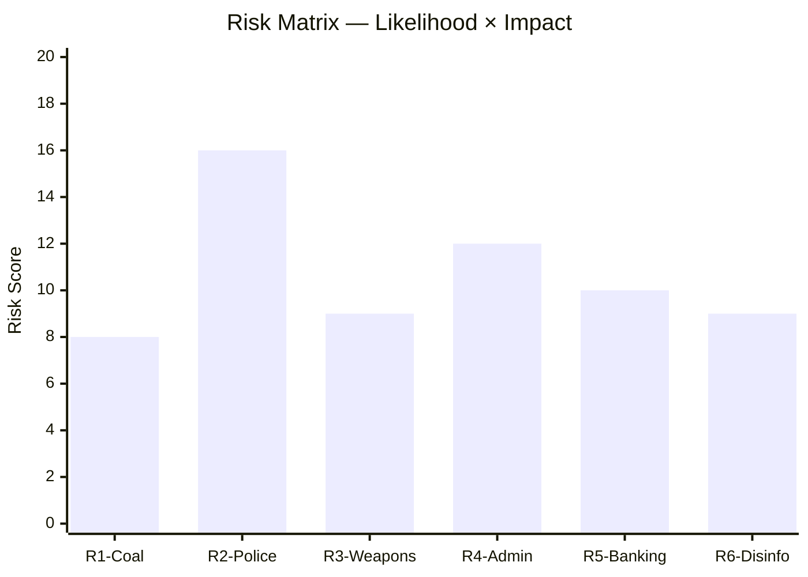

# Risk Assessment — Month-Ahead May–June 2026

**Author**: James Pether Sörling | **Date**: 2026-04-26  

## Risk Register

| # | Risk | Category | Likelihood (1–5) | Impact (1–5) | Score | Confidence |
|---|------|----------|-----------------|-------------|-------|------------|
| R1 | Coalition fracture on fuel tax vote | Political | 2 | 4 | 8 | B2 |
| R2 | Opposition exploits police reform failure | Reputational | 4 | 4 | 16 | A2 |
| R3 | Weapons law hunting lobby backlash | Social | 3 | 3 | 9 | B2 |
| R4 | Administrative welfare failures amplified pre-election | Governance | 4 | 3 | 12 | B2 |
| R5 | EU banking stress contagion | Financial | 2 | 5 | 10 | C3 |
| R6 | Wind power disinformation narrative spreads | Information | 3 | 3 | 9 | B3 |

## Cascading Risk Chains

**Chain 1 — Electoral security narrative collapse**:
R2 (police reform findings) → R4 (admin failures highlighted) → Coalition electoral lead shrinks → September election competitive outcome [Evidence: HD01JuU31, HD10446, HD10447]

**Chain 2 — Coalition cohesion fracture**:
R1 (fuel tax vote split) → SD voter base anger → SD threatens confidence vote → Emergency reshuffle risk [Evidence: HD024098, HD024092]

**Chain 3 — Financial stability**:
R5 (EU banking stress) → HD03253 implementation pressure → Swedish banking sector exposure → Fiscal cost-of-living narrative hijacked by opposition [Evidence: HD03253]

## Posterior Probabilities

| Scenario | Prior | Updated (post-analysis) | Delta |
|----------|-------|------------------------|-------|
| Coalition passes full legislative agenda by June 15 | 0.75 | 0.72 | -0.03 (police reform finding adds friction) |
| S electoral lead grows ≥ 3pp before September | 0.35 | 0.42 | +0.07 (coordinated interpellation campaign) |
| Coalition collapses before September 2026 | 0.05 | 0.06 | +0.01 (fuel tax risk minor) |

## Evidence Citations

- R2 evidence: HD01JuU31 — Riksrevisionen: "Polismyndigheten inte arbetat tillräckligt effektivt"
- R4 evidence: HD10446 (30 persons/year incorrectly death-declared), HD10447 (sjuklönekostnadsersättning removed), HD10444 (employer fee misuse)
- R1 evidence: HD024098 (MP), HD024092 (V) opposing fuel tax cut
- R5 evidence: HD03253 (EU bankpaket — capital requirements implementation)

