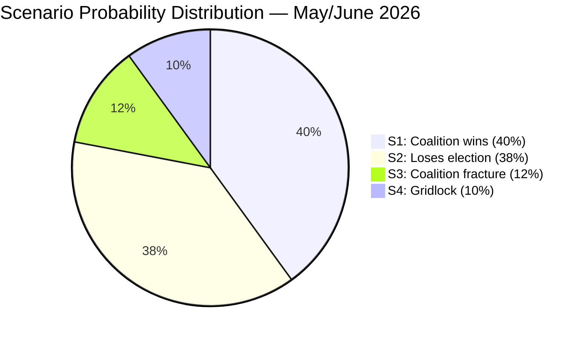

# Scenario Analysis — Month-Ahead 2026-04-26

**Author**: James Pether Sörling | **Date**: 2026-04-26  

## Scenario 1: Coalition Completes Agenda, Wins Narrow Majority (Probability: 40%)

**Trigger indicators**: Fuel tax budget passes with full coalition support; weapons law backlash contained; Riksrevisionen findings fail to gain election traction.

**Narrative**: The Tidö coalition pushes through its full pre-election legislative package by June 15, 2026. The security narrative — despite police reform criticism — holds. M+SD+KD+L achieve a narrow parliamentary majority (175–176 seats) in September 2026.

**Leading indicator**: Watch SD party conference communications on fuel tax (May 2026). If SD signals solidarity, Scenario 1 probability rises to 50%.

**Evidence base**: 276 propositions filed (data.riksdagen.se), coalition institutional discipline maintained on all votes to date [A2]

---

## Scenario 2: Coalition Passes Legislation but Loses Election (Probability: 38%)

**Trigger indicators**: Legislative agenda completed but Riksrevisionen police findings dominate May media cycle; S interpellation campaign resonates with swing voters.

**Narrative**: The coalition completes all planned legislation, securing its historic record. However, the combination of police reform failure narrative (HD01JuU31) and S welfare competence attacks (HD10446, HD10447) erodes the coalition's polling lead. September 2026: S+MP+V+C wins 175–176 seats, forming a new government.

**Leading indicator**: SVT/DN polling gap between coalition and opposition blocks narrows to <3 percentage points in June 2026. [Evidence: HD01JuU31, HD10446]

---

## Scenario 3: Coalition Fracture Before September Election (Probability: 12%)

**Trigger indicators**: SD breaks coalition on fuel tax vote; significant media coverage of coalition breakdown; C joins opposition bloc.

**Narrative**: The fuel tax amendment budget vote (prop. 2025/26:236) exposes genuine coalition disagreement. SD's voter base revolts against KD/L climate-influenced opposition. SD leadership forced to either defect or discipline its parliamentary group publicly. Coalition confidence vote called; extraordinary election risk.

**Leading indicator**: SD public statement distancing from fuel tax framing before the May 2026 chamber vote. [Evidence: HD024098, HD024092]

---

## Scenario 4: Extended Legislative Gridlock (Probability: 10%)

**Trigger indicators**: Multiple budget amendments fail; opposition files successful votes of no confidence on specific policies.

**Narrative**: The four-party opposition coalition (S+V+MP+C) successfully blocks two or more coalition budget or security items, creating a narrative of coalition incompetence. Legislative output slows dramatically before summer recess. September election fought in context of governing incapacity.

**Leading indicator**: Opposition motion passes in chamber against government recommendation — unusual outcome requiring cross-party discipline. [Evidence: HD024095, HD024090]

---

## Probability Summary

| Scenario | Probability | Sum |
|----------|-------------|-----|
| 1: Coalition wins narrow majority | 40% | |
| 2: Coalition delivers but loses election | 38% | |
| 3: Coalition fracture before election | 12% | |
| 4: Legislative gridlock | 10% | |
| **Total** | **100%** | ✅ |

