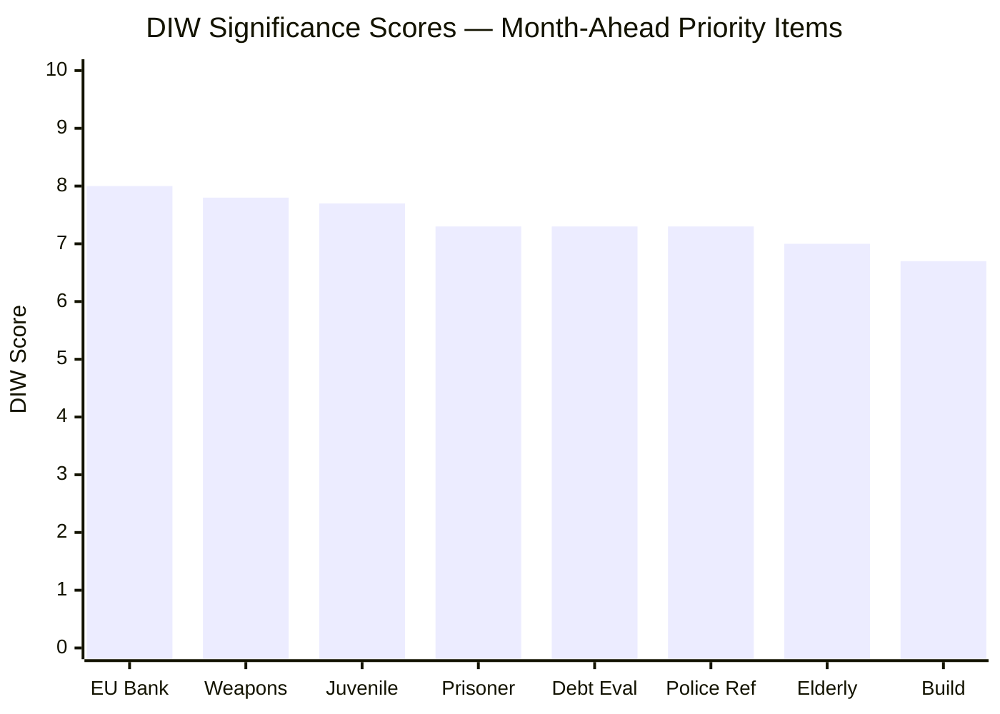

# Significance Scoring — Month-Ahead 2026-04-26

**Author**: James Pether Sörling | **Date**: 2026-04-26  

## DIW Score Methodology

Scores use the Decisional Impact Weight (DIW) framework: Democratic Impact (D) × Implementation Weight (I) × Welfare Reach (W), normalized 1–10.

## Document Rankings

| Rank | dok_id | Title | D | I | W | DIW | Tier |
|------|--------|-------|---|---|---|-----|------|
| 1 | HD03253 | EU:s bankpaket | 8 | 9 | 7 | 8.0 | L2+ |
| 2 | HD01JuU10 | En ny vapenlag | 9 | 8 | 6 | 7.8 | L2+ |
| 3 | HD03246 | Skärpta regler unga lagöverträdare | 8 | 8 | 7 | 7.7 | L2 |
| 4 | HD03252 | Begränsning socialförsäkringsförmåner fängelsestraff | 7 | 8 | 7 | 7.3 | L2 |
| 5 | HD03104 | Utvärdering statens upplåning 2021–2025 | 6 | 9 | 7 | 7.3 | L2 |
| 6 | HD01JuU31 | Polisreformen 2015 (Riksrevisionen) | 8 | 6 | 8 | 7.3 | L2 |
| 7 | HD01SoU25 | Stärkta insatser för äldre | 5 | 7 | 9 | 7.0 | L1 |
| 8 | HD01CU24 | Effektiv och säker byggprocess | 6 | 7 | 7 | 6.7 | L1 |
| 9 | HD10448 | Interpellation: Desinformation om vindkraft | 6 | 4 | 5 | 5.0 | L1 |
| 10 | HD024098 | Motion: Extra ändringsbudget drivmedel (MP) | 7 | 5 | 6 | 6.0 | L1 |

## Sensitivity Analysis

- **If SD breaks coalition on fuel tax vote**: All energy/transport items escalate by +2 DIW — political instability premium
- **If Riksrevisionen police finding generates media cascade**: HD01JuU31 escalates to L2+ — election-defining narrative risk
- **If weapons law hunting lobby mobilizes**: HD01JuU10 escalates to L3 — major coalition sensitivity

## Priority Tiers for Month-Ahead

- **L2+ (Priority intelligence)**: HD03253, HD01JuU10 — require deep monitoring
- **L2 (Strategic)**: HD03246, HD03252, HD03104, HD01JuU31 — weekly tracking
- **L1 (Surface)**: All others — monthly review

