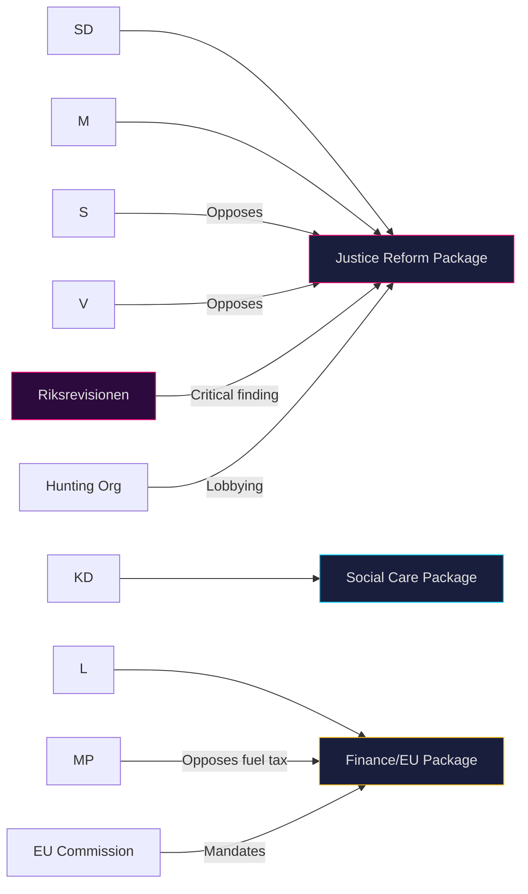

# Stakeholder Perspectives — Month-Ahead May–June 2026

**Author**: James Pether Sörling | **Date**: 2026-04-26  

## 6-Lens Stakeholder Matrix

### Lens 1: Political Parties

| Party | Stance | Key Actions | Evidence |
|-------|--------|-------------|---------|
| M (Moderaterna) | Pro: full coalition agenda | Lead propositions on finance, security | HD03253, HD03252 |
| SD (Sverigedemokraterna) | Pro: security/justice; tension on green policy | Supporting JuU reforms, interpellation on wind disinformation | HD01JuU10, HD10448 |
| KD (Kristdemokraterna) | Pro: social care, welfare | HD01SoU25 support; some EU banking concern | HD01SoU25 |
| L (Liberalerna) | Pro: rule of law, EU alignment | ILO conventions, research migration | HD01AU15, HD01SfU23 |
| S (Socialdemokraterna) | Opposition: welfare retrenchment, admin failures | Interpellation cascade, budget opposition | HD10444–10447 |
| V (Vänsterpartiet) | Opposition: criminal justice, social rights | Opposition motions on fuel tax, weapons, deportation | HD024090, HD024092 |
| MP (Miljöpartiet) | Opposition: environmental, rights-based | Anti-fuel tax, weapons export limits | HD024098, HD024096, HD024097 |
| C (Centerpartiet) | Constructive opposition | Nuanced positions on deportation, cybersecurity | HD024093, HD024095 |

### Lens 2: Civil Society & Professional Bodies

| Actor | Role | Stake |
|-------|------|-------|
| Swedish hunting associations (~350,000 members) | Threatened by HD01JuU10 semi-auto ban | Weapons law backlash potential |
| LO (trade unions) | Concerned about sick-leave cost transfer | HD10447 — employer burden increase |
| Swedish Banking Association | EU banking package (HD03253) implementation | Capital adequacy changes |
| Polisförbundet (police union) | HD01JuU31 — police reform efficiency findings | Organizational reputation |

### Lens 3: Government Ministries

| Ministry | Lead Legislation | Minister |
|---------|----------------|---------|
| Justitiedepartementet | HD03252, HD03246, HD01JuU10 | Gunnar Strömmer (M) |
| Finansdepartementet | HD03253, HD03104, HD03243 | Elisabeth Svantesson (M) |
| Landsbygds- och infrastrukturdepartementet | HD03256, HD03242 | Andreas Carlson (KD) |
| Klimat- och näringslivsdepartementet | HD03240, HD03238 | Ebba Busch (KD) |
| Utrikesdepartementet | HD03231, HD03232 (Ukraine tribunal) | Maria Malmer Stenergard (M) |

### Lens 4: EU and International

| Actor | Issue | Position |
|-------|-------|---------|
| EU Commission | HD03253 — banking package transposition | Expects on-schedule implementation |
| Ukraine (government) | HD03231, HD03232 — aggression tribunal membership | Swedish support critical for tribunal legitimacy |
| NATO allies | General Swedish security alignment | Positive: Swedish legislative security-focus |

### Lens 5: Media and Public

Expected media attention peaks:
- Police reform failure (HD01JuU31) — SVT, DN major story risk
- Weapons law hunting angle (HD01JuU10) — rural press, hunting media
- Fuel tax opposition (prop. 2025/26:236) — economy/environment press divide

### Lens 6: Riksrevisionen & Independent Bodies

- **Riksrevisionen**: HD01JuU31 finding creates political pressure on government; institutional credibility maintained through neutral reporting [HD01JuU31]
- **Riksbanken**: HD01FiU23 — accountability discharge, no dividend to state; FiU approves [HD01FiU23]

## Influence Network

