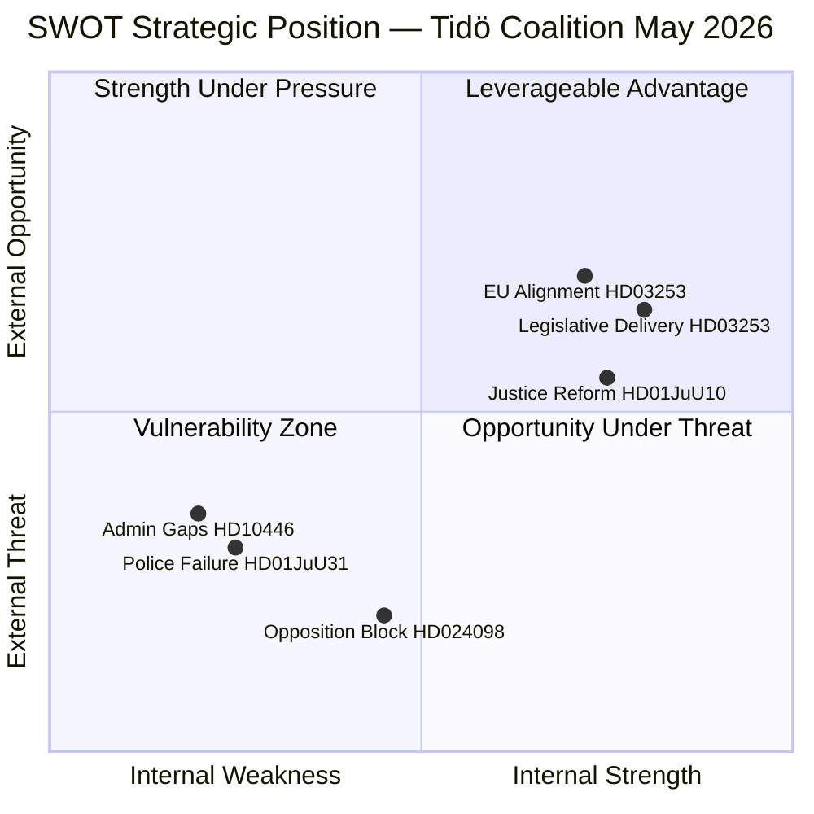

# SWOT Analysis — Swedish Political Month-Ahead May–June 2026

**Author**: James Pether Sörling | **Date**: 2026-04-26  

## SWOT Matrix

### Strengths

- **Dense legislative delivery**: 276 propositions in 2025/26 (data.riksdagen.se) — Tidö coalition demonstrating legislative capacity
- **Justice reform momentum**: New weapons law (HD01JuU10), juvenile crime reform (HD03246), and prisoner benefit restrictions (HD03252) passed or near passage — law-and-order narrative coherent [HD01JuU10, HD03246, HD03252]
- **Fiscal credibility**: State debt management evaluation (HD03104) shows strong Swedish sovereign borrowing performance 2021–2025 — low spreads maintained [HD03104]
- **EU implementation discipline**: EU banking package (HD03253) transposed on schedule — Stockholm maintaining European credibility [HD03253]
- **Social care delivery**: HD01SoU25 strengthens elderly care capacity — signals welfare attentiveness [HD01SoU25]

### Weaknesses

- **Police reform failure evidence**: Riksrevisionen found 2015 police reform did not achieve intended efficiency gains (HD01JuU31) — directly contradicts coalition security narrative [HD01JuU31]
- **Administrative failures**: Interpellations on incorrect death declarations (HD10446), sick-leave subsidy removal (HD10447), and employer-fee misuse (HD10444) point to governance gaps [HD10446, HD10447, HD10444]
- **Coalition incoherence on green issues**: Fuel tax cut (prop. 2025/26:236) opposed by green-adjacent members (C, KD environmental wing) while SD pushes cost-of-living frame — internal tension [HD024098, HD024092]
- **Desinformation vulnerability**: Interpellation HD10448 (SD) on wind power disinformation suggests government communications are not adequately countering anti-renewable narratives [HD10448]

### Opportunities

- **Election mandate clarity**: Dense pre-election legislation creates a clear platform for M+SD voter mobilization on security themes
- **EU alignment bonus**: Banking package (HD03253) + ILO conventions (HD01AU15) signal Sweden as reliable European partner — useful in international standing
- **EV infrastructure expansion**: HD01CU29 (home EV charging rights) modernizes climate infrastructure while avoiding divisive climate framing
- **September election legitimacy**: High legislative output provides democratic accountability evidence [data.riksdagen.se]

### Threats

- **Opposition coalition formation**: S, V, MP and C aligned on fuel tax, weapons exports, and deportation rules — four-party opposition block could mobilize shared voters against Tidö platform [HD024098, HD024096, HD024095]
- **Riksrevisionen narrative capture**: If S amplifies police reform failure findings in election campaign, security narrative advantage is neutralized [HD01JuU31]
- **Voter fatigue with criminal justice emphasis**: Seven consecutive years of crime-focused legislation risks alienating centrist voters concerned about healthcare and climate [riksdagen.se, 276 propositions filed]
- **Global economic headwinds**: EU banking package implementation in context of financial instability risks — Swedish banking sector exposure [HD03253]

## TOWS Matrix

| | Strengths | Weaknesses |
|---|-----------|-----------|
| **Opportunities** | SO: Use dense legislation to crowd-out opposition narratives | WO: Reform police governance before election using HD01JuU31 findings |
| **Threats** | ST: Frame EU alignment as coalition achievement vs opposition chaos | WT: Address HD10446/10447 administrative failures before S exploits them |

## Cross-SWOT Assessment

The coalition's core strength (legislative delivery on security) is structurally vulnerable to Riksrevisionen evidence (HD01JuU31) that security investments are inefficient. The most dangerous combination is: (1) opposition amplifying police reform failure + (2) S welfare narrative gaining traction + (3) fuel tax coalition split — this triple threat would dominate September election coverage.

