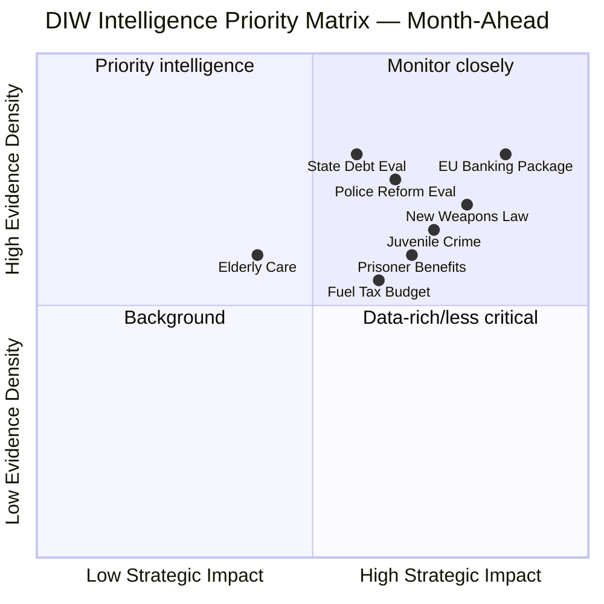

# Synthesis Summary — Month-Ahead May–June 2026

**Author**: James Pether Sörling  
**Date**: 2026-04-26  
**Period covered**: 2026-04-26 through 2026-06-30  

---

## Lead Story

Sweden's Riksdag is in its final pre-election legislative sprint. The Tidö coalition (M, SD, KD, L) has filed 276 propositions in the 2025/26 riksmöte — a record density — and is pushing through a comprehensive law-and-order package. The simultaneous passage of the new weapons law (HD01JuU10), juvenile crime reform (HD03246), prisoner benefit restrictions (HD03252), and the EU banking package (HD03253) constitutes the most concentrated legislative cluster since the coalition took office. The September 2026 election looms over every vote.

---

## DIW-Weighted Intelligence Ranking

| Rank | Document | DIW Score | Strategic Significance |
|------|----------|-----------|----------------------|
| 1 | HD03253 — EU banking package | L2+ | Financial stability, EU implementation |
| 2 | HD01JuU10 — New weapons law | L2+ | Security narrative, hunting lobby sensitivity |
| 3 | HD03246 — Juvenile crime reform | L2 | Election law-and-order flagship |
| 4 | HD03252 — Prisoner social benefits | L2 | Coalition identity legislation |
| 5 | HD03104 — State debt management eval 2021–25 | L2 | Fiscal credibility signal |
| 6 | HD01JuU31 — Police Reform 2015 review | L2 | Politically damaging Riksrevisionen finding |
| 7 | HD01SoU25 — Elderly care improvements | L1 | Social policy, coalition maintenance |
| 8 | Extra budget (prop. 2025/26:236) | L2 | Coalition test: fuel tax cut |

---

## Integrated Intelligence Picture

**Security cluster dominance**: Five of the top eight items are security/justice legislation. This is consistent with the Tidö coalition's core branding strategy entering the election. However, Riksrevisionen's negative evaluation of the 2015 police reform (HD01JuU31) — finding insufficient efficiency gains — undermines the coalition's "we fix security" narrative.

**Financial resilience signals**: The EU banking package (HD03253) is an implementation obligation, not a coalition choice. The state debt management evaluation (HD03104) shows Sweden maintained strong sovereign borrowing performance 2021–25 despite global turbulence. [Evidence: HD03104, data.riksdagen.se]

**Opposition coherence**: S, V, MP and C have formed coordinated opposition blocs on:
- Fuel tax cuts (HD024098/V, HD024092/MP)
- Weapons law exceptions (HD024096/MP, HD024091/V)
- Deportation rules (HD024095/C, HD024097/MP, HD024090/V)
This multi-party opposition coalition is politically significant heading into September.

**Welfare retrenchment risk**: Three interpellations from S targeting welfare administration failures (HD10446 incorrect deaths, HD10447 sick-leave costs, HD10444 employer fee misuse) constitute a sustained S narrative: the coalition is cutting social safety nets while failing on administrative basics.

---

## Key Analytical Judgments

1. **[LIKELY, B2]** The Tidö coalition will pass all major security/justice legislation before summer recess (mid-June 2026), completing its pre-election legislative agenda.

2. **[ROUGHLY EVEN, C3]** The fuel tax extra budget will pass but with cross-party opposition that reveals coalition tension, particularly between KD/L environmental concerns and SD populist cost-of-living framing.

3. **[VERY LIKELY, A2]** Riksrevisionen's negative police reform evaluation will be deployed as an S campaign talking point in the September election.

4. **[UNLIKELY, B2]** The Tidö coalition will collapse before the September 2026 election; internal tensions remain manageable given shared electoral incentive.

