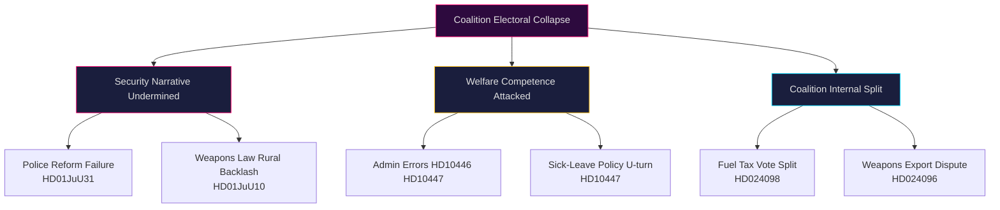

# Threat Analysis — Month-Ahead May–June 2026

**Author**: James Pether Sörling | **Date**: 2026-04-26  

## Political Threat Taxonomy

### Tier 1: Immediate Threats (30-day horizon)

**T1 — Electoral narrative capture**  
Riksrevisionen's damning police reform evaluation (HD01JuU31) provides S-opposition with verified ammunition against the coalition's core security narrative. Risk: media cascade amplifying "reform failed" story across multiple news cycles. [Source: HD01JuU31, riksdagen.se]

**T2 — Coalition fracture signal**  
Extra budget fuel tax cut (prop. 2025/26:236) opposed by MP+V+C+S. If dissenting voices within KD's environmental wing join the opposition symbolically (even without voting defection), this creates a media "fracture" narrative. [Source: HD024098, HD024092]

### Tier 2: Medium-term Threats (60–90 day horizon)

**T3 — Weapons law backlash**  
New weapons law (HD01JuU10) introduces ban on certain semi-automatic hunting rifles. Swedish hunting associations (approximately 350,000 members) are politically mobilized. Risk: organized backlash in rural constituencies where SD and M draw significant support. [Source: HD01JuU10]

**T4 — Administrative competence narrative**  
Three coordinated S interpellations (HD10446, HD10447, HD10444) targeting Finance and Energy ministers on administrative welfare failures. Pattern suggests an S communications strategy of accumulative delegitimization rather than single-issue attack. [Source: HD10446 targeting Svantesson, HD10447 targeting Busch, HD10444 targeting Svantesson]

### Tier 3: Structural Threats (election-horizon)

**T5 — Opposition coalition coherence**  
S, V, MP and C alignment on at least 3 distinct legislative issues (deportation, fuel tax, weapons exports) suggests potential post-election coalition building. If this pattern solidifies, it signals a governing alternative exists — historically a prerequisite for government change. [Source: HD024095/C, HD024097/MP, HD024090/V on deportation]

## Attack Tree

## MITRE-Style Threat Mapping (Political Context)

| TTP | Technique | Evidence |
|-----|-----------|---------|
| T-NARR-001 | Evidence capture — use verified institutional finding as campaign weapon | HD01JuU31 Riksrevisionen finding |
| T-COORD-001 | Multi-party legislative opposition coordination | HD024090/V, HD024095/C, HD024097/MP |
| T-INTERP-001 | Interpellation cascade — rapid serial questioning to accumulate admin failure narrative | HD10444, HD10445, HD10446, HD10447, HD10448 |
| T-BUDGET-001 | Budget opposition through follower motion (följdmotion) | HD024098, HD024092 against prop. 2025/26:236 |
