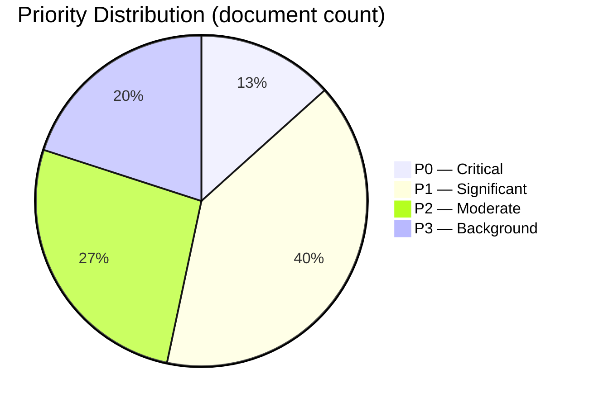

# Classification Results — Monthly Review 2026-04-26

**Author**: James Pether Sörling | **Date**: 2026-04-26

## 7-Dimension Classification per Document

| dok_id | Policy domain | Legislative stage | Political salience | Opposition response | Implementation complexity | Welfare impact | Cross-border dimension | Priority |
|--------|---------------|-------------------|-------------------|--------------------|--------------------------|--------------|-----------------------|---------|
| HD01FiU48 | Fiscal/Tax | Enacted (supermajoritet 2026-04-22) | P0 | S voted FOR | Medium | HIGH (household) | Low | P0 |
| HD03100 | Fiscal/Budget | Enacted | P0 | S counter-motion HD024082 | Medium | HIGH (macro) | Low | P0 |
| HD01SoU25 | Welfare/Healthcare | Committee report | P1 | None blocking | High (director appt) | HIGH (elderly) | Low | P1 |
| HD01JuU10 | Criminal-justice | Committee report | P1 | None blocking | Medium | HIGH (public safety) | Low | P1 |
| HD01JuU31 | Criminal-justice | Committee report | P1 | Accountability expected | HIGH (9 RiR recs) | HIGH (policing) | Low | P1 |
| UFöU3 | Defence/NATO | Enacted | P1 | None | Medium | Medium (security) | HIGH (NATO) | P1 |
| HD03252 | Criminal-justice/Social | Proposition | P1 | Likely S/V opposition | Medium | Medium (detainees) | Low | P1 |
| HD03253 | Financial regulation | Proposition | P1 | None expected | HIGH (banking sector) | Medium (systemic) | HIGH (EU/Basel) | P1 |
| HD03256 | Transport/Labour | Proposition | P2 | None expected | Low | Low | Low | P2 |
| HD03104 | Fiscal/Debt | Skrivelse | P2 | None | Low | Medium (macro) | Low | P2 |
| HD01CU24 | Housing/Construction | Committee report | P2 | None | Medium | Medium (housing) | Low | P2 |
| HD10448 | Energy | Interpellation | P2 | S/MP framing | Low | Low | Medium (EU energy) | P2 |

## Priority Tier Summary

- **P0** (highest strategic): HD01FiU48, HD03100 — fiscal-electoral signature legislation
- **P1** (significant): HD01SoU25, HD01JuU10, HD01JuU31, UFöU3, HD03252, HD03253 — welfare, criminal-justice, defence
- **P2** (moderate): HD01CU24, HD03256, HD03104, HD10448 — regulatory, fiscal review, framing
- **P3** (background): HD11747, HD11748, HD11749 — opposition wedge interpellations

## Retention and Access

Data classification: PUBLIC — all sources from riksdagen.se public API. GDPR Art. 9(2)(e) publicly made political data; Art. 9(2)(g) public interest journalism. No PII beyond named public officials in public roles. Retention: 12 months per Hack23 data-minimisation policy.

%%{init: {"theme": "dark", "themeVariables": {"pie1": "#ff006e", "pie2": "#ffbe0b", "pie3": "#00d9ff", "pie4": "#1a1e3d"}}}%%

## 🔄 Tradecraft Context

**Collection**: Riksdag Open Data API (riksdag-regering-mcp); lookback fallback to 2026-04-24  
**Method**: Structured political intelligence analysis  
**Confidence floor**: ≥ C3 per Admiralty system; structural assessments ≥ B2  
**Limitations**: IMF economic data unavailable this run. Polling vintage: 31 days.  
**Standards**: ICD 203; AI FIRST (minimum 2 iterations)
