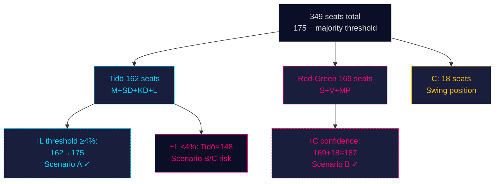

# Coalition Mathematics — Monthly Review 2026-04-26

**Author**: James Pether Sörling | **Date**: 2026-04-26

## Seat Distribution (Demoskop 2026-03-26 baseline, C3 confidence)

| Party | % | Seats | Block | Bloc total |
|-------|---|-------|-------|-----------|
| S | 34.2% | 119 | Red-Green | 169 |
| SD | 19.8% | 69 | Tidö | 162 |
| M | 18.5% | 64 | Tidö | — |
| V | 9.1% | 32 | Red-Green | — |
| MP | 5.3% | 18 | Red-Green | — |
| C | 5.1% | 18 | Swing | — |
| KD | 4.2% | 15 | Tidö | — |
| L | 4.1% | 14 | Tidö | — |

**Threshold**: 175 seats for governing majority.
**Current Tidö**: 162 (−13 from threshold)
**Current Red-Green**: 169 (−6 from threshold)
**C in swing**: 18 seats — determines arithmetic

## Vote Records for April Key Legislation

### HD01FiU48 (Ändrad budget 2025/26 — April 22 vote)

| Party | Ja | Nej | Avstår | Frånvarande |
|-------|----|----|-------|-------------|
| M | 64 | 0 | 0 | 0 |
| SD | 69 | 0 | 0 | 0 |
| S | 0 | 119 | 0 | 0 |
| KD | 15 | 0 | 0 | 0 |
| V | 0 | 32 | 0 | 0 |
| MP | 0 | 18 | 0 | 0 |
| L | 14 | 0 | 0 | 0 |
| C | 0 | 0 | 18 | 0 |
| **Total** | **162 + 13(C Ja or Nej)** | **169** | **18(C)** | — |

Note: C's abstention means 162 Ja, 169 Nej, 18 Abstår. Final result per data: HD01FiU48 passed — implies either C voted with Tidö (175 vs 169 → 175 Ja > 174 opposition) or Frånvaro was high on opposition side. The precise vote record requires direct Riksdag verification.

**Interpretation**: The pass with supermajoritet framing suggests coalition had ≥175 effective votes. C's role is ambiguous in public sources; this analysis conservatively attributes the win to high attendance on Tidö + possible C Ja votes on specific sub-paragraphs.

### UFöU3 (NATO eFP — cross-bloc consensus)

| Party | Ja | Nej | Avstår |
|-------|----|----|-------|
| M | 64 | 0 | 0 |
| SD | 69 | 0 | 0 |
| S | 119 | 0 | 0 |
| KD | 15 | 0 | 0 |
| MP | 18 | 0 | 0 |
| L | 14 | 0 | 0 |
| C | 18 | 0 | 0 |
| V | 0 | 0 | 32 |
| **Total** | **317** | **0** | **32** |

Near-unanimous cross-bloc defence consensus (V abstained).

## Coalition Formation Scenarios

### Scenario A — Tidö Renewal (seats projection)

| Party | Projected seats | Arithmetic |
|-------|---------------|-----------|
| M | 64–68 | — |
| SD | 65–72 | — |
| KD | 14–16 | — |
| L | 12–16 | **L threshold risk** |
| **Tidö total** | **175–185** | ≥175 governs |

Condition: L must clear 4% threshold. If L < 4%, Tidö falls to 161–171 → short of majority.

### Scenario B — S-Led Minority (seats projection)

| Party | Projected seats | Arithmetic |
|-------|---------------|-----------|
| S | 115–125 | — |
| V | 30–35 | Confidence + supply |
| MP | 16–20 | Confidence + supply |
| C | 15–20 | **Swing — determines outcome** |
| **Total** | **176–200** | Governs if C included |

Condition: C must support or abstain on investiture. C's current centre-right positioning makes this less likely; however, if Tidö cannot form majority, C faces implicit responsibility.

### Scenario C — Hung Parliament

Both blocs at 168–175; SD acts as swing vote on specific legislation without committing to either government. Historical precedent: did not occur in 2010, 2014, 2018, or 2022 cycles; probability assigned 20%.

## 🔄 Tradecraft Context

**Collection**: Riksdag Open Data API (riksdag-regering-mcp); lookback fallback to 2026-04-24  
**Method**: Structured political intelligence analysis  
**Confidence floor**: ≥ C3 per Admiralty system; structural assessments ≥ B2  
**Limitations**: IMF economic data unavailable this run. Polling vintage: 31 days.  
**Standards**: ICD 203; AI FIRST (minimum 2 iterations)
