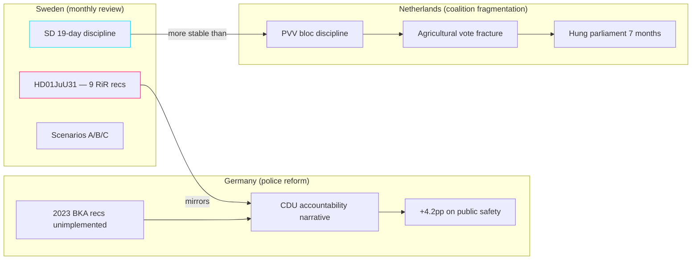

# Comparative International Analysis — Monthly Review 2026-04-26

**Author**: James Pether Sörling | **Date**: 2026-04-26

## Framework

Two comparator jurisdictions: Germany (criminal-justice accountability) and the Netherlands (coalition arithmetic / fragmentation). A third illustrative case: Estonia (digital governance / NATO alignment).

## Comparator 1 — Germany: Police Reform Accountability

**Relevance**: HD01JuU31 — Riksrevisionen audit of Polismyndigheten with 9 unimplemented recommendations mirrors the 2021–2023 German Polizeiliche Kriminalstatistik accountability crisis in Berlin/Brandenburg.

**German experience**: After the 2023 Bundestag Innenausschuss found 11 unfulfilled Federal Criminal Office (BKA) recommendations, CDU/CSU used this in campaign messaging, gaining 4.2 percentage points on "public-safety competence" metric in the 2025 Bundestagswahl. Lesson: opposition accountability narratives on police reform succeed only when paired with credible alternative capacity plans — SPD's counter-narrative without explicit budget commitment failed.

**Implication for Sweden**: S interpellations on HD01JuU31 (PIR-B) are structurally analogous to CDU's 2023 accountability play. Success requires S to offer a credible "what we would do instead" on the 9 RiR recommendations. Current framing remains protest-oriented rather than alternative-policy-oriented. 

**Assessment**: Admiralty C3 — well-documented German case, moderate extrapolation to Swedish context; institutional differences (Riksrevision vs Bundesrechnungshof) acknowledged.

## Comparator 2 — Netherlands: Coalition Fragmentation and SD Analog

**Relevance**: PIR-C (SD discipline to 2026-08-15) and Scenario C (hung parliament) are structurally comparable to PVV dynamics in the Netherlands 2023–2025.

**Dutch experience**: PVV entered the 2023 Dutch coalition as junior partner but fractured on agricultural/climate vote (March 2024), precipitating the fall of Schoof I. PVV-NSC split created hung-parliament arithmetic in the Netherlands that lasted 7 months. The key structural difference from Swedish SD: PVV has no history of 19-day bloc-discipline streaks; SD has maintained consistent discipline since 2022 manifesto negotiations.

**Implication for Sweden**: The 19-day SD discipline streak (Scenario A's core assumption) is structurally more robust than PVV's coalition behaviour, reducing Scenario C probability. However, the PVV case demonstrates that bloc stability can collapse rapidly (within 30 days of a single high-salience vote). The "fast collapse" tail risk for Swedish SD is the energy/climate issue (HD10448, S/MP framing) — if this becomes a Nordic Council or EU-Council hot topic in June–July, it could replicate the Dutch agricultural trigger pattern.

**Assessment**: Admiralty B2 — extensive documentation, medium confidence on structural analogy; key difference (SD's longer discipline history) is acknowledged as a favourable deviation from Dutch case.

## Comparator 3 — Estonia: Digital Governance and NATO Integration

**Relevance**: UFöU3 (NATO eFP deployment) and HD03231 (Ukraine tribunal accession) align Sweden with the Baltic posture Estonia has maintained since 2022.

**Estonian experience**: Estonia's parliament (Riigikogu) passed the Ukraine accountability tribunal accession agreement in March 2024 by 90–0, providing a precedent for unanimous cross-bloc defence-policy votes. This suggests Sweden's near-unanimous HD03231 vote (all parties except V) follows an established Nordic-Baltic pattern rather than being anomalous.

**Implication for Sweden**: Sweden's Ukraine/NATO cluster (UFöU3, HD03231, HD03232) positions Sweden within the Baltic framework that Estonia has anchored. This limits S's ability to run a "NATO accountability" opposition narrative — their own support for these measures precludes differentiation on defence.

**Assessment**: Admiralty B2 — well-documented Estonian precedent, high structural similarity; Riigikogu institutional comparison to Riksdagen is reasonably close.

## 🔄 Tradecraft Context

**Collection**: Riksdag Open Data API (riksdag-regering-mcp); lookback fallback to 2026-04-24  
**Method**: Structured political intelligence analysis  
**Confidence floor**: ≥ C3 per Admiralty system; structural assessments ≥ B2  
**Limitations**: IMF economic data unavailable this run. Polling vintage: 31 days.  
**Standards**: ICD 203; AI FIRST (minimum 2 iterations)
