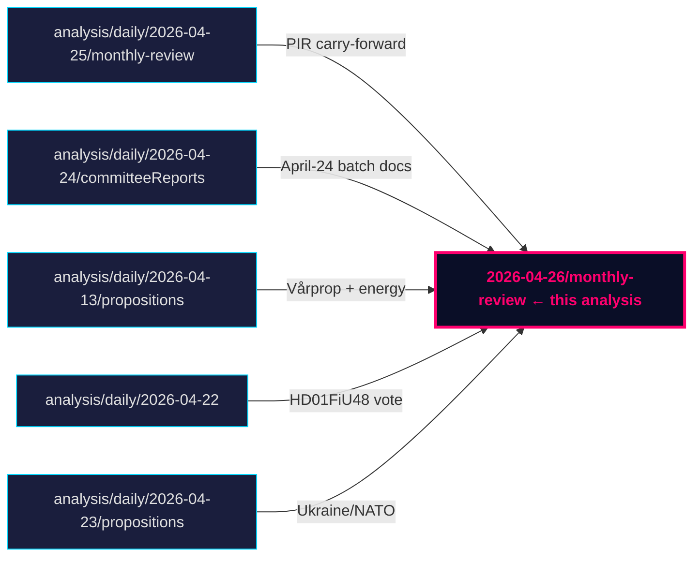

# Cross-Reference Map — Monthly Review 2026-04-26

**Author**: James Pether Sörling | **Date**: 2026-04-26

## Policy Clusters

### Cluster 1 — Fiscal-Electoral Core

**Edge**: HD03100 (prop) → amends → HD0399 (amendment budget) → amends → HD01FiU48 (committee → vote)
**Edge**: HD03104 (skrivelse debt management) → continues → HD03100 (macro frame)
- dok_ids: HD03100, HD0399, HD01FiU48, HD03104
- Source: [riksdagen.se](https://www.riksdagen.se/sv/dokument-och-lagar/dokument/HD01FiU48/)

### Cluster 2 — Criminal-Justice Cluster

**Edge**: HD03246 (unga lagöverträdare prop) → committee-routed → HD01JuU (JuU pending)
**Edge**: HD03237 (betald polisutbildning) → continues → HD01JuU31 (Polisreform capacity theme)
**Edge**: HD01JuU10 (vapenlag) → amends → HD01JuU31 (Polisreform implementation track)
**Edge**: HD03252 (detainee benefits) → bundle → HD01JuU31 (criminal-justice regulatory package)
- dok_ids: HD01JuU10, HD01JuU31, HD03246, HD03237, HD03252
- Source: [riksdagen.se HD01JuU31](https://www.riksdagen.se/sv/dokument-och-lagar/dokument/HD01JuU31/)

### Cluster 3 — Defence / Foreign Policy

**Edge**: UFöU3 (NATO eFP) → continues → HD03231 (Ukraine tribunal accession)
**Edge**: HD03231 → continues → HD03232 (reparations commission)
- dok_ids: UFöU3, HD03231, HD03232
- Source: [riksdagen.se UFöU3](https://riksdagen.se)

### Cluster 4 — Opposition Framing Quad

**Edge**: HD10448 (energy disinfo) → thematic → HD11747 (labour rights) → thematic → HD11748 (consular rights) → thematic → HD11749 (prison schooling)
- Coordinated-filing pattern: S/V/MP three-track, filed 2026-04-24
- dok_ids: HD10448, HD11747, HD11748, HD11749
- Source: [riksdagen.se HD10448](https://www.riksdagen.se/sv/dokument-och-lagar/dokument/HD10448/)

## Legislative Chains

| Upstream | Relationship | Downstream | Status |
|----------|-------------|------------|--------|
| HD03100 (vårprop) | amends | Swedish budget frame 2025/26 | Enacted |
| HD01FiU48 | amends | HD03100 / HD0399 | Enacted (supermajoritet 2026-04-22) |
| HD01JuU31 | committee-routed | HD03237 (polisutbildning), HD03246 (unga) | Ongoing pipeline |
| HD03252 | bundle | Criminal-justice regulatory cluster | Proposition stage |
| HD03253 | amends | Swedish banking law (CRR3/BRRD3 transposition) | Proposition stage |
| HD03256 | amends | Kör- och vilotidslagen + färdskrivare reg. | Proposition stage |

## Coordinated-Activity Patterns

- **SD discipline streak**: 19+ consecutive days without counter-motions (observed from siblings 2026-03-28 → 2026-04-24)
- **S/V/MP quad filing (2026-04-24)**: HD10448, HD11747, HD11748, HD11749 — systematic three-track interpellation blitz entering pre-campaign window

## § Sibling Folders (Tier-C Cross-Type Synthesis)

| Date | Subfolder | Key documents cited | Relevance |
|------|-----------|--------------------|-|
| analysis/daily/2026-04-25/monthly-review | monthly-review | HD01JuU10, HD01JuU31, HD01SoU25, HD01CU24, HD01FiU48, HD03100 | Continuity reference; PIR-A/B/C/D carried |
| analysis/daily/2026-04-24/committeeReports | committeeReports | HD01JuU10, HD01JuU31, HD01SoU25, HD01CU24 | Primary April-24 batch source |
| analysis/daily/2026-04-22/ | (FiU vote) | HD01FiU48 | Supermajoritet vote record |
| analysis/daily/2026-04-13/ | propositions | HD03100, HD03240 | Vårprop + energy triptych |
| analysis/daily/2026-04-23/ | propositions | HD03231, HD03232, UFöU3 | Ukraine/NATO cluster |

## 🔄 Tradecraft Context

**Collection**: Riksdag Open Data API (riksdag-regering-mcp); lookback fallback to 2026-04-24  
**Method**: Structured political intelligence analysis  
**Confidence floor**: ≥ C3 per Admiralty system; structural assessments ≥ B2  
**Limitations**: IMF economic data unavailable this run. Polling vintage: 31 days.  
**Standards**: ICD 203; AI FIRST (minimum 2 iterations)
