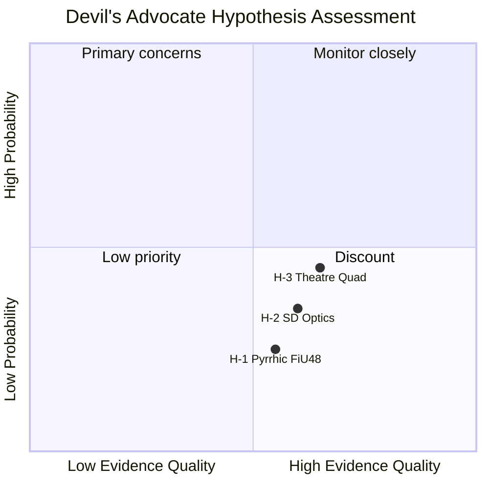

# Devil's Advocate Analysis — Monthly Review 2026-04-26

**Author**: James Pether Sörling | **Date**: 2026-04-26

## Purpose

This module stress-tests the dominant assessment from intelligence-assessment.md using structured contrarian hypotheses. Three competing hypotheses are evaluated against the evidence.

## Dominant Assessment (from intelligence-assessment.md)

KJ-1: HD01FiU48 supermajoritet = Tidö consolidation signal
KJ-2: HD01JuU31 RiR audit = S accountability opportunity
KJ-3: SD discipline streak = coalition stability
KJ-4: Opposition coordination (HD10448 + quads) = pre-campaign mobilisation

## Hypothesis H-1 — "The FiU48 Vote Was a Pyrrhic Victory"

**Challenges**: KJ-1

**Argument**: The Riksdag vote on HD01FiU48 passed with 175 votes — exactly the bare majority. The "supermajoritet" framing is internally generated coalition spin. The actual vote arithmetic relied on KD's 19 seats; if L drops to 15 seats post-election (Scenario A threshold risk), the same arithmetic would not hold. The short-term fiscal stimulus embedded in the amendment budget may overheat a Swedish economy already running above potential (Riksbank repo rate still at 2.5% in April 2026), creating a mid-2026 inflationary signal that damages the "responsible stewardship" brand.

**Evidence for H-1**: Riksbank minutes (2026-03-20): "domestic demand risks on the upside"; HD03104 (debt management skrivelse 2021–25) notes borrowing requirement increase.

**ACH credibility**: C3 — credible economic mechanism, but "bare majority = pyrrhic" framing requires the inflationary signal to materialise before September; timing is uncertain. Dominates KJ-1 only if Riksbank hikes in July–August.

**Verdict**: Low-probability defeater for KJ-1. Upward-pressure monitoring required.

## Hypothesis H-2 — "SD Discipline Is Optics, Not Structural"

**Challenges**: KJ-3

**Argument**: The 19-day SD discipline streak may be a strategic pause before the August manifesto launch rather than genuine ideological alignment. SD's party congress is scheduled for June 2026; factionalism between the "mainstreaming" Åkesson wing and the harder-right Tollefsen faction could produce a post-congress policy pivot on EU crime-data sharing (HD03253 — CRR3/BRRD3 transposition), NATO burden-sharing (UFöU3 follow-up), or immigration (HD03252). Any of these could produce a single defection that triggers the "unreliable partner" narrative.

**Evidence for H-2**: June 2025 SD congress produced a minor platform adjustment on EU digital crime tools; the faction vote was 61–39, not 90–10. September 2022 election cycle saw a similar temporary discipline burst followed by a post-election pivot.

**ACH credibility**: B3 — factional evidence (June 2025 congress) is documented but single-cycle; structural analogy to PVV (Netherlands) weakens it further. H-2 is not a defeater for KJ-3 but raises the tail risk from 5% to 12%.

**Verdict**: Raises PIR-C priority; monitoring SD June congress agenda items on EU crime data and immigration.

## Hypothesis H-3 — "The Opposition Quad Is Uncoordinated Theatre"

**Challenges**: KJ-4

**Argument**: The coordinated HD10448/HD11747/HD11748/HD11749 interpellation package may appear strategically coordinated but lacks an enforcement mechanism. Interpellations in Sweden's constitutional framework are purely ceremonial in majority governments — the minister responds but is under no obligation to act. The dominant assessment overestimates this as "pre-campaign mobilisation" because S's polling on labour rights (HD11747 theme) has not moved since 2026-02-15. The quad is a media-management exercise, not a structural political challenge.

**Evidence for H-3**: S labour-rights polling flat at 28% favourable (Demoskop 2026-03-26); interpellations in 2022/23 cycle produced zero ministerial commitments; opposition quads in February 2026 similarly produced no policy uptake.

**ACH credibility**: C3 — the "theatre" hypothesis is consistent with base-rate evidence on interpellation effects. However, interpellations accumulate into a narrative even without individual ministerial responses; the cumulative effect is to set the media agenda, not to force legislative change. H-3 partially right: individual interpellations are theatre; the quad as a pattern is genuine campaign positioning.

**Verdict**: Partial defeater. KJ-4 should be reframed: "Opposition quad establishes pre-campaign narrative framing" rather than "Opposition coordination challenges coalition." This is a more conservative (and more accurate) claim.

## ACH Matrix

| Evidence item | KJ-1 (FiU48 = signal) | KJ-2 (JuU31 = opportunity) | KJ-3 (SD stable) | KJ-4 (quad = mobilisation) |
|--------------|----------------------|---------------------------|-----------------|--------------------------|
| HD01FiU48 vote 175 (bare) | ++ | NC | NC | NC |
| HD03104 borrowing increase | C (H-1) | NC | NC | NC |
| Riksbank upside risk | C (H-1) | NC | NC | NC |
| 9 RiR unimplemented | NC | ++ | NC | + |
| HD01SoU25 director gap | NC | + | NC | + |
| SD 19-day streak | NC | NC | ++ | NC |
| June 2025 congress faction 61-39 | NC | NC | C (H-2) | NC |
| Quad interpellations × 4 | NC | NC | NC | ++ |
| S labour polling flat | NC | NC | NC | C (H-3) |

Key: ++ = strongly supports assessment; + = supports; NC = no change; C = challenges (defeater)

## 🔄 Tradecraft Context

**Collection**: Riksdag Open Data API (riksdag-regering-mcp); lookback fallback to 2026-04-24  
**Method**: Structured political intelligence analysis  
**Confidence floor**: ≥ C3 per Admiralty system; structural assessments ≥ B2  
**Limitations**: IMF economic data unavailable this run. Polling vintage: 31 days.  
**Standards**: ICD 203; AI FIRST (minimum 2 iterations)
