# Election 2026 Analysis — Monthly Review 2026-04-26

**Author**: James Pether Sörling | **Date**: 2026-04-26

**Election date**: 2026-09-13 (140 days from 2026-04-26)

## Current Poll Aggregate

Source: Demoskop 2026-03-26 (vintage 31 days; caution — C3 confidence)

| Party | % | Seats (349 total) | Block |
|-------|---|------|-------|
| S | 34.2% | 119 | Red-Green |
| SD | 19.8% | 69 | Tidö |
| M | 18.5% | 64 | Tidö |
| V | 9.1% | 32 | Red-Green |
| MP | 5.3% | 18 | Red-Green |
| C | 5.1% | 18 | Swing |
| KD | 4.2% | 15 | Tidö |
| L | 4.1% | 14 | Tidö |

**Tidö bloc**: 162 seats (below 175 threshold)
**Red-Green**: 169 + C swing 18 = potential 187 (above threshold)
**Note**: C has not declared bloc alignment; this calculation reflects an S-C confidence arrangement scenario.

## PIR-A Assessment (Demoskop ≥ 44%)

Current Tidö aggregate: M+KD+L+SD = 18.5+4.2+4.1+19.8 = **46.6%**

If this polling holds, Tidö arithmetic already exceeds 44%. The question is whether the FiU48 fiscal lift sustains or fades. Historical average: budget-related polling boosts decay 4–6 weeks after enactment. Next Demoskop reading (estimated 2026-05-08) will confirm or deny.

**PIR-A status**: On track to trigger (Tidö current at 46.6%), but 31-day vintage creates uncertainty. Confirm by 2026-05-08.

## Seat Projection Scenarios

**Scenario A (Tidö Renewal 45%)**: M+KD+L+SD = 175–185 seats; S-led block ≤ 175
**Scenario B (S-Led 35%)**: S+V+MP+C = 180–190 seats; Tidö ≤ 169
**Scenario C (Hung 20%)**: Both blocs 168–175 seats; SD acts as swing

## Campaign Timeline (Next 140 Days)

| Date | Event | Significance |
|------|-------|-------------|
| 2026-05-08 | Next Demoskop (est.) | PIR-A trigger confirmation |
| 2026-05-28 | EU summer recess | Foreign affairs window closes |
| 2026-06 | SD party congress | PIR-C monitoring: faction vote |
| 2026-08 | Party manifestos launch | Scenario C trigger window |
| 2026-08-15 | PIR-C closure date | SD discipline verdict |
| 2026-09-13 | **Riksdag election** | Outcome |

## Policy-to-Seat Mapping

| Legislation | Electoral mechanism | Affected seats |
|------------|--------------------|-|
| HD01FiU48 (fuel-tax relief) | Household disposable income; suburban swing voters | Est. 5–8 seats in M/SD marginals |
| HD01JuU31 (police reform) | "Crime-safety competence" narrative; public-sector voters | Est. 3–5 S/M swing |
| HD01SoU25 (elderly care) | Welfare voter base; older electorate | Est. 5–7 S/KD seats |
| HD03252 (detainee benefits) | Immigration-adjacent; SD/M rural base | Est. 2–3 SD seats |
| UFöU3 / HD03231 (defence) | Cross-bloc patriotic vote; no strong partisan skew | Stabilises M/KD defence narrative |

```mermaid
xychart-beta
  title "Seat Projection Range (Scenario midpoints)"
  x-axis ["Scenario A", "Scenario B", "Scenario C"]
  y-axis "Seats" 150 --> 200
  bar [180, 157, 172]
  bar [168, 190, 172]
  line [175, 175, 175]
```

%%{init: {"theme": "dark", "themeVariables": {"xyChart": {"plotColorPalette": "#00d9ff,#ff006e,#ffbe0b"}}}}%%

## 🔄 Tradecraft Context

**Collection**: Riksdag Open Data API (riksdag-regering-mcp); lookback fallback to 2026-04-24  
**Method**: Structured political intelligence analysis  
**Confidence floor**: ≥ C3 per Admiralty system; structural assessments ≥ B2  
**Limitations**: IMF economic data unavailable this run. Polling vintage: 31 days.  
**Standards**: ICD 203; AI FIRST (minimum 2 iterations)
