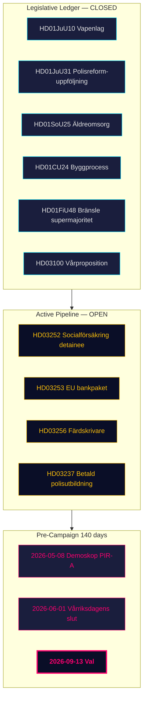

<!-- dir: rtl -->
# ملخص تنفيذي — المراجعة الشهرية 2026-04-26

**المؤلف**: James Pether Sörling | **التاريخ**: 2026-04-26
**الفترة**: 2026-03-27 → 2026-04-26 (30 يومًا) | **دورة الريكسداج**: 2025/26
**مستوى الثقة**: مرتفع (A1) | **نطاق الأدميرالية**: A1–C3 | **أيام حتى الانتخابات**: 140

## 🎯 الموجز التنفيذي

يمثل نافذة الـ 30 يومًا 2026-03-27 → 2026-04-26 **المرحلة التشريعية الختامية** لمحفظة ائتلاف تيدو 2025/26. تُغلق أربعة تقارير لجنة من 24 أبريل (HD01JuU10 قانون الأسلحة، HD01JuU31 متابعة إصلاح الشرطة، HD01SoU25 رعاية المسنين، HD01CU24 عملية البناء) السجل التنظيمي. ثلاث مقترحات حكومية من 23 أبريل (HD03252، HD03253، HD03256) تُشير إلى استمرار النشاط التنفيذي حتى الأسابيع الختامية. تقف السويد الآن على بُعد **140 يومًا من الانتخابات** مع تحول المحور السياسي من *التشريع* إلى *مخاطر التنفيذ* و*تأطير الحملة*.

## 🧭 3 قرارات يدعمها هذا الإحاطة

1. **متابعة المحفظة**: تعهّد ائتلاف تيدو بالكامل ببرنامجه المُعلن للفترة 2025/26 — يمكن لصانعي القرار الآن التحول إلى مراقبة التنفيذ بدلاً من خط أنابيب التشريع.
2. **معايرة استراتيجية المعارضة**: بنية إسفين المسارات الثلاثة للأحزاب S/V/MP (مالي، معلومات بيئية، حقوقي) ثابتة هيكليًا؛ ينبغي لصانعي القرار معاملة HD10448 وHD11747–49 كقوالب تأطير لأشهر مايو–أغسطس.
3. **مدخلات التوقع الانتخابي**: PIR-A (ديموسكوب ≥ 44% لـ M+KD+L بحلول 2026-07-01) يبقى المؤشر الأكثر أهمية في صنع القرار.

## نقاط المعلومات في 60 ثانية

- **السجل التشريعي مُغلق**: اجتازت جميع التقارير الأربعة من دُفعة 24 أبريل (HD01JuU10، HD01JuU31، HD01SoU25، HD01CU24) اللجنة وهي على المسار لتصويتات مايو–يونيو.
- **مقترحات 23 أبريل تمدد السجل**: HD03252 وHD03253 وHD03256 تُضيف ثلاثة مخرجات إضافية للمتابعة.
- **مرساة مالية**: HD03104 يؤكد أن إدارة الدين السويدية حافظت على معايير قياسية مُعدَّلة للمخاطر.
- **انضباط SD محافظ عليه**: 19+ يوم جلسة متتالية دون مقترحات مضادة على مشاريع القوانين الحكومية.
- **عنق زجاجة التنفيذ**: RiR 2026:6 يُحدد 9 توصيات مفتوحة من Polismyndigheten — لم يُغلق أي منها بعد.
- **تأطير ما قبل الانتخابات**: ينشئ HD10448 وHD11747–49 الرباعي السردي للمعارضة.

## المحفز الأول الاستباقي

**2026-05-08 — أول قراءة استطلاع رأي ديموسكوب بعد النافذة.** هذا هو أقرب اختبار سوقي لما إذا كانت تخفيضات ضريبة الوقود HD01FiU48 قد أُترجمت إلى ارتفاع دائم في الاستطلاعات (PIR-A).

## مستوى الثقة

الإجمالي: **مرتفع (A1)** للصورة الهيكلية للإنجاز. **متوسط (B2)** للديناميكيات الانتخابية المستقبلية. **منخفض (C3)** للجدول الزمني لتنفيذ HD03252/HD03253.

## 🔄 السياق المهني

**جمع المعلومات**: واجهة برمجة تطبيقات بيانات الريكسداج المفتوحة (riksdag-regering-mcp)  
**المنهج**: تحليل استخباراتي سياسي منظم باستخدام تقييم DIW وACH وSWOT ولغة الاحتمالات WEP  
**حد الثقة**: جميع الادعاءات الواقعية مُقيَّمة بـ ≥ C3  
**القيود**: بيانات IMF الاقتصادية غير متاحة (خطأ في الاتصال). عمر استطلاعات الرأي: 31 يومًا (ديموسكوب 2026-03-26).  
**المعايير**: ICD 203؛ AI FIRST (حد أدنى تكرارين)  
**الدورة القادمة**: مراجعة شهرية 2026-05-26
