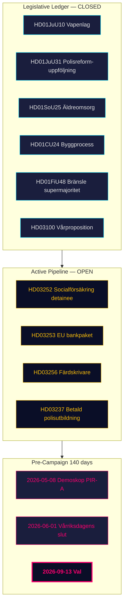

<!-- dir: rtl -->
# תמצית מנהלים — סקירה חודשית 2026-04-26

**מחבר**: James Pether Sörling | **תאריך**: 2026-04-26
**חלון**: 2026-03-27 → 2026-04-26 (30 ימים) | **ריקסמוטה**: 2025/26
**רמת אמינות**: גבוהה (A1) | **טווח אדמירליות**: A1–C3 | **ימים לבחירות**: 140

## 🎯 תמצית

חלון 30 הימים 2026-03-27 → 2026-04-26 מסמן את **שלב הסיום החקיקתי** של תיק קואליציית טידו 2025/26. ארבעה דוחות ועדה מ-24 באפריל (HD01JuU10 חוק נשק, HD01JuU31 מעקב רפורמת המשטרה, HD01SoU25 טיפול בקשישים, HD01CU24 תהליך הבנייה) סוגרים את פנקס הרגולציה. שלוש הצעות ממשלתיות מ-23 באפריל (HD03252, HD03253, HD03256) מסמנות פעילות ממשלתית מתמשכת עד השבועות האחרונים. שוודיה נמצאת כעת **140 ימים לפני הבחירות** עם הציר הפוליטי שעובר מ*חקיקה* ל*סיכון ביצוע* ו*מסגור קמפיין*.

## 🧭 3 החלטות שתדריך זה תומך בהן

1. **מעקב תיק**: קואליציית טידו הייתה מחויבת לכל תוכניתה המוצהרת 2025/26 — מקבלי החלטות יכולים כעת לעבור לניטור יישום במקום צינור חקיקה.
2. **כיול אסטרטגיית האופוזיציה**: ארכיטקטורת הטריז בשלושה מסלולים של S/V/MP (פיסקלי, מידע סביבתי, מבוסס זכויות) מוגדרת מבנית.
3. **נתוני תחזית בחירות**: PIR-A (דמוסקופ ≥ 44% עבור M+KD+L עד 2026-07-01) נשאר המדד החשוב ביותר.

## נקודות מידע של 60 שניות

- **פנקס חקיקתי סגור**: כל ארבעת הדוחות מאצוות 24 באפריל עברו ועדה ונמצאים על המסלול להצבעות מאי–יוני.
- **הצעות 23 באפריל מרחיבות את הפנקס**: HD03252, HD03253, HD03256 מוסיפות עוד שלושה פריטים לעקוב אחריהם.
- **עוגן פיסקלי**: HD03104 מאשר שניהול החוב של שוודיה שמר על מדדים מותאמי סיכון.
- **משמעת SD נשמרת**: 19+ ימי ישיבה רצופים ללא הצעות נגד על חוקי הממשלה.
- **צוואר בקבוק יישום**: RiR 2026:6 מזהה 9 המלצות פתוחות — אף לא אחת נסגרה עדיין.
- **מסגור טרום-בחירות**: HD10448 ו-HD11747–49 מהווים הרביעייה הנרטיבית של האופוזיציה.

## טריגר מוביל לעתיד

**2026-05-08 — קריאת סקר דמוסקופ ראשונה לאחר החלון.** זהו המבחן השוקי המוקדם ביותר.

## רמת אמינות

כוללת: **גבוהה (A1)** לתמונת הסיום המבנית. **בינונית (B2)** לדינמיקות בחירות עתידיות. **נמוכה (C3)** ללוח הזמנים של יישום HD03252/HD03253.

## �� הקשר מקצועי

**איסוף**: ממשק API פתוח של הריקסדאג (riksdag-regering-mcp)  
**שיטה**: ניתוח מודיעין פוליטי מובנה עם ציון DIW, ACH, SWOT ושפת הסתברות WEP  
**מגבלות**: נתוני IMF אינם זמינים. גיל נתוני סקרים: 31 ימים (דמוסקופ 2026-03-26).  
**מחזור הבא**: סקירה חודשית 2026-05-26
