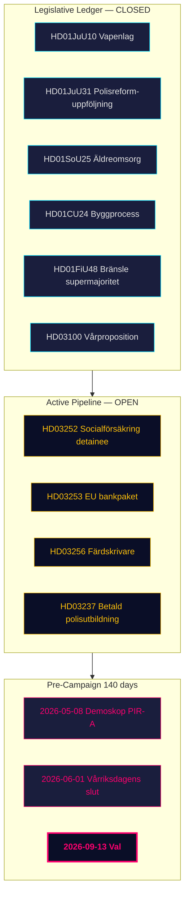

# エグゼクティブブリーフ — 月次レビュー 2026-04-26

**著者**：James Pether Sörling | **日付**：2026-04-26
**期間**：2026-03-27 → 2026-04-26 (30日間) | **リクスモテ**：2025/26
**信頼度**：高 (A1) | **提督符号範囲**：A1–C3 | **選挙まであと**：140日

## 🎯 要旨（BLUF）

2026-03-27 → 2026-04-26の30日間ウィンドウは、ティドー連立政権2025/26ポートフォリオの**立法的完了段階**を示す。4月24日の4件の委員会報告（HD01JuU10 武器法、HD01JuU31 警察改革フォローアップ、HD01SoU25 高齢者ケア、HD01CU24 建築プロセス）が規制台帳を閉じる。4月23日の3件の政府提案（HD03252、HD03253、HD03256）は最終週まで継続的な行政活動を示唆する。スウェーデンは今**選挙まで140日**、政治軸が*立法*から*実施リスク*と*キャンペーンの枠組み*へと移行している。

## 🧭 このブリーフィングが支援する3つの決定

1. **ポートフォリオ追跡**: ティドー連立は宣言した2025/26プログラムを完全に実行した — 意思決定者は立法パイプラインではなく実施の監視に軸足を移せる。
2. **野党戦略の調整**: S/V/MPの3本柱のくさび構造（財政、環境情報、権利ベース）は構造的に確立されている。
3. **選挙予測インプット**: PIR-A (デモスコップ M+KD+L ≥ 44% 2026-07-01まで) が最も重要な指標である。

## 60秒インテリジェンスポイント

- **立法台帳完了**: 4月24日の4件の委員会報告はすべて委員会を通過し、5月〜6月の本会議投票に向けて準備中。
- **4月23日の提案が台帳を延長**: HD03252、HD03253、HD03256がさらに3件の追跡事項を追加。
- **財政的アンカー**: HD03104がスウェーデンの債務管理が5年サイクルにわたりリスク調整基準を維持したことを確認。
- **SDの規律維持**: 政府法案への対抗動議なしの連続19+会期日。
- **実施のボトルネック**: RiR 2026:6が9件の未解決のPolismyndigheten勧告を特定。
- **選挙前の枠組み**: HD10448とHD11747–49が野党の18週間プレキャンペーンの物語的四重奏を形成。

## 主要な先行トリガー

**2026-05-08 — ウィンドウ後初のデモスコップ世論調査結果。** PIR-Aの最初の市場テスト。

## 信頼度

全体: **高 (A1)** 構造的完了の全体像。**中 (B2)** 前向きの選挙ダイナミクス。**低 (C3)** HD03252/HD03253の実施スケジュール。

## 🔄 トレードクラフトコンテキスト

**収集**: Riksdag Open Data API (riksdag-regering-mcp); ルックバックフォールバック 2026-04-24まで  
**方法**: DIWスコアリング、ACH、SWOT、WEP確率言語を用いた構造的政治インテリジェンス分析  
**制限**: IMF経済データ不利用 (接続エラー). 世論調査の精度: 31日 (デモスコップ 2026-03-26).  
**次のサイクル**: 月次レビュー 2026-05-26
