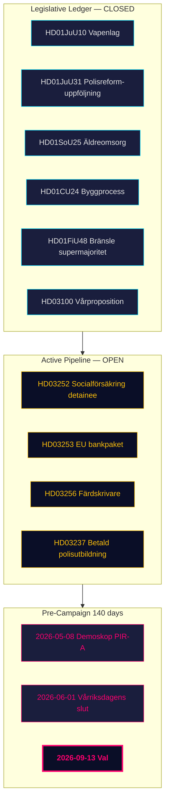

# 임원 브리핑 — 월간 리뷰 2026-04-26

**저자**: James Pether Sörling | **날짜**: 2026-04-26
**기간**: 2026-03-27 → 2026-04-26 (30일) | **릭스모테**: 2025/26
**신뢰도**: 높음 (A1) | **제독 범위**: A1–C3 | **선거까지 남은 일수**: 140

## 🎯 핵심 요약(BLUF)

2026-03-27 → 2026-04-26의 30일 기간은 티도 연립정부 2025/26 포트폴리오의 **입법 완성 단계**를 표시한다. 4월 24일의 4개 위원회 보고서(HD01JuU10 무기법, HD01JuU31 경찰 개혁 후속, HD01SoU25 노인 복지, HD01CU24 건축 과정)가 규제 원장을 마감한다. 4월 23일의 3개 제안(HD03252, HD03253, HD03256)은 마감 주까지 계속되는 행정 활동을 시사한다. 스웨덴은 이제 **선거까지 140일** 남은 상황에서 정치 축이 *입법*에서 *이행 위험*과 *선거 캠페인 프레이밍*으로 이동하고 있다.

## 🧭 이 브리핑이 지원하는 3가지 결정

1. **포트폴리오 추적**: 티도 연립은 선언된 2025/26 프로그램을 완전히 실행했다 — 의사결정자들은 입법 파이프라인 대신 이행 모니터링에 집중할 수 있다.
2. **야당 전략 보정**: S/V/MP의 3트랙 쐐기 구조(재정, 환경 정보, 권리 기반)는 구조적으로 확정되었다.
3. **선거 예측 입력**: PIR-A(데모스코프 M+KD+L ≥ 44% 2026-07-01까지)가 가장 중요한 단일 의사결정 지표이다.

## 60초 인텔리전스 포인트

- **입법 원장 마감**: 4월 24일 배치의 4개 보고서 모두 위원회를 통과하고 5월~6월 본회의 투표 궤도에 있음.
- **4월 23일 제안들이 원장 확장**: HD03252, HD03253, HD03256이 추가로 3개 항목을 추적 목록에 추가.
- **재정적 닻**: HD03104가 스웨덴의 부채 관리가 5년 주기에 걸쳐 위험 조정 기준을 유지했음을 확인.
- **SD 규율 유지**: 정부 법안에 대한 대항 발의 없이 19+ 연속 회의일.
- **이행 병목**: RiR 2026:6이 미해결 Polismyndigheten 권고 9개 확인 — 아직 하나도 해결되지 않음.
- **선거 전 프레이밍**: HD10448과 HD11747–49가 18주 사전 캠페인 진입 시 야당의 서술적 사중주 형성.

## 주요 선행 트리거

**2026-05-08 — 기간 후 첫 번째 데모스코프 여론조사 결과.** PIR-A의 첫 번째 시장 테스트.

## 신뢰도

전체: **높음 (A1)** 구조적 완성 그림. **중간 (B2)** 미래 선거 역학. **낮음 (C3)** HD03252/HD03253 이행 일정.

## 🔄 전문 맥락

**수집**: Riksdag 개방 데이터 API (riksdag-regering-mcp); 2026-04-24까지 소급 예비  
**방법**: DIW 점수, ACH, SWOT 및 WEP 확률 언어를 사용한 구조화된 정치 인텔리전스 분석  
**제한**: IMF 경제 데이터 미사용 (연결 오류). 여론조사 데이터 기간: 31일 (데모스코프 2026-03-26).  
**다음 주기**: 월간 리뷰 2026-05-26
