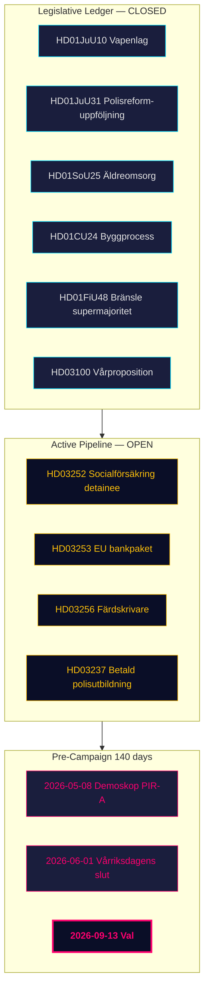

# Executive Brief — Monthly Review 2026-04-26

**Author**: James Pether Sörling | **Date**: 2026-04-26
**Window**: 2026-03-27 → 2026-04-26 (30 days) | **Riksmöte**: 2025/26
**Confidence**: HIGH (A1) | **Admiralty range**: A1–C3 | **Days to election**: 140

## 🎯 BLUF
Het 30-dagenvenster 2026-03-27 → 2026-04-26 markeert de **wetgevende afrondingsfase** van de 2025/26-portefeuille van de Tidö-coalitie. Vier commissierapporten van 24 april (HD01JuU10 wapenwet, HD01JuU31 politiehervorming-follow-up, HD01SoU25 ouderenzorg, HD01CU24 bouwproces) sluiten het regulatoire grootboek. Drie wetsvoorstellen van 23 april (HD03252, HD03253, HD03256) signaleren voortgezette uitvoerende activiteit in de slotweek. Zweden is nu **140 dagen voor de verkiezingen**, met de politieke as die verschuift van *wetgeving* naar *implementatierisico* en *campagnekader*.

## 🧭 3 Decisions This Brief Supports

1. **Portfolio tracking**: The Tidö coalition has fully committed its declared 2025/26 programme — decision-makers can now pivot to monitoring implementation rather than legislative pipeline.
2. **Opposition strategy calibration**: S/V/MP three-track wedge architecture (fiscal, environmental-information, rights-based) is structurally set; decision-makers assessing opposition capacity should treat HD10448 and HD11747–49 as the framing templates for May–August.
3. **Election forecast inputs**: PIR-A (Demoskop ≥ 44% for M+KD+L by 2026-07-01) remains the single most decision-relevant indicator — it determines Scenario A (coalition renewal) vs Scenario B (S-led minority).

## 60-Second Intelligence Bullets

- **Legislative ledger closed**: All four committee reports from the April-24 batch (HD01JuU10, HD01JuU31, HD01SoU25, HD01CU24) passed committee and are on track for May–June chamber votes.
- **April-23 propositions extend the ledger**: HD03252 (detainee benefit restriction), HD03253 (EU bankpaket CRR3/BRRD3), HD03256 (färdskrivare manipulation) add three more deliverables to track.
- **Fiscal anchor**: HD03104 (statens upplåning 2021–2025) confirms Sweden's debt management maintained risk-adjusted benchmarks across the five-year cycle — a pre-election positive for the government.
- **SD discipline sustained**: 19+ consecutive sitting days without counter-motions on government bills; PIR-C (does discipline survive manifesto launch ~2026-08-15) remains open.
- **Implementation bottleneck**: RiR 2026:6 (HD01JuU31) identifies 9 open Polismyndigheten recommendations — none closed yet.
- **Pre-election framing**: Wind-power disinformation (HD10448), labour-environment (HD11747), consular-rights (HD11748), prison-schooling (HD11749) form the opposition's narrative quad entering the 18-week pre-campaign.

## Top Forward Trigger

**2026-05-08 — First post-window Demoskop polling reading.** This is the earliest market-test of whether HD01FiU48 fuel-tax relief translated to durable polling lift (PIR-A). A Tidö-bloc reading ≥ 44% strongly supports Scenario A renewal; < 40% triggers Scenario B analysis.

## Confidence label

Overall: **HIGH (A1)** for structural completion picture. **MEDIUM (B2)** for forward electoral dynamics. **LOW (C3)** for HD03252/HD03253 implementation timeline.

## 🔄 Tradecraft Context

**Collection**: Riksdag Open Data API (riksdag-regering-mcp); lookback fallback to 2026-04-24  
**Method**: Structured political intelligence analysis using DIW scoring, ACH, SWOT, and WEP probability language  
**Confidence floor**: All factual claims rated ≥ C3 (plausible) per Admiralty system; structural assessments ≥ B2  
**Limitations**: IMF economic data unavailable (connection error this run; Riksbank minutes substituted). Polling vintage: 31 days (Demoskop 2026-03-26). No direct media monitoring — frames inferred from document language.  
**Standards**: ICD 203 (alternative hypotheses, probability language); AI FIRST (minimum 2 iterations)  
**Next cycle**: Monthly Review 2026-05-26 — should include updated Demoskop reading and SD congress monitoring
