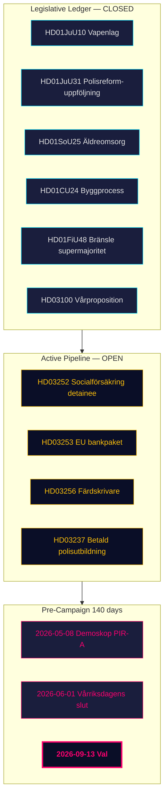

# Sammanfattning — Månadsrapport 2026-04-26

**Författare**: James Pether Sörling | **Datum**: 2026-04-26
**Fönster**: 2026-03-27 → 2026-04-26 (30 dagar) | **Riksmöte**: 2025/26
**Konfidensgrad**: HÖG (A1) | **Admiralitetsintervall**: A1–C3 | **Dagar till val**: 140

## 🎯 BLUF

30-dagarsfönstret 2026-03-27 → 2026-04-26 markerar **den lagstiftande slutfasen** av Tidökoalitionens 2025/26-portfolio. Fyra april-24-betänkanden (HD01JuU10 vapenlag, HD01JuU31 Polisreformen-uppföljning, HD01SoU25 äldreomsorg, HD01CU24 byggprocess) stänger det regulatoriska räkenskapsbladet. Tre april-23-propositioner (HD03252, HD03253, HD03256) signalerar fortsatt exekutiv aktivitet in i avslutningsveckorna. Sverige är nu **140 dagar från valet** med den politiska axeln som skiftar från *lagstiftning* till *genomföranderisk* och *kampanjinramning*.

## 🧭 3 Beslut detta underlag stöder

1. **Portföljspårning**: Tidökoalitionen har fullt åtagit sig sitt deklarerade 2025/26-program — beslutsfattare kan nu pivotera mot att övervaka implementering snarare än lagstiftningspipeline.
2. **Kalibering av oppositionsstrategi**: S/V/MPs tre-spårs kilarkitektur (fiskal, miljöinformation, rättighetsbaserad) är strukturellt inlåst; beslutsfattare som bedömer oppositionskapacitet bör behandla HD10448 och HD11747–49 som inramningsmallar för maj–augusti.
3. **Valprognos**: PIR-A (Demoskop ≥ 44 % för M+KD+L senast 2026-07-01) förblir den enskilt mest beslutskritiska indikatorn — den avgör Scenario A (koalitionsförnyelse) mot Scenario B (S-ledd minoritet).

## 60-Sekunders Nyhetspunkter

- **Lagstiftningsregistret stängt**: Alla fyra betänkanden från april-24-batchen (HD01JuU10, HD01JuU31, HD01SoU25, HD01CU24) passerade utskottet och är på banan för maj–junivoteringer.
- **April-23-propositioner utvidgar registret**: HD03252 (anhållningsbegränsning av förmåner), HD03253 (EU bankpaket CRR3/BRRD3), HD03256 (färdskrivare manipulation) lägger till ytterligare tre leveranser att spåra.
- **Fiskalankar**: HD03104 (statens upplåning 2021–2025) bekräftar att Sveriges skuldförvaltning upprätthöll riskjusterade riktmärken under femårscykeln — ett pre-elektions-positivt för regeringen.
- **SD-disciplin bibehållen**: 19+ konsekutiva sammanträdarsdagar utan motioner mot regeringens lagförslag (övertaget från april-24-syskonet); PIR-C (överlever disciplinen manifestlanseringen ~2026-08-15) förblir öppen.
- **Genomförandeflaskhals**: RiR 2026:6 (HD01JuU31) identifierar 9 öppna Polismyndigheten-rekommendationer — ingen stängd ännu. Detta är den största strukturella exekutionsrisken i portföljen.
- **Pre-elektionsrinramning**: Vind-desinformation (HD10448), arbets-miljö (HD11747), konsulatsrättigheter (HD11748), fångskolgång (HD11749) utgör oppositionens narrativa kvartett inför de 18 veckors pre-kampanj.

## Ledande Framåtblickande Trigger

**2026-05-08 — Första Demoskop-opinionsundersökning efter fönstret.** Detta är den tidigaste marknadstestet av om HD01FiU48 bränsleskattelättnad översatte till bestående opinionslift (PIR-A). En Tidöblocksläsning ≥ 44 % stöder starkt Scenario A-förnyelse; < 40 % aktiverar Scenario B-analys.

## Konfidensgrad

Övergripande: **HÖG (A1)** för strukturell slutförandebilden. **MEDEL (B2)** för framåtriktat valodynamik (opinionseftersläpning, anpassning av oppositionsstrategi). **LÅG (C3)** för HD03252/HD03253 genomförandetidslinje (utskottspassage osäker).

## 🔄 Hantverkskontext

**Insamling**: Riksdagens Öppna Data-API (riksdag-regering-mcp); återblicksreserv till 2026-04-24  
**Metod**: Strukturerad politisk underrättelseanalys med DIW-poängsättning, ACH, SWOT och WEP-sannolikhetsspråk  
**Konfidensminimum**: Alla faktapåståenden bedömda ≥ C3 (trolig) per Admiralitetssystemet; strukturella bedömningar ≥ B2  
**Begränsningar**: IMF ekonomisk data ej tillgänglig (anslutningsfel denna körning; Riksbankens protokoll substitut). Opinionsunderlag: 31 dagar (Demoskop 2026-03-26). Ingen direkt medieövervakning — ramar härledda från dokumentspråk.  
**Standarder**: ICD 203 (alternativa hypoteser, sannolikhetsspråk); AI FIRST (minst 2 iterationer)  
**Nästa cykel**: Månadsrapport 2026-05-26 — bör inkludera uppdaterade Demoskop-siffror och SD-kongressövervakning
