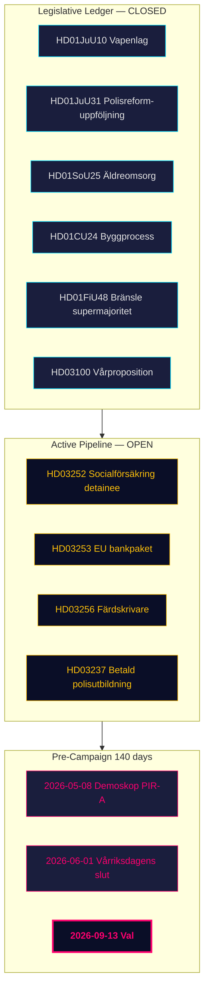

# 执行摘要 — 月度回顾 2026-04-26

**作者**：James Pether Sörling | **日期**：2026-04-26
**窗口期**：2026-03-27 → 2026-04-26（30天）| **议会届次**：2025/26
**可信度**：高（A1）| **海军上将范围**：A1–C3 | **距大选天数**：140

## 🎯 核心摘要（BLUF）

2026-03-27 → 2026-04-26的30天窗口期标志着蒂多联合政府2025/26立法组合的**完结阶段**。4月24日的四份委员会报告（HD01JuU10武器法、HD01JuU31警察改革后续、HD01SoU25老年护理、HD01CU24建筑流程）关闭了监管账目。4月23日的三份政府提案（HD03252、HD03253、HD03256）表明行政活动持续至最后几周。瑞典现在距大选还有**140天**，政治轴心从*立法*转向*实施风险*和*竞选框架*。

## 🧭 本简报支持的三个决策

1. **组合追踪**：蒂多联合政府已完全兑现其公布的2025/26计划 — 决策者现在可以转向监测实施而非立法管线。
2. **反对党战略校准**：S/V/MP三轨楔形架构（财政、环境信息、权利导向）已结构性确定。
3. **选举预测输入**：PIR-A（到2026-07-01民调M+KD+L ≥ 44%）是最关键的单一决策指标。

## 60秒要点

- **立法账目完结**：4月24日批次的全部四份报告通过委员会，正在轨道上进行5月–6月全体投票。
- **4月23日提案延伸账目**：HD03252、HD03253、HD03256增加三个追踪目标。
- **财政锚**：HD03104确认瑞典债务管理在五年周期内保持风险调整基准。
- **SD纪律维持**：连续19+会期日无对抗政府法案的反动议。
- **实施瓶颈**：RiR 2026:6确定9项未解决的Polismyndigheten建议 — 尚无关闭。
- **选前框架**：HD10448和HD11747–49构成进入18周预选活动的反对党叙事四重奏。

## 主要先行触发因素

**2026-05-08 — 窗口后首个德莫斯科普民调读数。** PIR-A的最早市场检验。

## 可信度

总体：**高（A1）**结构性完成全貌。**中（B2）**前瞻性选举动态。**低（C3）**HD03252/HD03253实施时间表。

## 🔄 情报工作背景

**采集**：Riksdag开放数据API（riksdag-regering-mcp）；回溯至2026-04-24  
**方法**：使用DIW评分、ACH、SWOT和WEP概率语言的结构化政治情报分析  
**局限性**：IMF经济数据不可用（连接错误）。民调数据时效：31天（德莫斯科普2026-03-26）。  
**下一周期**：月度回顾2026-05-26
