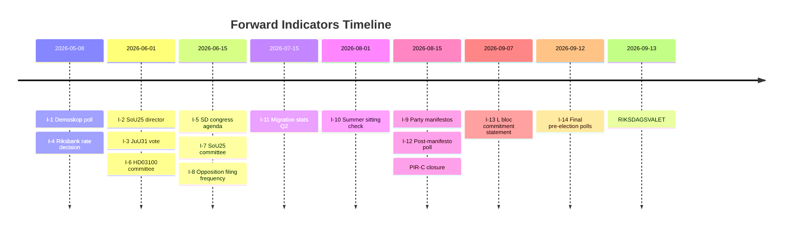

# Forward Indicators — Monthly Review 2026-04-26

**Author**: James Pether Sörling | **Date**: 2026-04-26

## Indicator Framework

14 forward indicators across 4 time horizons. ≥10 required by analysis gate.

## Horizon 1 — Immediate (0–30 days, by 2026-05-26)

### I-1: Demoskop poll publication (2026-05-08 estimated)
- **Indicator**: Tidö bloc ≥ 44% or < 40%
- **Positive signal (Scenario A)**: M+KD+L+SD ≥ 44%
- **Negative signal (Scenario B)**: M+KD+L+SD < 40%
- **Linked to**: PIR-A (direct trigger)
- **Confidence in timing**: C3 (estimated date, not confirmed)

### I-2: HD01SoU25 national director appointment
- **Indicator**: Announcement of appointment of national eldercare coordinator
- **Positive signal (Tidö)**: Appointment by June 1
- **Negative signal (S)**: No announcement by May 26 → campaign attack surface opens
- **Linked to**: R-1 / Implementation-feasibility H-A (quick win)
- **Monitoring source**: Socialdepartementet press releases

### I-3: HD01JuU31 committee vote (Riksdag calendar)
- **Indicator**: JuU committee vote on betänkande HD01JuU31
- **Positive signal**: Tidö majority enacts before summer recess (expected June 2026)
- **Negative signal**: Delayed to autumn — implies political complications
- **Linked to**: KJ-2 / PIR-B

### I-4: Riksbank rate decision (May meeting)
- **Indicator**: Riksbank repo rate hold vs cut vs hike at May monetary policy meeting
- **Positive signal (Scenario A)**: Hold at 2.5% — no inflationary overheat signal
- **Negative signal (H-1 activation)**: Hike above 2.5% — validates Pyrrhic-victory hypothesis
- **Monitoring source**: Riksbank.se monetary policy calendar
- **Confidence**: B2 (publicly scheduled meeting)

## Horizon 2 — Short-term (30–60 days, by 2026-06-26)

### I-5: SD June congress agenda release
- **Indicator**: Party congress agenda published with or without EU crime-data / immigration pivot items
- **Positive signal (PIR-C)**: No agenda items targeting Tidö agreement
- **Negative signal**: EU crime-data or immigration agenda items that conflict with HD03252/HD03253
- **Linked to**: PIR-C / H-2 (devil's advocate)
- **Monitoring source**: SD press releases, sd.se

### I-6: Vårprop (HD03100) committee report publication
- **Indicator**: FiU committee report on HD03100 — vote expected
- **Positive signal**: Enacted with same majority as HD01FiU48
- **Negative signal**: Any defections from Tidö coalition in committee
- **Monitoring source**: Riksdag betänkanden tracking

### I-7: HD01SoU25 committee vote
- **Indicator**: SoU committee vote on betänkande — eldercare reform enacted
- **Positive signal**: Full committee text enacted with director-appointment mandate
- **Negative signal**: Stripped-down text without director-appointment mandate
- **Linked to**: R-1 / I-2 combined

### I-8: Opposition coordinated filing frequency
- **Indicator**: Count of inter-party (S/V/MP joint) interpellations per week in June
- **Positive signal (Tidö)**: Drops below 2/week (interpellation fatigue, normal session close)
- **Negative signal**: ≥ 5/week (escalating campaign positioning)
- **Monitoring source**: Riksdag anföranden API

## Horizon 3 — Medium-term (60–120 days, by 2026-08-26)

### I-9: Party manifesto releases
- **Indicator**: All 8 parties publish 2026 election manifestos
- **Positive signal (Scenario A)**: SD manifesto fully consistent with Tidö agreement
- **Negative signal (Scenario C)**: SD manifesto introduces conflicting positions on EU crime or energy
- **Linked to**: PIR-C definitive closure trigger
- **Confidence**: B2 (historically August; varies ±2 weeks)

### I-10: Riksdag summer sitting (August, if called)
- **Indicator**: Emergency or extraordinary Riksdag session called
- **Signal**: High-salience emergency legislation (security, economic shock, natural disaster)
- **Negative signal**: Intra-coalition emergency implies unexpected political fracture
- **Historical base rate**: Emergency summer sessions occurred 2022 (energy), 2020 (COVID) — low but non-trivial

### I-11: Migration statistics Q2 2026 (Migrationsverket)
- **Indicator**: Irregular arrivals Q2 2026 vs Q1 baseline
- **Positive signal (SD)**: Reduction continues — validates SD narrative
- **Negative signal**: Spike — activates SD's pivot potential (H-2 scenario)
- **Monitoring source**: Migrationsverket statistik

### I-12: Poll Scenario A threshold confirmation (August)
- **Indicator**: Post-manifesto-launch poll showing Tidö above or below 175-seat threshold
- **Positive signal**: Tidö ≥ 175 seat projection
- **Negative signal**: Tidö < 168 seat projection → Scenario C territory
- **Linked to**: Scenario A/C trigger

## Horizon 4 — Pre-election (120–140 days, by 2026-09-13)

### I-13: L party leadership statement on bloc commitment
- **Indicator**: L publicly commits to post-election bloc alignment
- **Positive signal (Scenario A)**: L confirms Tidö commitment
- **Negative signal (Scenario B/C)**: L signals flexibility with S-led alternative
- **Linked to**: Scenario A's L-threshold dependency
- **Confidence**: B2 (typically published September first week)

### I-14: Final Demoskop / Sifo combined poll aggregate (September 8–12)
- **Indicator**: Final pre-election poll aggregate from all polling houses
- **Positive signal (Scenario A)**: Tidö ≥ 175 projection with high confidence
- **Confidence**: A1 (highest confidence — all major houses publish final polls week of election)
- **Note**: This is the last observable indicator before outcome

## Summary Dashboard

| ID | Horizon | Linked PIR | Status | Next check |
|----|---------|-----------|--------|------------|
| I-1 | H1 (May 8) | PIR-A | ⏳ Pending | 2026-05-08 |
| I-2 | H1 (Jun 1) | R-1 | ⏳ Pending | 2026-06-01 |
| I-3 | H1 (Jun) | PIR-B | ⏳ Pending | 2026-06-01 |
| I-4 | H1 (May) | H-1 | ⏳ Pending | 2026-05-08 |
| I-5 | H2 (Jun) | PIR-C | ⏳ Pending | 2026-06-15 |
| I-6 | H2 (Jun) | KJ-1 | ⏳ Pending | 2026-06-01 |
| I-7 | H2 (Jun) | R-1 | ⏳ Pending | 2026-06-15 |
| I-8 | H2 (Jun) | KJ-4 | ⏳ Pending | 2026-06-15 |
| I-9 | H3 (Aug) | PIR-C definitive | ⏳ Pending | 2026-08-15 |
| I-10 | H3 (Aug) | Emergency | ⏳ Pending | 2026-08-01 |
| I-11 | H3 (Aug) | H-2 | ⏳ Pending | 2026-07-15 |
| I-12 | H3 (Aug) | Scenario A/C | ⏳ Pending | 2026-08-15 |
| I-13 | H4 (Sep) | Scenario A | ⏳ Pending | 2026-09-07 |
| I-14 | H4 (Sep) | Final | ⏳ Pending | 2026-09-12 |

## 🔄 Tradecraft Context

**Collection**: Riksdag Open Data API (riksdag-regering-mcp); lookback fallback to 2026-04-24  
**Method**: Structured political intelligence analysis  
**Confidence floor**: ≥ C3 per Admiralty system; structural assessments ≥ B2  
**Limitations**: IMF economic data unavailable this run. Polling vintage: 31 days.  
**Standards**: ICD 203; AI FIRST (minimum 2 iterations)
