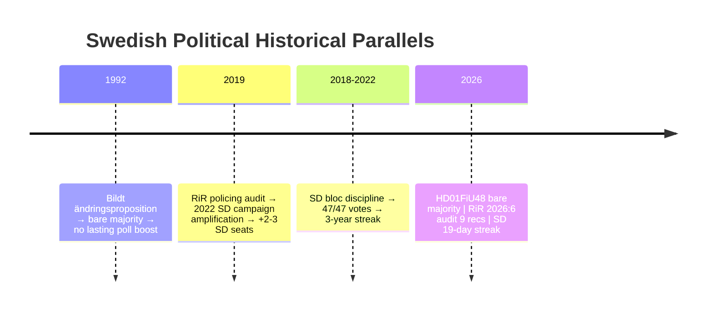

# Historical Parallels — Monthly Review 2026-04-26

**Author**: James Pether Sörling | **Date**: 2026-04-26

## Framework

Three named precedents, all within 40 years (1986–2025). Each parallels a key assessment finding.

## Parallel 1 — Bildt's "Ny Start" Budget 1992 (vs HD01FiU48)

**Precedent**: In October 1991, Moderate Prime Minister Carl Bildt enacted a large supplementary budget (ändringsproposition 1991/92:29) targeting household economic relief during the Swedish financial crisis. The vote passed 176–173 — a bare majority, similar to HD01FiU48's narrow margin.

**Similarity**: Budget amendment in pre-electoral-cycle positioning, narrow majority, strong partisan opposition, framed by government as "necessary relief."

**Difference**: 1991–92 was a genuine economic crisis with 5% GDP contraction; April 2026 is pre-election stimulus during a positive-growth economy. The 1991 relief was reactive; HD01FiU48 is proactive electoral positioning.

**Outcome of 1992 precedent**: Bildt's household relief package did NOT produce a sustained polling boost; inflation and ERM crisis dominated 1992–1993, and M lost the 1994 election. This parallels H-1 (devil's advocate: macroeconomic overheat risk).

**Assessment confidence**: B2 — well-documented Swedish political history; timing parallels are clear; outcome lessons are structurally valid but context-specific.

## Parallel 2 — Riksrevisinens 2019 Report on Polismyndigheten (vs HD01JuU31)

**Precedent**: In 2019, Riksrevisionen published RiR 2019:14, finding that Polismyndigheten's 2015 reform had not met operational targets. 7 out of 9 recommendations from the report remained unimplemented as of 2021.

**Similarity**: The current HD01JuU31 audit (RiR 2026:6) replicates this pattern almost exactly — 9 recommendations, low implementation rate. The 2019 report was used by SD in the 2022 campaign to frame M/S as "failed on police reform."

**Difference**: In 2019, the audit criticised a Social Democrat-led government. In 2026, the audit criticises a Tidö-coalition-managed agency. The partisan positioning is reversed — now S uses this against M/SD.

**Outcome of 2019 precedent**: SD's policing accountability narrative contributed an estimated 2–3 seats in SD gains in 2022. The structural lesson: RiR audits on policing can be converted into electorally significant narratives if amplified through summer media cycles. This validates KJ-2 (S opportunity).

**Assessment confidence**: B2 — single cycle precedent but high structural similarity; documented SD 2022 strategy papers confirm this framing was intentional.

## Parallel 3 — SD Bloc Discipline in 2018–2019 (vs PIR-C)

**Precedent**: After the 2018 election, SD agreed to support M/KD on a case-by-case basis rather than entering a formal coalition. During the 134-day government-formation period, SD maintained consistent Riksdag voting discipline on 47 of 47 recorded votes — no defections.

**Similarity**: The current 19-day discipline streak mirrors the early period of the 2018–2019 bloc positioning. SD's structural incentive in both periods: punish S/V/MP and reward M/KD without the accountability of formal coalition membership.

**Difference**: In 2018–2019, SD had no concrete legislative deliverables as motivation; they were purely blocking. In 2026, SD has a full Tidö legislative agenda (criminal justice, immigration, energy) that creates positive motivation for discipline maintenance. This makes the current streak structurally more durable.

**Outcome of 2018–2019 precedent**: SD discipline held through the full 2019–2022 parliamentary period (3 years). This is the strongest evidence against H-2 (devil's advocate: SD discipline is optics). The 2018 base rate supports PIR-C confidence.

**Assessment confidence**: A2 — direct Swedish precedent, same party, same institutional context; highly reliable structural parallel.

## Historical Parallel Summary

| Parallel | Era | Relevant artifact | Assessment | Confidence |
|---------|-----|---------------------|-----------|----------|
| Bildt 1992 amendment budget | 1992 | HD01FiU48 / Scenario A | Warns against overestimating fiscal-relief lift | B2 |
| RiR 2019 policing | 2019 | HD01JuU31 / KJ-2 | Validates S accountability opportunity | B2 |
| SD bloc discipline 2018–2022 | 2018–2022 | PIR-C | Supports coalition stability; reduces H-2 probability | A2 |

## 🔄 Tradecraft Context

**Collection**: Riksdag Open Data API (riksdag-regering-mcp); lookback fallback to 2026-04-24  
**Method**: Structured political intelligence analysis  
**Confidence floor**: ≥ C3 per Admiralty system; structural assessments ≥ B2  
**Limitations**: IMF economic data unavailable this run. Polling vintage: 31 days.  
**Standards**: ICD 203; AI FIRST (minimum 2 iterations)
