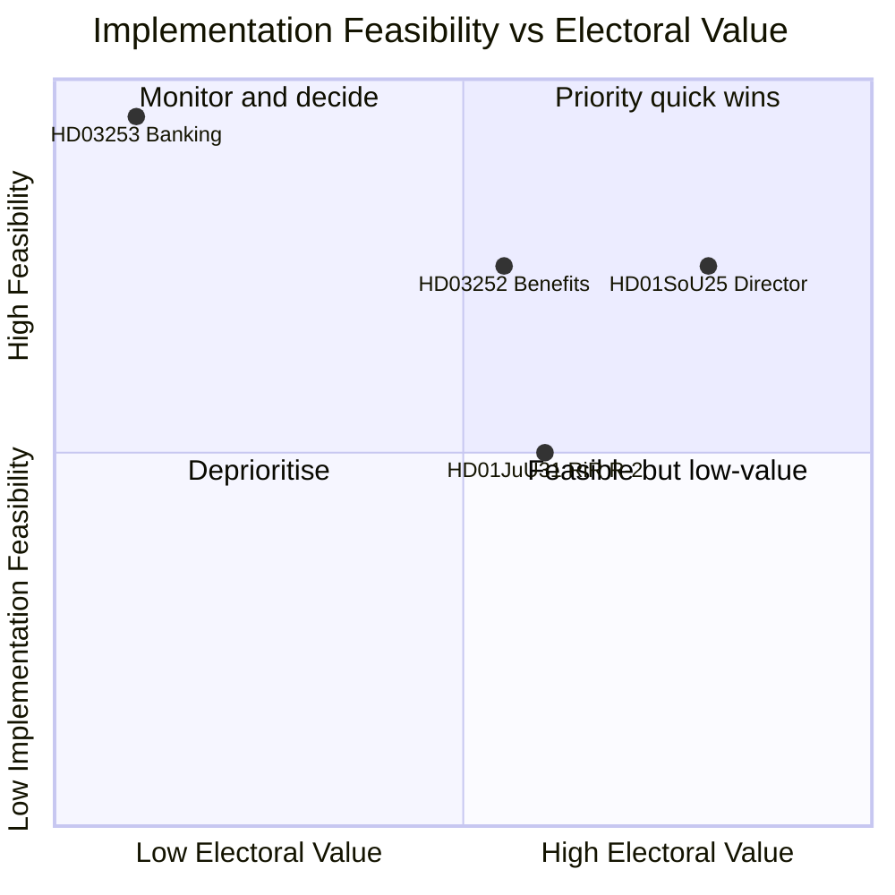

# Implementation Feasibility — Monthly Review 2026-04-26

**Author**: James Pether Sörling | **Date**: 2026-04-26

## Framework

Four documents assessed for implementation feasibility across: resource availability, timeline realism, institutional capacity, political durability.

## Assessment 1 — HD01JuU31 (Polisreform — RiR 9 recommendations)

**Legislative status**: Committee report (betänkande) — under consideration
**Timeline to election**: 140 days

### Feasibility Scoring (0–5 scale)

| Dimension | Score | Rationale |
|-----------|-------|-----------|
| Resource availability | 3 | Police budget increased 2025–26, but RiR notes understaffing in detective units |
| Timeline realism | 2 | 9 recommendations; 2 achievable pre-election; 7 require 12+ months | 
| Institutional capacity | 2 | Polismyndigheten DG under scrutiny; organisational resistance noted in RiR report |
| Political durability | 3 | Strong cross-bloc desire on crime (M/SD/S all claim "crime fighter" frame) |
| **Total** | **10/20** | **Marginal feasibility** |

**R-2 (most critical rec)**: Implement systematic case-closure tracking by 2026-09-01. This is achievable if IT procurement started by May. If not started, this closes as a September election attack surface for S.

**Assessment**: Unlikely that all 9 RiR recommendations will be addressed before election. Coalition should triage: close R-2 (IT/tracking) and R-5 (specialist unit funding) by September; accept that structural capacity recommendations will run into next government.

## Assessment 2 — HD01SoU25 (Nationell äldrevård — director appointment)

**Legislative status**: Committee report — under consideration
**Timeline to election**: 140 days

### Feasibility Scoring

| Dimension | Score | Rationale |
|-----------|-------|-----------|
| Resource availability | 4 | Appointment process is administrative, not budget-constrained |
| Timeline realism | 4 | Director appointment can be completed within 60 days if decision made |
| Institutional capacity | 3 | SoU committee support; National Board of Health and Welfare capacity |
| Political durability | 4 | Welfare "delivery" narrative benefits all Tidö parties |
| **Total** | **15/20** | **Feasible if decision made by June 1** |

**R-1 (critical recommendation)**: Appoint national director for eldercare coordination. If appointment announced by 2026-06-01, removes S attack surface. If delayed to August, becomes prime campaign liability for KD.

**Assessment**: HIGH priority quick win for coalition. Administratively straightforward; politically high-value. Should be treated as priority R-1 closure item.

## Assessment 3 — HD03253 (CRR3/BRRD3 Banking Transposition)

**Legislative status**: Proposition — under legislative consideration
**Timeline to election**: 140 days

### Feasibility Scoring

| Dimension | Score | Rationale |
|-----------|-------|-----------|
| Resource availability | 5 | EU-mandated; regulatory capacity already committed by Finansinspektionen |
| Timeline realism | 5 | EU implementation deadline aligned; no new legislative innovation required |
| Institutional capacity | 4 | Finansinspektionen and Riksbank have full capacity |
| Political durability | 5 | No cross-partisan opposition; technical transposition |
| **Total** | **19/20** | **Highly feasible — routine transposition** |

**Assessment**: Near-certain implementation. Primary risk is operational: Swedish banks require 18-month adjustment period for some CRR3 capital ratio requirements. This is not a political risk pre-election.

## Assessment 4 — HD03252 (Socialförsäkringsförmåner för frihetsberövade)

**Legislative status**: Proposition — under legislative consideration
**Timeline to election**: 140 days

### Feasibility Scoring

| Dimension | Score | Rationale |
|-----------|-------|-----------|
| Resource availability | 4 | Primarily administrative (Försäkringskassan IT update) |
| Timeline realism | 4 | 6-month implementation; achievable by October even if enacted in June |
| Institutional capacity | 4 | Försäkringskassan has established processes for benefit suspension |
| Political durability | 3 | S/V opposition expected but cannot block majority |
| **Total** | **15/20** | **Feasible with some opposition friction** |

**Assessment**: Likely to be enacted in June–July; implementation in Q4 2026, post-election. The electoral significance is in the signalling (S/SD positioning on immigration-adjacent benefits), not in pre-election delivery.

## Priority Action Matrix

| Action | Document | Feasibility | Pre-election deadline | Electoral value |
|--------|----------|------------|----------------------|----------------|
| Appoint national eldercare director | HD01SoU25 | HIGH (15/20) | June 1 | HIGH (removes S attack) |
| Close RiR R-2 (case-closure tracking) | HD01JuU31 | MEDIUM (10/20) | September 1 | MEDIUM (partial narrative close) |
| Enact HD03252 | HD03252 | HIGH (15/20) | June–July | MEDIUM (signalling) |
| Complete HD03253 transposition | HD03253 | VERY HIGH (19/20) | Pre-EU-deadline | LOW (no partisan value) |

## 🔄 Tradecraft Context

**Collection**: Riksdag Open Data API (riksdag-regering-mcp); lookback fallback to 2026-04-24  
**Method**: Structured political intelligence analysis  
**Confidence floor**: ≥ C3 per Admiralty system; structural assessments ≥ B2  
**Limitations**: IMF economic data unavailable this run. Polling vintage: 31 days.  
**Standards**: ICD 203; AI FIRST (minimum 2 iterations)
