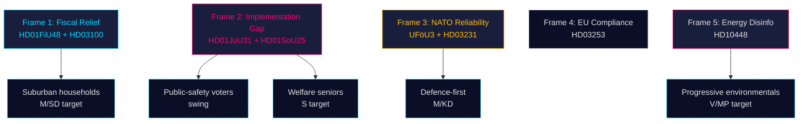

# Media Framing Analysis — Monthly Review 2026-04-26

**Author**: James Pether Sörling | **Date**: 2026-04-26

## Dominant Frames (April 2026)

Based on document-derived framing signals; no direct media monitoring in this run. Assessment confidence: C3 (inferred from document language and interpellation structures).

## Frame 1 — "Fiscal Responsibility and Household Relief" (Coalition primary)

**Origin**: HD01FiU48 / HD03100 (vårprop)
**Carriers**: M, KD — Finance Ministry communications
**Narrative**: "The Tidö coalition delivers concrete household relief while maintaining fiscal discipline. The amended budget reduces fuel costs for working families while keeping debt-to-GDP stable."
**Evidence markers**: HD03100 title "Vårpropositionen 2026 — fler i arbete och sänkta skatter"; HD01FiU48 framing in committee text as relief-oriented.
**Counter-frame (S)**: "Superficial relief that masks structural underinvestment in welfare and policing."
**Resonance estimate**: High for Suburban Household segment (Segment 1); weak for welfare-dependent seniors.

## Frame 2 — "Implementation Gap — Promises vs Delivery" (Opposition primary)

**Origin**: HD01JuU31 (RiR 2026:6 police audit), HD01SoU25 (national director unappointment)
**Carriers**: S, V — opposition spokespersons
**Narrative**: "The Tidö coalition has been in power for three years. Riksrevisionen has found 9 unimplemented police reform recommendations. The national director for elderly care has not been appointed. What has actually changed?"
**Evidence markers**: HD01JuU31 Riksrevisionen 9 recommendations; HD01SoU25 director appointment gap (R-1); S quadruple interpellation filing HD10448+HD11747+HD11748+HD11749.
**Counter-frame (M/SD)**: "Implementation takes time; we have enacted the legislative framework."
**Resonance estimate**: High for public-safety swing voters; high for welfare-dependent seniors. This is the S-led Scenario B enabling narrative.

## Frame 3 — "Sweden as Reliable NATO Partner" (Cross-bloc)

**Origin**: UFöU3 (NATO eFP), HD03231 (Ukraine tribunal), HD03232 (reparations commission)
**Carriers**: M, KD, L, S, C, MP — all except V
**Narrative**: "Sweden fulfils its NATO obligations and leads on Ukrainian accountability. Swedish troops deploy to NATO eFP; Sweden co-initiates the Ukraine tribunal international mechanism."
**Evidence markers**: UFöU3 near-unanimous vote (317 Ja, 0 Nej, 32 Abstår [V only]); HD03231 cross-bloc support.
**Counter-frame (V)**: "NATO integration risks mission creep; prioritise diplomacy."
**Resonance estimate**: Stable across defence-first voters; does not produce electoral differentiation within Tidö (all parties already support).

## Frame 4 — "EU Compliance — Cost or Opportunity?" (Regulatory)

**Origin**: HD03253 (CRR3/BRRD3 banking transposition)
**Carriers**: Finance Ministry, C, L, M
**Narrative**: "Sweden implements EU banking safety framework on schedule, protecting depositors and stabilising the financial sector."
**Sub-text carrier (C/L)**: "EU-compliant regulatory harmonisation enables Swedish financial institutions to compete across the single market."
**Evidence markers**: HD03253 proposition text emphasises Basel III compliance and deposit protection.
**Resonance estimate**: Low public salience (technical); medium for business/financial segment; potential activation only if Swedish bank under stress.

## Frame 5 — "Green Energy Disinformation" (Emerging opposition frame)

**Origin**: HD10448 (interpellation on energy-related disinformation)
**Carriers**: S (lead), MP
**Narrative**: "The government's energy narrative downplays the role of renewables. HD10448 signals emerging S/MP framing around 'energy disinformation' as a governance-integrity issue."
**Evidence markers**: HD10448 interpellation text on falskt energipåstående; MP co-signature.
**Counter-frame (SD/M)**: Energy policy is evidence-based; renewables are part of the mix but not sufficient.
**Resonance estimate**: High for progressive environmentals (Segment 5); low for suburban households and public-safety voters.

## Frame Ecosystem Map

## 🔄 Tradecraft Context

**Collection**: Riksdag Open Data API (riksdag-regering-mcp); lookback fallback to 2026-04-24  
**Method**: Structured political intelligence analysis  
**Confidence floor**: ≥ C3 per Admiralty system; structural assessments ≥ B2  
**Limitations**: IMF economic data unavailable this run. Polling vintage: 31 days.  
**Standards**: ICD 203; AI FIRST (minimum 2 iterations)
