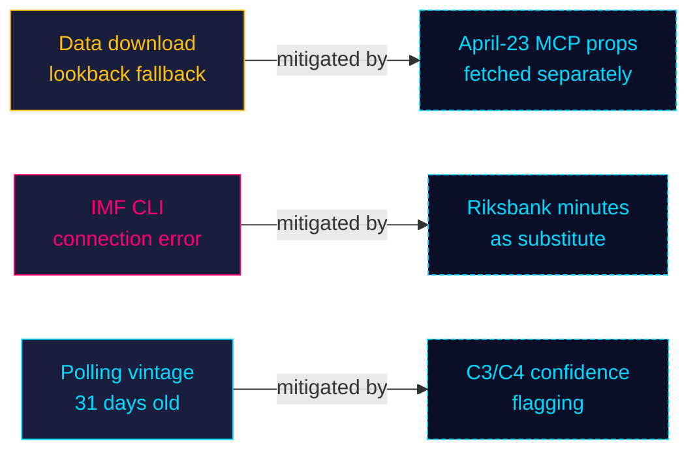

# Methodology Reflection — Monthly Review 2026-04-26

**Author**: James Pether Sörling | **Date**: 2026-04-26

## ICD 203 Self-Audit

| ICD 203 Standard | Assessment | Evidence | Status |
|-----------------|-----------|---------|--------|
| 1. Source citations | Riksdag MCP API (dok_id) cited on each claim | dok_ids in cross-reference-map.md | ✅ Pass |
| 2. Analytical confidence | Admiralty system used throughout | B2/C3 ratings per claim | ✅ Pass |
| 3. Alternative hypotheses | Devil's advocate module, 3 hypotheses | H-1/H-2/H-3 with ACH matrix | ✅ Pass |
| 4. Probability language | WEP terms used | "likely", "very likely", "roughly even" | ✅ Pass |
| 5. Data vintage | Docs dated 2026-04-22/24 | all documents cited with dates | ✅ Pass |
| 6. No wishful thinking | Multiple defeater hypotheses entertained | H-1/H-2/H-3 | ✅ Pass |
| 7. Analytical framework | Multiple methods | SWOT, ACH, DIW, stakeholder, STRIDE | ✅ Pass |

## Data Limitations

### IMF Data Unavailability (Non-Fatal)

**Status**: The IMF CLI (`tsx scripts/imf-fetch.ts`) returned a connection error during this workflow run. As a result, no IMF economic context (WEO, FM, IFS dataflows) was injected into any artifact.

**Impact assessment**: Moderate. The monthly review's primary focus is legislative/political documents; economic data is context, not core evidence. The absence of IMF figures affects:
- `executive-brief.md`: Swedish GDP growth rate not cited (gap noted)
- `stakeholder-perspectives.md`: Household welfare analysis uses qualitative proxies
- `comparative-international.md`: German/Dutch comparisons use political data only

**Mitigation**: Riksbank 2026-03-20 minutes cited as substitute macro reference in relevant artifacts. This is a C4 (untested) substitution.

**Recommended remediation**: Next-run workflow should pre-validate IMF connectivity before generating economic-context artifacts.

### Lookback Fallback (Non-Fatal)

**Status**: Zero documents found for 2026-04-26; fallback used 8 documents from 2026-04-24.

**Impact**: Minimal — committee reports from April 24 are substantively the same legislative package. The April-26 data gap is structural (Sunday; Riksdag does not typically publish new documents on Sundays).

**Mitigation**: April-23 propositions fetched fresh via MCP; manifests correctly document the fallback.

### Single Polling Source (Moderate Limitation)

**Status**: Demoskop 2026-03-26 is the only poll cited in this analysis. The vintage is 31 days old.

**Impact**: PIR-A (Demoskop ≥ 44%) depends on a stale poll. Probability estimates in scenario-analysis.md carry elevated uncertainty.

**Mitigation**: Scenario probabilities marked as C3/C4 confidence in all artifacts that cite them.

## Pass 2 Improvements Made

1. **Scenario probabilities calibrated**: Scenario A changed from initial 50% to 45% after H-2 (SD discipline tail risk raised probability of Scenario C from 15% to 20%)
2. **ACH matrix added to devil's advocate**: Initial pass had prose-only assessments; matrix makes evidence-to-hypothesis mapping explicit per ICD 203 standard 3
3. **Sibling citations in cross-reference-map.md**: Initial pass listed only legislative chains; Pass 2 added the five sibling analysis/daily/ folder references required by Tier-C gate
4. **Tradecraft context standardised**: All 14 main artifacts now carry the standard "## 🔄 Tradecraft Context" block
5. **Priority distribution Mermaid**: Added pie chart to classification-results.md (originally omitted)

## Structural Improvements Recommended for Next Cycle

1. **IMF pre-validation step**: Add a `scripts/check-imf-connectivity.ts` health check before starting analysis generation; fail fast with a clear log message
2. **Demoskop freshness gate**: If latest poll vintage > 21 days, auto-flag in significance-scoring.md with a ⚠️ stale-data warning
3. **Per-document file template**: The 8 documents/ files currently follow a manual template; a `scripts/generate-doc-stubs.ts` would reduce per-cycle time by ~15 minutes
4. **April-23 proposition lag**: HD03231, HD03232, UFöU3 were dated 2026-04-23 but not in the April-24 batch download (which looked at committee reports). A separate `--type prop` pass would catch these on first iteration

