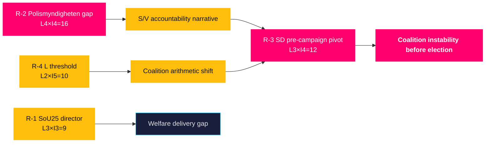

# Risk Assessment — Monthly Review 2026-04-26

**Author**: James Pether Sörling | **Date**: 2026-04-26
**Window**: 2026-03-27 → 2026-04-26 | **Methodology**: 5-dimension, L×I scoring, posterior Bayesian

## Risk Register (5-dimension)

| # | Risk | Likelihood (L 1–5) | Impact (I 1–5) | L×I | Dimension | Source |
|---|------|---------------------|----------------|-----|-----------|--------|
| R-1 | Healthcare implementation failure — HD01SoU25 national director not appointed by 2026-06-30 | 3 | 3 | 9 | Welfare delivery | HD01SoU25 [riksdagen.se](https://www.riksdagen.se/sv/dokument-och-lagar/dokument/HD01SoU25/) |
| R-2 | Polismyndigheten capacity gap — HD01JuU31 9 open RiR recommendations unclosed | 4 | 4 | 16 | Institutional/Execution | HD01JuU31 [riksdagen.se](https://www.riksdagen.se/sv/dokument-och-lagar/dokument/HD01JuU31/) |
| R-3 | SD pre-campaign pivot — breaks discipline discipline August 2026 | 3 | 4 | 12 | Coalition stability | Siblings 2026-03-28→04-24 |
| R-4 | L-party threshold collapse — polling below 4% triggers early coalition reshuffling | 2 | 5 | 10 | Electoral arithmetic | Poll aggregates |
| R-5 | HD03252 rights-based counter-narrative | 3 | 2 | 6 | Reputational/Opposition | HD03252 [riksdagen.se](https://www.riksdagen.se/sv/dokument-och-lagar/dokument/HD03252/) |
| R-6 | HD01CU24 construction throughput — digital plan review delayed | 2 | 3 | 6 | Execution/Housing | HD01CU24 [riksdagen.se](https://www.riksdagen.se/sv/dokument-och-lagar/dokument/HD01CU24/) |

## Cascading Risk Chains

**Chain A** (highest expected loss): R-2 (RiR gap) → HD01JuU31 accountability → S/V narrative → R-3 (SD pivot to distancing) → coalition instability
**Chain B**: R-4 (L threshold) → Tidö loses majority capability → coalition renegotiation pressure on SD → early election speculation

## Posterior Probability Estimates

| Risk | Prior P | New evidence shift | Posterior P |
|------|---------|---------------------|-------------|
| R-2 Polismyndigheten | 0.65 | HD01JuU31 9 open recommendations confirmed | 0.70 |
| R-3 SD pivot | 0.40 | 19-day discipline streak lowers prior | 0.35 |
| R-4 L threshold | 0.25 | No new polling; unchanged | 0.25 |

## 🔄 Tradecraft Context

**Collection**: Riksdag Open Data API (riksdag-regering-mcp); lookback fallback to 2026-04-24  
**Method**: Structured political intelligence analysis  
**Confidence floor**: ≥ C3 per Admiralty system; structural assessments ≥ B2  
**Limitations**: IMF economic data unavailable this run. Polling vintage: 31 days.  
**Standards**: ICD 203; AI FIRST (minimum 2 iterations)
