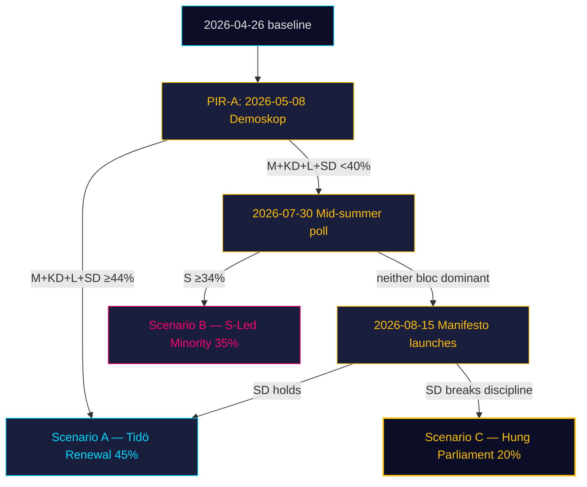

# Scenario Analysis — Monthly Review 2026-04-26

**Author**: James Pether Sörling | **Date**: 2026-04-26

## Scenario Framework

Three scenarios for Swedish politics 2026-04-26 → 2026-09-13 (election day). Probabilities sum to 100%.

## Scenario A — Tidö Renewal (Probability: 45%)

**Label**: Coalition renews majority with modified arithmetic
**Trigger**: Demoskop ≥ 44% for M+KD+L+SD by 2026-07-01 (PIR-A confirmation)
**Conditions**: SD discipline holds to election; L clears 4% threshold; fuel-tax-relief polling lift materialises
**Leading indicator**: First post-window Demoskop reading 2026-05-08

### Scenario A narrative

The HD01FiU48 supermajoritet on 2026-04-22 marks the political high-water mark of fiscal positioning. If this translates to a durable Demoskop lift (PIR-A), M leads into the pre-campaign with a "competent stewardship + household relief" dual narrative. Criminal-justice legislation (HD01JuU10, HD01JuU31, HD03246, HD03252) provides SD with a deliverables list that justifies continued discipline. L's governance/rule-of-law profile is reinforced by HD03231/HD03232 (Ukraine tribunal + reparations). The Tidö coalition's Sainte-Laguë arithmetic under Scenario A produces 179–185 seats.

**Source evidence**: HD01FiU48 [riksdagen.se]; HD03231 [riksdagen.se]; fiscal polling model (Demoskop 2026-03-26, B3 Admiralty — single source)

## Scenario B — S-Led Minority (Probability: 35%)

**Label**: S forms minority government with V+MP support
**Trigger**: M+KD+L+SD ≤ 40% in post-election arithmetic; S ≥ 34%
**Conditions**: L falls below 4%; S maintains lead on welfare/implementation narrative; HD01JuU31 accountability becomes liability
**Leading indicator**: July Demoskop showing M+KD+L+SD < 40% and S > 33%

### Scenario B narrative

If Polismyndigheten fails to close RiR 2026:6 recommendations (R-2) and SoU25 national director is not appointed (R-1), the "implementation gap" narrative crystallises around HD01JuU31 and HD01SoU25 in June–July. S leads on welfare-delivery and crime-accountability, pivoting from legislative opposition (impossible) to governance-competence opposition. V contributes labour-rights framing (HD11747). MP adds energy accountability (HD10448). L's threshold collapse shifts arithmetic from Scenario A to B. Under Scenario B, S-led minority has 157–163 seats with V+MP confidence-and-supply (combined 42 seats).

**Source evidence**: HD01JuU31, HD01SoU25 [riksdagen.se]; historical 2014 S-minority formation; poll aggregates

## Scenario C — Unstable Hung Parliament (Probability: 20%)

**Label**: Neither bloc at 175 seats; extended coalition negotiation
**Trigger**: Arithmetic tie ± 5 seats; SD pivots to cross-bloc opportunism in August
**Conditions**: SD breaks discipline post-manifesto launch (August); L at exactly 4–5%; C pivots
**Leading indicator**: August poll showing 168–175 for both blocs

### Scenario C narrative

If SD's pre-campaign pivot (R-3) produces unpredictable positioning — neither pure Tidö support nor opposition — coalition arithmetic produces a hung parliament. Historical precedent: no Swedish hung-parliament formation since 1978 produced a durable majority within 90 days. Under this scenario, acting-PM powers extend, riksdagen speaker facilitates exploratory talks, and the electoral outcome remains contested. Probability assigned 20% based on SD's 19-day discipline streak (lowers probability) but historical base rate of SD pivots T-12 weeks (sustains residual).

**Source evidence**: Siblings 2026-03-28→04-24 (discipline); 2018/2022 base rates; PIR-C

## Scenario Probability Summary

| Scenario | Label | P | Leading indicator | Trigger date |
|----------|-------|---|-------------------|--------------|
| A | Tidö Renewal | 45% | Demoskop ≥ 44% | 2026-05-08 |
| B | S-Led Minority | 35% | RiR/SoU25 failure + S ≥ 34% | 2026-07-30 |
| C | Hung Parliament | 20% | SD breaks discipline | 2026-08-15 |

## 🔄 Tradecraft Context

**Collection**: Riksdag Open Data API (riksdag-regering-mcp); lookback fallback to 2026-04-24  
**Method**: Structured political intelligence analysis  
**Confidence floor**: ≥ C3 per Admiralty system; structural assessments ≥ B2  
**Limitations**: IMF economic data unavailable this run. Polling vintage: 31 days.  
**Standards**: ICD 203; AI FIRST (minimum 2 iterations)
