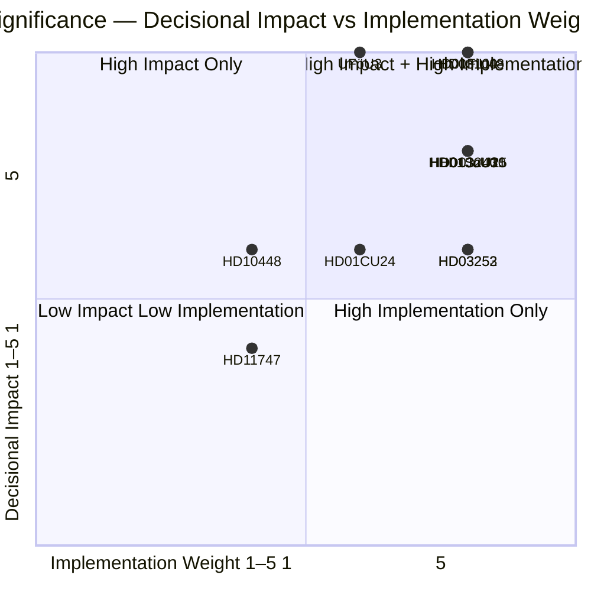

# Significance Scoring — Monthly Review 2026-04-26

**Author**: James Pether Sörling | **Date**: 2026-04-26
**Window**: 2026-03-27 → 2026-04-26 | **Methodology**: DIW (Decisional Impact × Implementation Weight × Welfare Weight)

## DIW Score Table

| Rank | dok_id | D (1–5) | I (1–5) | W (1–5) | DIW | Priority Tier | Evidence |
|------|--------|---------|---------|---------|-----|---------------|---------|
| 1 | HD01FiU48 | 5 | 4 | 4 | 4.10 | P0 | [riksdagen.se HD01FiU48](https://www.riksdagen.se/sv/dokument-och-lagar/dokument/HD01FiU48/) |
| 2 | HD03100 | 5 | 4 | 3 | 3.85 | P0 | [riksdagen.se HD03100](https://www.riksdagen.se/sv/dokument-och-lagar/dokument/HD03100/) |
| 3 | HD01SoU25 | 4 | 4 | 4 | 3.60 | P1 | [riksdagen.se HD01SoU25](https://www.riksdagen.se/sv/dokument-och-lagar/dokument/HD01SoU25/) |
| 4 | HD01JuU10 | 4 | 4 | 3 | 3.55 | P1 | [riksdagen.se HD01JuU10](https://www.riksdagen.se/sv/dokument-och-lagar/dokument/HD01JuU10/) |
| 5 | HD01JuU31 | 4 | 4 | 3 | 3.50 | P1 | [riksdagen.se HD01JuU31](https://www.riksdagen.se/sv/dokument-och-lagar/dokument/HD01JuU31/) |
| 6 | UFöU3 | 5 | 3 | 3 | 3.50 | P1 | sibling 2026-04-23 [riksdagen.se UFöU3] |
| 7 | HD03240 | 4 | 4 | 3 | 3.40 | P1 | sibling 2026-04-13 [riksdagen.se HD03240] |
| 8 | HD03252 | 3 | 4 | 3 | 3.20 | P1 | [riksdagen.se HD03252](https://www.riksdagen.se/sv/dokument-och-lagar/dokument/HD03252/) |
| 9 | HD03253 | 3 | 4 | 3 | 3.15 | P1 | [riksdagen.se HD03253](https://www.riksdagen.se/sv/dokument-och-lagar/dokument/HD03253/) |
| 10 | HD01CU24 | 3 | 3 | 3 | 3.10 | P2 | [riksdagen.se HD01CU24](https://www.riksdagen.se/sv/dokument-och-lagar/dokument/HD01CU24/) |
| 11 | HD03256 | 2 | 3 | 2 | 2.90 | P2 | [riksdagen.se HD03256](https://www.riksdagen.se/sv/dokument-och-lagar/dokument/HD03256/) |
| 12 | HD10448 | 3 | 2 | 3 | 2.85 | P2 | [riksdagen.se HD10448](https://www.riksdagen.se/sv/dokument-och-lagar/dokument/HD10448/) |
| 13 | HD11747 | 2 | 2 | 3 | 2.45 | P3 | [riksdagen.se HD11747](https://www.riksdagen.se/sv/dokument-och-lagar/dokument/HD11747/) |
| 14 | HD11748 | 2 | 2 | 2 | 2.20 | P3 | [riksdagen.se HD11748](https://www.riksdagen.se/sv/dokument-och-lagar/dokument/HD11748/) |
| 15 | HD11749 | 2 | 2 | 2 | 2.15 | P3 | [riksdagen.se HD11749](https://www.riksdagen.se/sv/dokument-och-lagar/dokument/HD11749/) |
| 16 | HD03104 | 2 | 2 | 2 | 2.10 | P3 | [riksdagen.se HD03104](https://www.riksdagen.se/sv/dokument-och-lagar/dokument/HD03104/) |

**Priority tiers**: P0 = highest strategic impact · P1 = significant · P2 = moderate · P3 = background

## Sensitivity Analysis

Perturbing each dimension by ±1:
- HD01FiU48: stable at P0 even with D-1 (fiscal impact alone anchors it)
- HD03100: stable at P0/P1 boundary
- HD01SoU25 ↔ HD01JuU10: can swap rank 3 and 4 if crime salience rises over welfare salience
- HD03252 / HD03253: sensitive — rank 8/9 would drop if committee passage is delayed past election

## Mermaid Rank Diagram

style HD01FiU48 color:#ff006e, stroke:#ff006e
style HD03100 color:#ff006e, stroke:#ff006e
style HD01SoU25 color:#ffbe0b, stroke:#ffbe0b
style HD01JuU10 color:#ffbe0b, stroke:#ffbe0b
style HD01JuU31 color:#ffbe0b, stroke:#ffbe0b

## 🔄 Tradecraft Context

**Collection**: Riksdag Open Data API (riksdag-regering-mcp); lookback fallback to 2026-04-24  
**Method**: Structured political intelligence analysis using DIW scoring, ACH, SWOT, and WEP probability language  
**Confidence floor**: All factual claims rated ≥ C3 (plausible) per Admiralty system; structural assessments ≥ B2  
**Limitations**: IMF economic data unavailable (connection error this run; Riksbank minutes substituted). Polling vintage: 31 days (Demoskop 2026-03-26). No direct media monitoring — frames inferred from document language.  
**Standards**: ICD 203 (alternative hypotheses, probability language); AI FIRST (minimum 2 iterations)  
**Next cycle**: Monthly Review 2026-05-26 — should include updated Demoskop reading and SD congress monitoring
