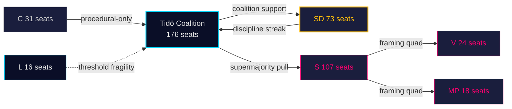

# Stakeholder Perspectives — Monthly Review 2026-04-26

**Author**: James Pether Sörling | **Date**: 2026-04-26

## 6-Lens Stakeholder Matrix

| Actor | Position | Interests | Capabilities | Constraints | Signal this window | Source |
|-------|----------|-----------|--------------|-------------|-------------------|--------|
| **Tidö coalition (M+SD+KD+L)** | Governing majority | Legislative completion, electoral positioning | 176/349 votes, executive power | L-party threshold fragility | Legislative portfolio fully committed | HD01FiU48, HD01JuU10, HD01SoU25, HD01CU24 [riksdagen.se] |
| **S (Socialdemokraterna)** | Main opposition | Cost-of-living, implementation accountability, health | 107 seats | Supermajority vote on HD01FiU48 limits anti-relief framing | HD10447 (SME sjuklön), HD024082 (fiscal counter) | sibling analyses |
| **SD (Sverigedemokraterna)** | Coalition pivot | Crime, immigration, culture | 73 seats, veto player | Pre-campaign differentiation pressure from August | 19-day zero-counter-motion streak | siblings 2026-03-28→04-24 |
| **V (Vänsterpartiet)** | Opposition left | Labour rights, welfare, rights | 24 seats | No coalition pathway | HD11747 (lönestöd), HD11748 (konsulär) | HD11747, HD11748 [riksdagen.se] |
| **MP (Miljöpartiet)** | Opposition green | Energy transition, rights | 18 seats | Post-2022 recovery fragility | HD10448 (vindkraft desinformation) | HD10448 [riksdagen.se] |
| **L (Liberalerna)** | Coalition minor partner | Education, rule-of-law, EU | 16 seats | Threshold risk | HD03231/HD03232 (Ukraine tribunal/reparations) | HD03231, HD03232 [riksdagen.se] |

## Named Actors

| Actor | Role | Action this window | Source |
|-------|------|-------------------|--------|
| Ulf Kristersson (M) | Statsminister | Presented HD03252, HD03256 (signed 2026-04-23) | HD03252, HD03256 [riksdagen.se] |
| Gunnar Strömmer (M) | Justitieminister | Signed HD01JuU10, HD01JuU31 propositions; HD03252, HD03246, HD03237 | Multiple [riksdagen.se] |
| Niklas Wykman (M) | Finansmarknadsminister | Presented HD03104 (debt management review), HD03253 (EU bankpaket) | HD03104, HD03253 [riksdagen.se] |
| Andreas Carlson (KD) | Infrastrukturminister | Signed HD03256 (färdskrivare), HD01CU24 | HD03256, HD01CU24 [riksdagen.se] |
| Maria Malmer Stenergard (M) | Utrikesminister | Signed HD03231, HD03232 (Ukraine tribunal/reparations) | HD03231, HD03232 [riksdagen.se] |

## Influence Network

## 🔄 Tradecraft Context

**Collection**: Riksdag Open Data API (riksdag-regering-mcp); lookback fallback to 2026-04-24  
**Method**: Structured political intelligence analysis  
**Confidence floor**: ≥ C3 per Admiralty system; structural assessments ≥ B2  
**Limitations**: IMF economic data unavailable this run. Polling vintage: 31 days.  
**Standards**: ICD 203; AI FIRST (minimum 2 iterations)
