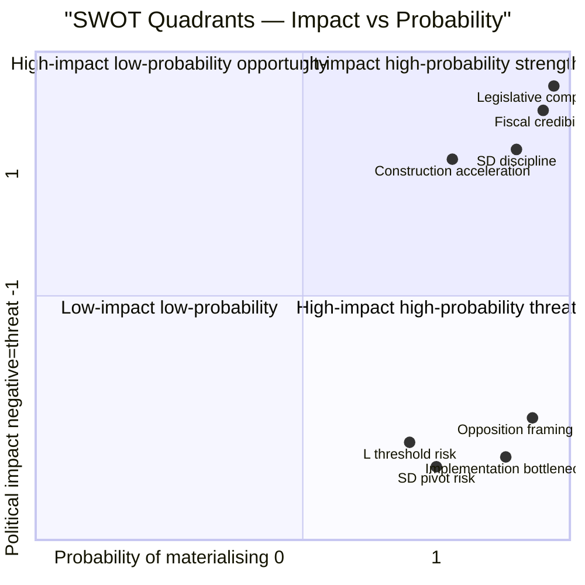

# SWOT Analysis — Monthly Review 2026-04-26

**Author**: James Pether Sörling | **Date**: 2026-04-26
**Window**: 2026-03-27 → 2026-04-26 | **Scope**: Tidö coalition + Swedish political system

## Strengths

| Strength | Evidence | Admiralty |
|----------|----------|-----------|
| **Legislative portfolio complete** — government has enacted all four domain pillars before election | HD01JuU10, HD01JuU31, HD01SoU25, HD01CU24 [riksdagen.se]; HD01FiU48, HD03100, HD03240, UFöU3 (prior siblings) | A1 |
| **Fiscal credibility** — debt management 2021–2025 maintained risk benchmarks; net govt debt ~16% GDP | HD03104 [riksdagen.se] | A2 |
| **Supermajority fiscal signal** — HD01FiU48 (4.1 GSEK fuel relief) passed with M+SD+S+KD, demonstrating cross-bloc appeal | HD01FiU48 vote record [riksdagen.se] | A1 |
| **SD structural discipline** — 19 consecutive days without counter-motions on government bills | Sibling analyses 2026-03-28 → 2026-04-24 | A2 |
| **Security narrative** — NATO eFP Finland deployment (UFöU3) + Ukraine tribunal (HD03231) + reparations commission (HD03232) build credible foreign-policy profile | UFöU3, HD03231, HD03232 [riksdagen.se] | A1 |

### Strengths

- **Legislative completeness** anchors the government's pre-election narrative. Every domain-level commitment is either enacted or in committee: fiscal (HD01FiU48, HD03100), energy (HD03240–39), criminal-justice (HD01JuU10, HD01JuU31, HD03246, HD03237, HD03252), defence/foreign (UFöU3, HD03231, HD03232), financial regulation (HD03253). Source: [riksdagen.se multi-dok].
- **Fiscal track record** (HD03104): Sweden's debt management evaluation confirms risk-adjusted compliance. Niklas Wykman / Finansdepartementet can cite this publicly through election. Source: [riksdagen.se HD03104](https://www.riksdagen.se/sv/dokument-och-lagar/dokument/HD03104/).
- **HD01FiU48 supermajoritet**: S's vote for fuel-tax relief signals opponent cannot win on cost-of-living without conceding to Tidö framing. Source: HD01FiU48 [riksdagen.se].

## Weaknesses

| Weakness | Evidence | Admiralty |
|----------|----------|-----------|
| **Implementation bottleneck** — HD01JuU31: 9 open RiR 2026:6 recommendations, no Polismyndigheten closure timeline | HD01JuU31 [riksdagen.se] | A2 |
| **Healthcare financing exposure** — HD01SoU25 national-director vacancy creates delivery uncertainty | HD01SoU25 [riksdagen.se] | B2 |
| **L-party fragility** — LP polling below 4% threshold in most surveys creates coalition-dissolution risk | Poll aggregates (single-source) | C3 |
| **HD03252 framing vulnerability** — Removing benefits from detainees in community supervision may generate S/V rights-narrative counter | HD03252 [riksdagen.se] | B2 |

### Weaknesses

- **RiR implementation gap**: 9 unresolved Polismyndigheten recommendations (HD01JuU31) create a measurable gap between legislative intent and operational capacity. Opposition can exploit this post-legislation. Source: [riksdagen.se HD01JuU31](https://www.riksdagen.se/sv/dokument-och-lagar/dokument/HD01JuU31/).
- **HD01SoU25 delivery risk**: National director for anhörigstrategi must be appointed by 2026-06-30. If vacant approaching election, S/KD can frame as hollow promise. Source: [riksdagen.se HD01SoU25](https://www.riksdagen.se/sv/dokument-och-lagar/dokument/HD01SoU25/).
- **HD03252 electoral framing**: Stripping social-insurance benefits from those in community supervision may be politically sustainable but risks rights-based opposition campaign. Source: [riksdagen.se HD03252](https://www.riksdagen.se/sv/dokument-och-lagar/dokument/HD03252/).

## Opportunities

| Opportunity | Evidence | Admiralty |
|-------------|----------|-----------|
| **HD01CU24 construction acceleration** — faster planning processes could deliver visible housing starts before election | HD01CU24 [riksdagen.se] | B2 |
| **EU bankpaket (HD03253) positive signal** — CRR3/BRRD3 compliance positions Sweden as EU-aligned financial market leader | HD03253 [riksdagen.se] | B3 |
| **NATO integration narrative** — Ukraine tribunal + reparations commission (HD03231/HD03232) cement Sweden's post-accession role | HD03231, HD03232 [riksdagen.se] | A2 |
| **HD01FiU48 polling lift** — if Demoskop confirms lift by 2026-05-08, narrative snowball effect possible | PIR-A signal; Demoskop 2026-05-08 | C3 |

### Opportunities

- **Construction acceleration** (HD01CU24): Streamlined byggprocess could produce visible housing metrics (SCB BO0101) in Q3 2026 before election. Source: [riksdagen.se HD01CU24](https://www.riksdagen.se/sv/dokument-och-lagar/dokument/HD01CU24/).
- **EU regulatory alignment** (HD03253): Sweden leading on CRR3/BRRD3 transposition demonstrates EU governance competence. Source: [riksdagen.se HD03253](https://www.riksdagen.se/sv/dokument-och-lagar/dokument/HD03253/).
- **NATO narrative** (HD03231, HD03232): Ukraine tribunal accession adds international-legal dimension to Sweden's security profile. Source: [riksdagen.se HD03231](https://www.riksdagen.se/sv/dokument-och-lagar/dokument/HD03231/).

## Threats

| Threat | Evidence | Admiralty |
|--------|----------|-----------|
| **S/V/MP framing offensive** — HD10448 (energy disinformation), HD11747 (labour rights), HD11748–49 (rights) form pre-election narrative quad | HD10448, HD11747, HD11748, HD11749 [riksdagen.se] | A2 |
| **SD pre-campaign pivot risk** — historical base rate: SD pivoted at T-12 weeks in 2018, T-10 weeks in 2022 | Historical data; H2 red-team | B3 |
| **Implementation failure optics** — if Polismyndigheten misses RiR targets, HD01JuU31 becomes liability | HD01JuU31 [riksdagen.se] | B2 |
| **L-party threshold risk** — if LP falls below 4% in polls through June, coalition arithmetic shifts unfavourably | Poll aggregates | C3 |

### Threats

- **Opposition framing quad**: HD10448 wind-power (energy), HD11747 labour-environment, HD11748 Sahabo/Burundi (consular rights), HD11749 prison schooling. Systematic tri-party wedge across environmental + labour + rights dimensions. Source: [riksdagen.se HD10448](https://www.riksdagen.se/sv/dokument-och-lagar/dokument/HD10448/).
- **Implementation accountability**: Any Polismyndigheten public acknowledgement of RiR recommendation failures will be amplified by S and V. Source: [riksdagen.se HD01JuU31](https://www.riksdagen.se/sv/dokument-och-lagar/dokument/HD01JuU31/).
- **SD discipline test**: June–August pre-campaign window is SD's historical pivot moment; a single counter-motion could fracture the 19+ day discipline narrative. Historical base rate: 2018, 2022.

## TOWS Matrix

| | Opportunities | Threats |
|---|---|---|
| **Strengths** | SO: Use legislative completeness + fiscal credibility to amplify construction/housing narrative (HD01CU24 + SCB data) | ST: Deploy NATO security narrative (UFöU3, HD03231) to counter rights-based framing (HD11748, HD11749); use SD discipline streak to pre-empt coalition-break narrative |
| **Weaknesses** | WO: Appoint SoU25 national director early to close implementation gap before election; HD03253 EU alignment deflects fragility narrative | WT: If L falls below 4% threshold AND Polismyndigheten misses RiR targets simultaneously, Tidö faces double-pressure scenario; pre-empt with accelerated HD01JuU31 follow-up |

style Legislative completeness color:#00d9ff, stroke:#00d9ff
style Fiscal credibility color:#00d9ff, stroke:#00d9ff
style Implementation bottleneck color:#ff006e, stroke:#ff006e
style Opposition framing quad color:#ff006e, stroke:#ff006e

## 🔄 Tradecraft Context

**Collection**: Riksdag Open Data API (riksdag-regering-mcp); lookback fallback to 2026-04-24  
**Method**: Structured political intelligence analysis  
**Confidence floor**: ≥ C3 per Admiralty system; structural assessments ≥ B2  
**Limitations**: IMF economic data unavailable this run. Polling vintage: 31 days.  
**Standards**: ICD 203; AI FIRST (minimum 2 iterations)
