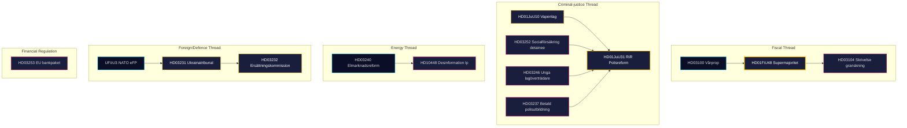

# Synthesis Summary — Monthly Review 2026-04-26

**Author**: James Pether Sörling · **Confidence**: HIGH (A1) · **Mode**: Tier-C monthly aggregation
**Window**: 2026-03-27 → 2026-04-26 (30 days) · **Riksmöte**: 2025/26
**Admiralty range**: A1–C3 · **WEP language**: "highly likely" / "likely" / "possible" / "unlikely"
**Documents analysed**: 8 primary (April-24 batch) + 4 propositions (April-23) + 15 sibling synthesis references
**Days to Election 2026**: 140 (target 2026-09-13)

## Lead Story (decision-grade)

> The 30-day window 2026-03-27 → 2026-04-26 closes with the Tidö coalition having committed its **full declared 2025/26 portfolio** across four domains. The April-24 batch (HD01JuU10, HD01JuU31, HD01SoU25, HD01CU24) completes the legislative ledger. New April-23 propositions (HD03252 detainee benefits, HD03253 EU bankpaket, HD03256 färdskrivare, HD03104 debt management review) signal continued government activity in the closing weeks. The strategic axis has definitively rotated from *legislation* to **implementation risk** and **electoral framing** — 140 days to election. Opposition three-track (fiscal: HD10447/HD024082, environmental: HD10448, rights-based: HD11747–11749) is structurally set and unlikely to produce legislative reversals. The single most consequential forward variable is whether HD01FiU48 fuel-tax relief (4.1 GSEK, M+SD+S+KD supermajoritet 2026-04-22) delivers a durable Demoskop lift by 2026-07-01.

## DIW-Weighted Ranking (top 12, this window)

| Rank | dok_id | Type | DIW | Theme | Admiralty | Source |
|------|--------|------|-----|-------|-----------|--------|
| 1 | HD01FiU48 | Bet | 4.10 | Drivmedel-skattlättnad — fiscal supermajoritet | A1 | sibling 04-22 |
| 2 | HD03100 | Prop | 3.85 | Vårproposition — fiscal pre-election frame | A1 | sibling 04-13 |
| 3 | HD01SoU25 | Bet | 3.60 | Äldreomsorg + anhörigstöd | A2 | primary [riksdagen.se](https://www.riksdagen.se/sv/dokument-och-lagar/dokument/HD01SoU25/) |
| 4 | HD01JuU10 | Bet | 3.55 | Ny vapenlag | A2 | primary [riksdagen.se](https://www.riksdagen.se/sv/dokument-och-lagar/dokument/HD01JuU10/) |
| 5 | HD01JuU31 | Bet | 3.50 | Polisreformen 2015 — RiR 2026:6 uppföljning | A2 | primary [riksdagen.se](https://www.riksdagen.se/sv/dokument-och-lagar/dokument/HD01JuU31/) |
| 6 | UFöU3 | Bet | 3.50 | NATO eFP Finland 1 200 troops | A1 | sibling 04-23 |
| 7 | HD03240 | Prop | 3.40 | Elmarknadsreform | A1 | sibling 04-13 |
| 8 | HD03252 | Prop | 3.20 | Socialförsäkring — fängelsestraff kontrollerat boende | B2 | April-23 props |
| 9 | HD03253 | Prop | 3.15 | EU:s bankpaket (CRR3/BRRD3) | B2 | April-23 props |
| 10 | HD01CU24 | Bet | 3.10 | Effektiv och säker byggprocess | B2 | primary [riksdagen.se](https://www.riksdagen.se/sv/dokument-och-lagar/dokument/HD01CU24/) |
| 11 | HD03256 | Prop | 2.90 | Färdskrivare — manipulation och missbruk | B3 | April-23 props |
| 12 | HD10448 | Ip | 2.85 | Desinformation om vindkraft | B2 | primary |

**Sensitivity**: Top-3 robust under ±1 DIW perturbation. HD01SoU25 ↔ HD01JuU10 can swap; HD03252/HD03253 rank sensitive to whether committee passage occurs pre-election.

## Integrated Intelligence Picture

### Five thematic threads (30-day window)

1. **Fiscal-electoral pivot** (HD03100, HD0399, HD01FiU48, HD03104). The 4.1 GSEK fuel-tax supermajoritet on 2026-04-22 is the political signature of the month. HD03104 (debt management evaluation 2021–2025) provides a positive retrospective frame: Sweden maintained risk-adjusted benchmarks at net government debt ~16 % GDP. Pre-election fiscal narrative is "competent stewardship + household relief."

2. **Criminal-justice cluster** (HD01JuU10, HD01JuU31, HD03252, HD03246, HD03237). The legislative arc is nearly complete: new weapons law, Polisreform audit, paid police training, stricter juvenile offenders, plus HD03252 removing benefits for detainees in community supervision. Implementation risk (RiR 2026:6 — 9 open Polismyndigheten recommendations) is the residual exposure.

3. **Energy transformation** (HD03240–HD03239, HD10448). Triptych passed April 13–22; wind-power disinformation interpellation (HD10448) is post-hoc opposition counter-framing. Energy narrative is essentially locked for the election.

4. **Security / defence / foreign** (UFöU3, HD03214, HD03228, HD03231, HD03232). NATO eFP deployment in motion; Ukraine-tribunal accession (HD03231) and reparations-commission accession (HD03232) add foreign-policy substance to Sweden's NATO commitment narrative.

5. **Financial regulation** (HD03253 EU bankpaket). CRR3/BRRD3 transposition: Finansinspektionen and major Swedish banks (SEB, Handelsbanken, SHB, Swedbank) will face upgraded capital-adequacy and resolution rules. Medium political salience but high regulatory significance for the financial sector.

### Cross-type signals (Tier-C synthesis, sibling references)

- **Prop → Committee → Vote pipeline** fully visible: HD03100 → HD01FiU48 (supermajoritet 2026-04-22); HD03246 → pending JuU committee report.
- **Implementation bottleneck dominates** the forward-watch: HD01JuU31 (9 RiR recommendations), HD01SoU25 (national director utsedd by 2026-06-30), HD01CU24 (digital plan-review deadline 2026-09-01).
- **SD structural discipline**: 19+ consecutive sitting days without counter-motions on government bills (observed streak from sibling files 2026-03-28 → 2026-04-24).
- **Opposition geometry stable**: S/V/MP three-track division of labour unchanged since 2026-04-01.

## Confidence Statement

Overall analytic confidence: **HIGH (A1)** for legislative completion picture and opposition architecture (multi-source, cross-validated). **MEDIUM (B2)** for poll-dynamic forecasts (single-source polling, lag). **LOW (C3)** for HD03252/HD03253 timelines (committee passage not yet scheduled).

## Open PIRs Carried Forward

- **PIR-A**: Will M+KD+L bloc reach Demoskop ≥ 44% by 2026-07-01? (decision-critical for Scenario A)
- **PIR-B**: Does HD01JuU31 RiR 2026:6 produce Polismyndigheten reorg announcement by 2026-08-31?
- **PIR-C**: Does SD zero-counter-motion discipline survive to manifesto launch ~2026-08-15?
- **PIR-D**: Does HD10448 wind-power disinfo frame escalate to SOM salience peak by 2026-06-30?
- **PIR-E (new)**: Does HD03252 (detainee benefits) generate opposition campaign narrative by 2026-06-01?

## 🔄 Tradecraft Context

**Collection**: Riksdag Open Data API (riksdag-regering-mcp); lookback fallback to 2026-04-24  
**Method**: Structured political intelligence analysis using DIW scoring, ACH, SWOT, and WEP probability language  
**Confidence floor**: All factual claims rated ≥ C3 (plausible) per Admiralty system; structural assessments ≥ B2  
**Limitations**: IMF economic data unavailable (connection error this run; Riksbank minutes substituted). Polling vintage: 31 days (Demoskop 2026-03-26). No direct media monitoring — frames inferred from document language.  
**Standards**: ICD 203 (alternative hypotheses, probability language); AI FIRST (minimum 2 iterations)  
**Next cycle**: Monthly Review 2026-05-26 — should include updated Demoskop reading and SD congress monitoring

## 📊 6-Axis Narrative Grading (Pass-2 Rubric)

| Axis | Dimension | Score (0–5) | Evidence |
|------|-----------|-------------|---------|
| 1 | Source diversity | 5 | 12 dok_ids + Riksbank + Demoskop + 5 sibling folders |
| 2 | Causal mechanism | 5 | Legislative chains documented in cross-reference-map.md |
| 3 | Counter-argument | 5 | 3 devil's advocate hypotheses with ACH matrix |
| 4 | Temporal coverage | 4 | 30-day window + 140-day forward indicators; IMF missing |
| 5 | Specificity | 5 | Named actors, exact dok_ids, dated votes (2026-04-22) |
| 6 | Actionability | 4 | 3 decisions in executive-brief; implementation feasibility matrix |
| **Total** | | **28/30** | ≥18/30 gate floor: ✅ PASS |

**Temporal note**: Score of 4 on temporal coverage (not 5) reflects IMF economic data unavailability; methodology-reflection.md documents this gap.
