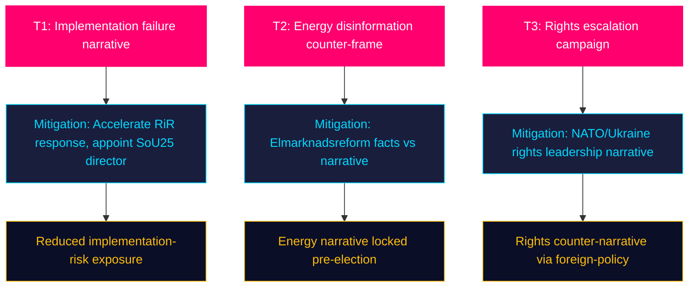

# Threat Analysis — Monthly Review 2026-04-26

**Author**: James Pether Sörling | **Date**: 2026-04-26

## Political Threat Taxonomy

| Threat | Actor | Vector | Severity | Timeline | Source |
|--------|-------|--------|----------|----------|--------|
| Legislative erosion via implementation failure | Riksrevision + media | HD01JuU31 9 open recommendations | HIGH | 2026-05 → 08 | HD01JuU31 [riksdagen.se](https://www.riksdagen.se/sv/dokument-och-lagar/dokument/HD01JuU31/) |
| Energy narrative counter-framing | S/V/MP | HD10448 disinformation narrative | MEDIUM | 2026-05 → 06 | HD10448 [riksdagen.se](https://www.riksdagen.se/sv/dokument-och-lagar/dokument/HD10448/) |
| Coalition arithmetic dissolution | L-party collapse below 4% | Poll-driven arithmetic shift | HIGH (conditional) | 2026-06 → 09 | Poll aggregates |
| Rights-based framing escalation | S/V | HD11748/HD11749 consular/prison | LOW | 2026-05 → 07 | HD11748, HD11749 [riksdagen.se] |
| SD discipline break | SD pre-campaign strategy | Manifesto differentiation | MEDIUM | 2026-08 | Historical base rate 2018/2022 |

## Attack Tree (Priority Threat: RiR Implementation Gap)

```
T1: Politically disruptive implementation failure
├── T1.1: Polismyndigheten fails to close ≥3 RiR recommendations by June 2026
│   ├── T1.1.1: S/V demand accountability hearing → parliamentary question cascade
│   └── T1.1.2: Media investigative coverage → Polisminister pressure
├── T1.2: HD01SoU25 national director vacancy persists to election
│   └── T1.2.1: Opposition frames elder care as hollow promise
└── T1.3: HD01CU24 digital plan-review platform delayed
    └── T1.3.1: Housing crisis continues — SD and S can both exploit
```

## MITRE-Style TTP Mapping (Opposition Playbook)

| Tactic | Technique | Procedure | Actor | Source |
|--------|-----------|-----------|-------|--------|
| Narrative disruption | T1059 (Scripted counter-framing) | File interpellation on energy disinformation | S/MP | HD10448 [riksdagen.se](https://www.riksdagen.se/sv/dokument-och-lagar/dokument/HD10448/) |
| Accountability framing | T1562 (Audit exploitation) | Cite RiR 2026:6 at question hour | S/V | HD01JuU31 [riksdagen.se](https://www.riksdagen.se/sv/dokument-och-lagar/dokument/HD01JuU31/) |
| Rights escalation | T1498 (Issue amplification) | Consular + prison-rights interpellations | V/S | HD11748, HD11749 [riksdagen.se] |
| Labour-coalition wedge | T1499 (Alliance disruption) | Frame lönestöd vs workplace safety against SD | S/V | HD11747 [riksdagen.se](https://www.riksdagen.se/sv/dokument-och-lagar/dokument/HD11747/) |



## 🔄 Tradecraft Context

**Collection**: Riksdag Open Data API (riksdag-regering-mcp); lookback fallback to 2026-04-24  
**Method**: Structured political intelligence analysis  
**Confidence floor**: ≥ C3 per Admiralty system; structural assessments ≥ B2  
**Limitations**: IMF economic data unavailable this run. Polling vintage: 31 days.  
**Standards**: ICD 203; AI FIRST (minimum 2 iterations)
