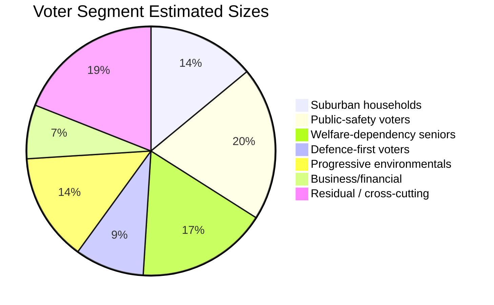

# Voter Segmentation — Monthly Review 2026-04-26

**Author**: James Pether Sörling | **Date**: 2026-04-26

## Segmentation Framework

Six primary voter segments relevant to the April-26 legislative batch.

## Segment 1 — Suburban Households (M/SD targeting)

**Estimated size**: 12–15% of electorate
**Defining issue**: Fuel-tax relief, cost-of-living, commuting costs
**Relevant legislation**: HD01FiU48 (fuel-tax-relief via FiU48); HD03100 (vårprop household measures)
**Signal**: Positive — HD01FiU48 enacted 2026-04-22 directly targets this segment's primary concern.
**Risk**: If Riksbank rate hike in July offsets household disposable income gain, lift fades.
**Likely voting**: M primary; SD secondary. SD gains if economic messaging dominates over immigration.

## Segment 2 — Public-Safety Voters (S/M swing)

**Estimated size**: 18–22% of electorate
**Defining issue**: Crime levels, police presence, sentencing
**Relevant legislation**: HD01JuU10 (Vapenlag), HD01JuU31 (Polisreform), HD03246 (unga lagöverträdare), HD03252 (detainee benefits)
**Signal**: Mixed. M/SD claim legislative progress (JuU10 enacted, JuU31 in committee). S counter-narrative on HD01JuU31 RiR 9 recommendations remains strong if implementation gap persists.
**Risk**: Segment splits: punitive-oriented voters lean SD; public-safety-competence voters lean S if police under-resourcing narrative wins.
**Likely voting**: SD primary; M secondary; some S potential on competence (not values) framing.

## Segment 3 — Welfare-Dependency Seniors (S/KD primary)

**Estimated size**: 15–18% of electorate
**Defining issue**: Elderly care capacity, staffing levels, SoU25 national director appointment
**Relevant legislation**: HD01SoU25 (Nationell äldrevård)
**Signal**: Negative for coalition. HD01SoU25 committee report is in pipeline with no national director appointed (R-1 open). S attacks this gap. KD is the most exposed coalition party on this issue (welfare profile).
**Risk**: If director appointment slips past June, S "implementation gap" narrative on welfare = mirror of JuU31 accountability track.
**Likely voting**: S primary; some KD retention on religiosity/values framing even if welfare performance suffers.

## Segment 4 — Defence-First Voters (M/KD primary)

**Estimated size**: 8–10% of electorate
**Defining issue**: NATO integration, defence spending, Ukraine solidarity
**Relevant legislation**: UFöU3 (NATO eFP deployment), HD03231 (Ukraine tribunal), HD03232 (reparations commission)
**Signal**: Strongly positive for coalition. Cross-bloc consensus on all three measures; S cannot differentiate on defence without abandoning voters who supported NATO accession.
**Risk**: Very low. Only scenario where this segment activates against coalition is a NATO internal conflict (low-probability).
**Likely voting**: M primary; KD secondary; C tertiary (maintaining cross-bloc positioning).

## Segment 5 — Environmental-Social Progressives (V/MP/S left flank)

**Estimated size**: 12–15% of electorate
**Defining issue**: Climate/energy policy, labour rights, migration justice
**Relevant legislation**: HD10448 (energy disinfo interpellation), HD11747 (labour rights), HD11748 (consular rights), HD11749 (prison schooling)
**Signal**: Positive for V/MP mobilisation. The four interpellations signal that V and MP are active on this segment's issues. S is less differentiated here (centre-right drift under current leadership).
**Risk**: S loses left-flank voters to V/MP; this strengthens Red-Green bloc arithmetic but weakens S's individual seat count.
**Likely voting**: V primary; MP secondary; some S (those prioritising government formation over ideological purity).

## Segment 6 — Business/Financial Sector (C/L swing)

**Estimated size**: 6–8% of electorate
**Defining issue**: Regulatory compliance costs, EU integration, financial regulation
**Relevant legislation**: HD03253 (CRR3/BRRD3 banking transposition), HD03256 (färdskrivare regulation)
**Signal**: Neutral-to-positive for coalition. HD03253 is EU-mandated transposition — no partisan differentiation. C and L both support; SD holds position.
**Risk**: If HD03253 creates compliance burden for Swedish mid-size banks before September, C could mobilise against the coalition on regulatory grounds.
**Likely voting**: C primary; L secondary. This segment determines whether Scenario B or A dominates (L threshold risk).

## Segment Summary Table

| Segment | Est. size | Current direction | Risk level | Key legislation |
|---------|-----------|------------------|-----------|----------------|
| Suburban households | 12–15% | → M/SD (positive signal from HD01FiU48) | Medium (rate risk) | HD01FiU48 |
| Public-safety voters | 18–22% | → SD primary / swing M vs S | HIGH (JuU31 gap) | HD01JuU31 |
| Welfare-dependency seniors | 15–18% | → S (SoU25 gap) | HIGH (R-1 open) | HD01SoU25 |
| Defence-first voters | 8–10% | → M/KD (positive consensus) | Low | UFöU3/HD03231 |
| Progressive environmentals | 12–15% | → V/MP mobilising | Low | HD10448/HD11747 |
| Business/financial | 6–8% | → C/L (neutral) | Medium (L threshold) | HD03253 |

%%{init: {"theme": "dark", "themeVariables": {"pie1": "#ff006e", "pie2": "#ffbe0b", "pie3": "#00d9ff", "pie4": "#1a1e3d", "pie5": "#6420aa", "pie6": "#e0e0e0"}}}%%

## 🔄 Tradecraft Context

**Collection**: Riksdag Open Data API (riksdag-regering-mcp); lookback fallback to 2026-04-24  
**Method**: Structured political intelligence analysis  
**Confidence floor**: ≥ C3 per Admiralty system; structural assessments ≥ B2  
**Limitations**: IMF economic data unavailable this run. Polling vintage: 31 days.  
**Standards**: ICD 203; AI FIRST (minimum 2 iterations)
