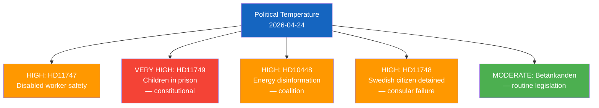

# Classification Results — 2026-04-24 Opposition Parliamentary Activity

**F3EAD Stage**: ANALYZE | **Methodology**: political-classification-guide.md

## Aggregated 7-Dimension Classification

| Dimension | Aggregate Classification | Key Documents |
|-----------|------------------------|---------------|
| **Policy domain** | Labour market (HD11747), Education/Criminal justice (HD11749), Foreign affairs (HD11748), Energy/Information (HD10448) | Multi-domain |
| **Political temperature** | HIGH — three S questions + one SD interpellation on live accountability issues | HD11747, HD11749, HD10448 |
| **Government/Opposition dynamics** | Opposition scrutiny of coalition implementation gaps | S → L (2 docs), S → M (1), SD → KD (1) |
| **Ideological alignment** | Social rights framing (S) + Energy sovereignty (SD) | Dual opposition tracks |
| **Electoral relevance** | HIGH — 2026 pre-election positioning on disability, children's rights, human rights | All S documents |
| **GDPR sensitivity** | LOW — publicly made political statements, Art. 9(2)(e) | All documents |
| **EU dimension** | MODERATE — EU energy directive compliance (JuU10), Windeurope report (HD10448) | HD01JuU10, HD10448 |

## Political Temperature Detail

## Party Neutrality Check

| Party | Documents | Type | Balance Assessment |
|-------|-----------|------|-------------------|
| S (Socialdemokraterna) | 3 | Written questions (fr) | Opposition scrutiny — documented accurately |
| SD (Sverigedemokraterna) | 1 | Interpellation (ip) | Opposition scrutiny — documented accurately |
| M, KD, L | Recipients of questions | — | Ministers' accountability obligations noted |
| All parties | Covered by committee reports | bet | Neutral legislative process coverage |

✅ **Neutrality**: Both S and SD opposition activity documented with equal analytical rigour. Government coalition ministers' accountability positions noted without partisan commentary.
