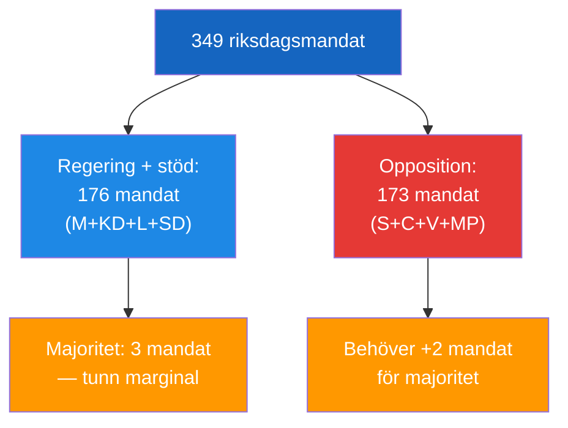

# Coalition Mathematics — 2026-04-24 Context

**F3EAD Stage**: ANALYZE (extended) | **Methodology**: coalition-mathematics.md template, Morphological

## Current Seat Map

| Party | Seats | % | Bloc |
|-------|-------|---|------|
| SD | 73 | 20.9% | Tidö support |
| S | 107 | 30.7% | Opposition |
| M | 68 | 19.5% | Government |
| C | 24 | 6.9% | Opposition |
| V | 24 | 6.9% | Opposition |
| KD | 19 | 5.4% | Government |
| MP | 18 | 5.2% | Opposition |
| L | 16 | 4.6% | Government |

**Government majority threshold**: 175

## Pivotal Votes (2026-04-24 context)

None of today's documents directly trigger confidence votes. However:
- **HD11749** (children's rights) could trigger KU scrutiny if constitutional violation confirmed — requires KU majority (7 parties have seats, opposition has majority on KU)
- **HD10448** (SD energy) is parliamentary not coalition-level — no formal majority implications

## Tidöavtal Stability Assessment

| Factor | Status |
|--------|--------|
| Formal majority (176 vs 173) | STABLE |
| SD-KD energy tension | LOW-MEDIUM signal |
| L social rights credibility | ERODING (HD11747, HD11749) |
| Coalition budget agreement | INTACT |

**Assessment**: Coalition remains stable. Today's documents reveal narrative stress, not structural crisis.

