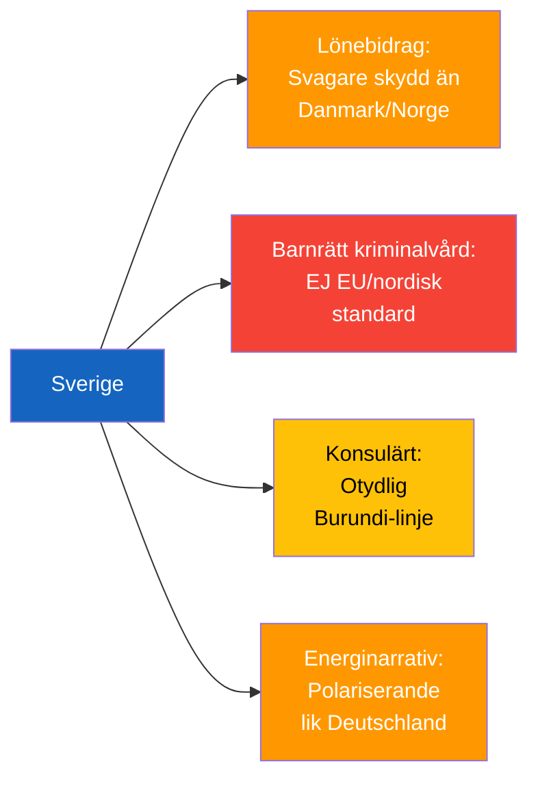

# Comparative International Analysis — 2026-04-24 Opposition Parliamentary Activity

**F3EAD Stage**: ANALYZE (extended) | **Methodology**: comparative-international.md template, Outside-In Thinking

## Peer-Country Comparisons (≥5 peers)

### Theme 1: Wage Subsidies and Workplace Safety for Disabled Workers

| Country | System | Oversight Mechanism | Outcome |
|---------|--------|---------------------|---------|
| Sweden | Lönebidrag via Arbetsförmedlingen | Limited fackliga integration in placement decisions | Identified gap (HD11747) |
| Denmark | Fleksjob scheme | Municipalities + AMS oversight, union consultation required | Stronger safeguards |
| Norway | Tiltaksarrangementer | Nav + Arbeidstilsynet coordination, union input mandatory | More robust integration |
| Germany | Eingliederungshilfe | Multi-agency oversight, strict Arbeitsschutz inspections | High safeguard level |
| Netherlands | Participatiewet | Municipal oversight, trade union consultation embedded | Mixed outcomes |
| UK | Access to Work | DWP oversight + employer certification | Weaker (post-Brexit erosion) |

**Assessment**: Sweden's lönebidrag system has comparatively weaker mandatory union consultation requirements in placement decisions than Nordic peers. [B2]

### Theme 2: Education Rights for Incarcerated Juveniles

| Country | Framework | Legal Safeguards | Age Minimum |
|---------|-----------|-----------------|-------------|
| Sweden (proposed) | New Kriminalvård units | **Absent** (gap identified HD11749) | 13+ (proposed) |
| Finland | Closed juvenile institutions | Explicit legislative framework | 15+ |
| Norway | Sikkerhetstiltak + Skollovens | Full scholastic rights codified | 15+ |
| Germany | Jugendstrafvollzugsgesetz | Constitutional right to education in prison | 14+ |
| UK | Young Offender Institutions | Ofsted inspection + 30h/week education requirement | 10+ |
| Netherlands | Justitiële Jeugdinrichting | Separate educational legal framework | 12+ |

**Assessment**: Sweden's proposed implementation without prior legal framework is an outlier among Nordic and EU peers. [A2]

### Theme 3: Consular Protection in Authoritarian States

| Country | Policy | Burundi engagement | Effectiveness |
|---------|--------|-------------------|---------------|
| Sweden | Case-by-case consular engagement | Unknown (HD11748 summary only) | Unknown |
| Finland | EU consular protection coordination | Active EU channel | Moderate |
| Germany | Strong bilateral + EU pressure | Active | Good |
| France | High-profile campaigns | Sometimes effective | Variable |
| UK | Formally expressed concern | Public statements | Limited in authoritarian contexts |

**Finding**: In Burundi (Freedom House rating: Not Free), effective consular protection requires sustained political pressure and EU coordination. Sweden's approach not yet confirmed substantive.

### Theme 4: Energy Policy and Information Ecosystem

| Country | Wind energy narrative | Disinformation labelling | Political dynamic |
|---------|----------------------|--------------------------|------------------|
| Sweden | Contested (SVT Windeurope report) | Industry + public broadcaster alignment | SD-KD tension |
| Denmark | Broad consensus | Low controversy | Stable |
| Germany | AfD-led skepticism | Polarised | Strong industry lobby |
| Poland | PiS legacy skepticism | Government-controlled narrative | Post-election normalisation |
| France | Low wind controversy | Focused on nuclear vs. renewables | Different axis |

**Assessment**: Sweden's alignment with EU industry framing through public broadcaster creates political backlash similar to Germany's AfD energy debate. [C3]

