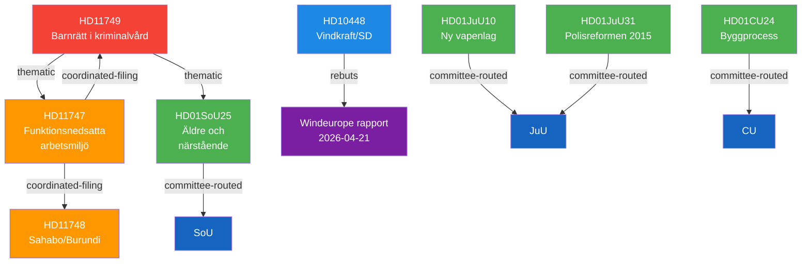

# Cross-Reference Map — 2026-04-24 Opposition Parliamentary Activity

**F3EAD Stage**: ANALYZE | **Methodology**: structural-metadata-methodology.md §Relationship taxonomy
**Edge types used**: amends, thematic, coordinated-filing, committee-routed, rebuts

## Policy Cluster Map

## Coordinated Filing Pattern (S opposition cluster)

HD11747 + HD11748 + HD11749 all filed by S MPs on the same date (2026-04-24). This is consistent with a **coordinated parliamentary filing strategy**: simultaneous multi-front questions maximise pressure on multiple ministers and media bandwidth.

| Edge | From | To | Type | Basis |
|------|----|---|------|-------|
| Coordinated | HD11747 | HD11748 | coordinated-filing | Same party, same date, different ministers |
| Coordinated | HD11747 | HD11749 | coordinated-filing | Same party, same date, different ministers |
| Thematic | HD11749 | HD01SoU25 | thematic | Both concern vulnerable population welfare + care rights |
| Thematic | HD11749 | HD11747 | thematic | Both target vulnerable groups + government implementation failure |
| Rebuttal | HD10448 | Windeurope 2026-04-21 | rebuts | Fransson directly challenges Windeurope report |
| Committee | HD01JuU10 | HD01JuU31 | committee-routed | Both JuU betänkanden on same day |
| Amends | HD01JuU10 | Prop. vapenlag | amends | Committee approves government proposition |

## Legislative Chain: New Firearms Law

`Prop. (vapenlag) → JuU10 → Riksdag vote (approves) → Ny vapenlag in force`

## Opposition Accountability Chain

`IF Metall larnar → HD11747 (Haraldsson) → Britz svar 2026-05-06 → [escalation] → Interpellation?`
`IMR oroar sig → HD11749 (Wallentheim) → Mohamsson svar 2026-05-06 → [escalation] → KU?`
`Windeurope rapport → SVT/SR rapporterar → HD10448 (Fransson) → Busch svar 2026-05-08`
