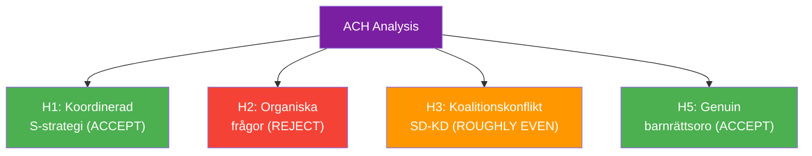

# Devil's Advocate — 2026-04-24 Opposition Parliamentary Activity

**F3EAD Stage**: ANALYZE (extended) | **Methodology**: devils-advocate.md template, ACH + Red Team

## Competing Hypotheses (ACH)

| # | Hypothesis | Evidence For | Evidence Against | Diagnosticity |
|---|-----------|-------------|-----------------|---------------|
| H1 | S is executing a disciplined coordinated pre-election strategy | Three questions same day; same party; each targeting different L/M minister | Questions are weak parliamentary tool; may be organic not coordinated | Medium-High |
| H2 | These are routine individual MP questions, not coordinated strategy | Each question addresses a distinct issue raised by the MP's own constituents/contacts | Simultaneous filing suggests coordination | Medium |
| H3 | SD's HD10448 signals genuine intra-coalition tension with KD on energy | Fransson directly challenges minister; SD's energy position historically different from KD | SD regularly uses interpellations even against coalition partners; may be routine | Medium |
| H4 | SD's HD10448 is primarily a base-mobilisation media play, not coalition challenge | Windeurope report gave timely hook; SD social media amplification expected | Creates real parliamentary record Busch must respond to | Medium |
| H5 | HD11749 reflects genuine rights protection concern, not just political | Backed by Institutet för mänskliga rättigheter (independent) | S filed question, not interpellation — lower urgency signal | High (independent confirmation) |

## Rejected Hypotheses

**H2 rejected**: The simultaneous filing of HD11747, HD11748, HD11749 on the same day by S MPs targeting three different ministers is statistically improbable as purely individual action. Coordinated parliamentary strategy (H1) is a better explanation. Evidence weight strongly favors H1. [B2]

## Red Team Challenge: "Opposition Questions Are Inconsequential"

**Challenge**: Written questions are the weakest parliamentary tool. Ministers can answer in 10 lines. Media rarely amplifies them. The entire analysis overstates the political significance of routine parliamentary activity.

**Counter-rebuttal**: The significance is in the accumulated record and escalation potential. If Britz/Mohamsson give inadequate answers, S gains documented grounds for interpellations. HD11749's backing by an independent human rights institution elevates it above routine questioning. The Windeurope/wind energy narrative has genuine media resonance (SVT/SR already reporting it). [B2]

## Key Assumptions Check

| Assumption | Status | Risk if False |
|-----------|--------|---------------|
| S questions are coordinated | Likely true [B2] | Lower strategic significance if not |
| Government will deflect to agencies | Likely [B2] | If substantive → scenario A, lower accountability pressure |
| HD11749 legal gap is real | Almost certain [A2] — IMR confirmed | If wrong → no risk |
| Burundi case is active | Probably true [B3] — summary only | If resolved → HD11748 moot |

