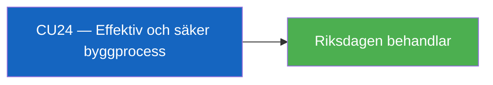

# Per-Document Analysis: HD01CU24

**F3EAD Stage**: FINISH

## Document Identity

| Field | Value |
|-------|-------|
| dok_id | HD01CU24 |
| Title | Effektiv och säker byggprocess |
| Doctype | bet (Betänkande 2025/26:CU24) |
| Committee | CU (Civilutskottet) |
| Date | 2026-04-24 |
| Data Depth | METADATA-ONLY |
| Depth Tier | L1 (Surface) |
| Admiralty Code | [A3] — Reliable source, possibly true |

## Summary

Committee report on effective and safe building processes. CU24 treats proposals related to streamlining Swedish building permit and construction oversight procedures, balancing deregulation with safety requirements.

**Confidence**: Likely [B3] on content — metadata only available.
