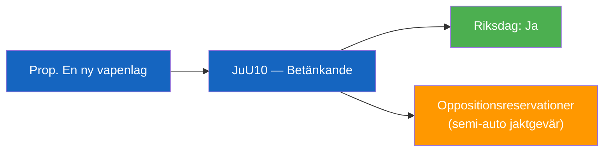

# Per-Document Analysis: HD01JuU10

**F3EAD Stage**: FINISH (per-document tactical analysis)

## Document Identity

| Field | Value |
|-------|-------|
| dok_id | HD01JuU10 |
| Title | En ny vapenlag |
| Doctype | bet (Betänkande 2025/26:JuU10) |
| Committee | JuU (Justitieutskottet) |
| Date | 2026-04-24 |
| Riksmöte | 2025/26 |
| Status | Debatt om förslag |
| Data Depth | SUMMARY |
| Depth Tier | L2 (Strategic — firearms legislation, EU compliance, security) |
| Admiralty Code | [A2] — Completely reliable (committee report), probably true |

## 1. Classification

| Dimension | Classification | Evidence |
|-----------|---------------|----------|
| Policy area | Juridik / Säkerhet / Vapenpolitik | HD01JuU10 summary |
| Political temperature | Moderate — consensus around new framework, some controversy on semi-auto rifle ban | HD01JuU10 |
| Government/Opposition | Government bill approved by JuU | HD01JuU10 |
| Electoral relevance | Moderate — hunting/sport shooting community affected; public security framing | — |
| EU dimension | High — implements EU directives on firearms | HD01JuU10 summary |

## 2. Key Changes

- Ban on certain semi-automatic rifles for hunting
- Clarified firearms ownership requirements
- Flexible storage rules introduced
- Simplified EU rules for sport shooters/hunters entering Sweden
- Five-year permits for automatic weapons and multi-shot handguns abolished → replaced with supervision procedure
- Enhanced oversight and registration

## 3. Opposition Motions (Reservations)

*Per summary: JuU recommends Riksdagen approve the government's proposal. Reservations expected from parties opposing semi-auto ban.*

**Confidence**: Almost certain [A2] that the committee approved the proposition. Likely [B2] that opposition parties filed reservations on the semi-auto hunting rifle ban.
