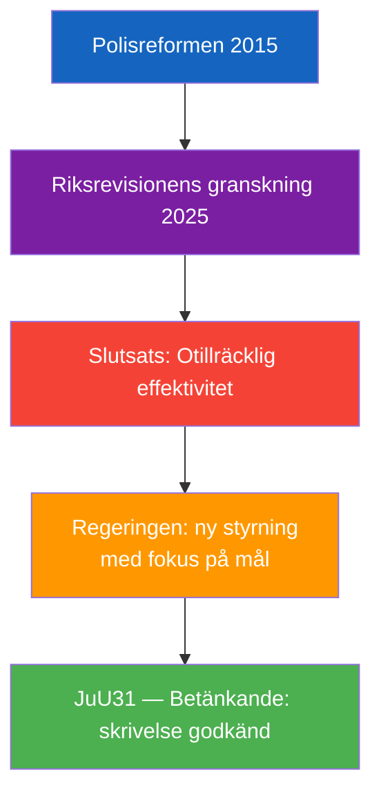

# Per-Document Analysis: HD01JuU31

**F3EAD Stage**: FINISH (per-document tactical analysis)

## Document Identity

| Field | Value |
|-------|-------|
| dok_id | HD01JuU31 |
| Title | Riksrevisionens rapport om Polisreformen 2015 |
| Doctype | bet (Betänkande 2025/26:JuU31) |
| Committee | JuU (Justitieutskottet) |
| Date | 2026-04-24 |
| Riksmöte | 2025/26 |
| Status | Debatt om förslag |
| Data Depth | SUMMARY |
| Depth Tier | L2 (Strategic — police efficiency, reform accountability) |
| Admiralty Code | [A1] — Completely reliable (Riksrevisionens audit), confirmed |

## 1. Classification

| Dimension | Classification | Evidence |
|-----------|---------------|----------|
| Policy area | Juridik / Polismyndigheten / Offentlig förvaltning | HD01JuU31 summary |
| Political temperature | Moderate-High — Riksrevisionen's critical verdict politically significant | HD01JuU31 |
| Government/Opposition | Government skrivelse + committee response | HD01JuU31 |
| Electoral relevance | High — police reform outcomes affect public safety narrative for 2026 | — |

## 2. Riksrevisionens Finding

Riksrevisionen's overarching conclusion: Polismyndigheten has NOT worked sufficiently efficiently to achieve the intentions of the 2015 reform. JuU notes positively that the government has begun work with greater focus on management of Polismyndigheten.

**Confidence**: Almost certain [A1] — Riksrevisionen is Sweden's supreme audit institution.
