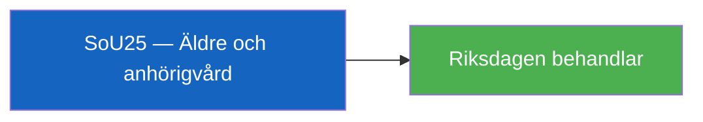

# Per-Document Analysis: HD01SoU25

**F3EAD Stage**: FINISH

## Document Identity

| Field | Value |
|-------|-------|
| dok_id | HD01SoU25 |
| Title | Stärkta insatser för äldre och för de som vårdar eller stöder närstående |
| Doctype | bet (Betänkande 2025/26:SoU25) |
| Committee | SoU (Socialutskottet) |
| Date | 2026-04-24 |
| Data Depth | METADATA-ONLY |
| Depth Tier | L1 (Surface) |
| Admiralty Code | [A3] — Reliable, possibly true |

## Summary

Committee report on strengthened measures for elderly people and informal caregivers. SoU25 covers proposals to improve support systems for both elderly citizens and those who informally care for or support family members.

**Confidence**: Likely [B3] on content — metadata only available.
