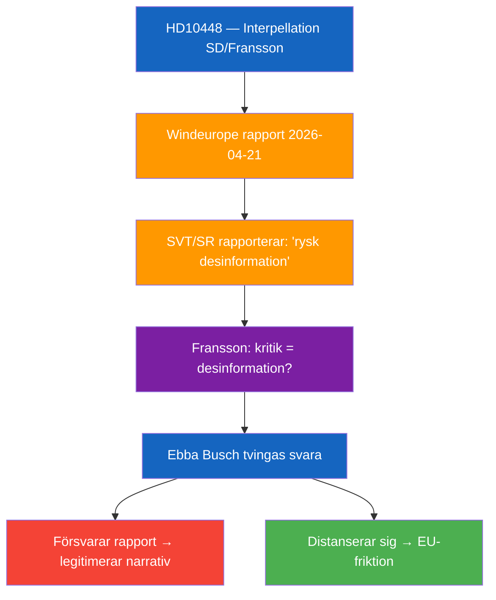

# Per-Document Analysis: HD10448

**F3EAD Stage**: FINISH (per-document tactical analysis)

## Document Identity

| Field | Value |
|-------|-------|
| dok_id | HD10448 |
| Title | Desinformation om vindkraft |
| Doctype | ip (Interpellation 2025/26:448) |
| Committee | — (Energi- och näringsdepartementet) |
| Submitter | Josef Fransson (SD) |
| Recipient | Energi- och näringsminister Ebba Busch (KD) |
| Date | 2026-04-24 |
| Riksmöte | 2025/26 |
| Status | Skickad; Anmäld 2026-04-27; Sista svarsdatum 2026-05-08 |
| Data Depth | FULL-TEXT |
| Depth Tier | L2+ (Priority — contested energy-policy framing, coalition tension signal) |
| Admiralty Code | [B2] — Reliable source (elected MP, official submission), probably true |

## 1. Classification

*Classification per political-classification-guide.md §7-Dimension Classification*

| Dimension | Classification | Evidence |
|-----------|---------------|----------|
| Policy area | Energy / Information environment | Wind energy + disinformation narrative |
| Political temperature | High — challenges framing used by SVT/SR and EU industry body | Touches on media trust, Russian influence narrative |
| Government/Opposition | Opposition (SD as stödparti) scrutiny of coalition energy policy | SD MP → KD minister |
| Ideological alignment | Centre-right populist / energy sovereignty framing | HD10448 text |
| Electoral relevance | Moderate-High: energy costs are a 2026 election wedge issue | Coalition stress if Busch responds defensively |
| GDPR sensitivity | Low — public political speech | Art. 9(2)(e) applies |
| EU dimension | Moderate — references Windeurope (EU industry) report | HD10448 text |

## 2. SWOT Analysis

| Quadrant | Finding | Admiralty | Evidence |
|----------|---------|-----------|----------|
| **Strength** | Fransson effectively weaponises a credible EU industry report to create a reductio ad absurdum of the "disinformation" label | [B2] | HD10448 full text |
| **Strength** | Question forces minister Busch to either defend SR/Windeurope framing or acknowledge legitimate wind energy criticism | [B2] | HD10448 text |
| **Weakness** | Fransson's framing conflates all wind skepticism with Russian disinformation without engaging the Windeurope methodology | [B3] | HD10448 text — no counter-evidence cited |
| **Weakness** | SD's own energy positions have been criticised as obstructionist without alternative supply plans | [C3] | Public record |
| **Opportunity** | Opens parliamentary record on media-industry-government nexus in energy reporting | [B2] | HD10448 |
| **Opportunity** | If Busch distances herself from Windeurope report, creates policy daylight between KD and EU energy agenda | [B3] | Analytical inference |
| **Threat** | If minister endorses SVT/Windeurope framing, SD could use this to fuel distrust in public broadcaster | [B2] | HD10448 rhetorical structure |
| **Threat** | Destabilises Tidöavtalet energy consensus if KD responds in ways uncomfortable to SD | [C3] | Coalition arithmetic |

## 3. Risk Assessment

*5×5 Likelihood × Impact matrix per political-risk-methodology.md*

| Risk | L | I | Score | Mitigation |
|------|---|---|-------|------------|
| Coalition friction (SD-KD) on energy framing | 3 | 3 | 9 | Busch can respond diplomatically without endorsing Windeurope fully |
| Escalation into media-trust debate before 2026 election | 3 | 4 | 12 | Government communication strategy |
| S exploits SD-KD tension | 2 | 3 | 6 | Low — S has own energy platform |

## 4. Stakeholder Impact

| Stakeholder | Impact | Valence |
|-------------|--------|---------|
| SD (Fransson) | Platform win — parliamentary record of wind-skeptic stance | Positive for SD |
| KD / Ebba Busch | Forced to navigate EU energy narrative vs domestic coalition | Negative pressure |
| Sveriges Radio | Implicitly challenged on editorial framing | Reputational |
| Swedish energy consumers | Indirect — policy debate affects future energy mix | Neutral (depends on response) |

## 5. Forward Indicators

| Trigger | Horizon | Significance |
|---------|---------|-------------|
| Busch's written response (due 2026-05-08) | 72h–2 weeks | If defensive → confirms framing; if nuanced → coalition stability signal |
| Interpellationsdebatt scheduled 2026-04-27 | 72h | Parliamentary record of government position |
| SD raises energy disinformation in 2026 election campaign | Month–election | Voter-segmentation targeting |

## 6. Narrative

**Lede**: SD riksdagsledamot Josef Fransson utmanar den rådande narrativen om rysk desinformation kring vindkraft i en interpellation till energiminister Ebba Busch (KD), genom att använda branschorganisationen Windeuropes rapport mot dem själva.

**Body**: Franssons interpellation är noggrant konstruerad — han citerar Windeuropes rapport om att fyra kategorier av "falska narrativ" (dolda intressen, miljöförstörelse, teknisk oduglighet, ekonomiskt misslyckande) driver desinformation, och argumenterar sedan att dessa "falska narrativ" faktiskt är legitima frågor som han och andra kritiker av vindkraft ställt i decennier. Interpellationen skapar en klassisk parlamentarisk snara: om Busch försvarar Windeuropes rapport försvarar hon implicit att kritik av vindkraft är rysk desinformation — en position som undergräver fri politisk debatt och kan fjärma SD-väljare. Om hon distanserar sig från rapporten skapar hon daylight mot EU:s energiagenda.

**Counter-narrative**: SD:s vindkraftskepticism är inte värdeneutral — partiet har konsekvent motarbetat förnybar energiutbyggnad och förespråkat mer kärnkraft och fossila bränslen. Franssons retorik kan vara legitim debatt, men den saknar konstruktiva alternativförslag för den energiomställning Sverige faktiskt behöver.

**Confidence**: Likely [B2] that Windeurope report exists and was reported by SVT/SR. Likely [B2] that Fransson's framing creates genuine parliamentary tension. Roughly even [C3] that response will cause significant coalition friction.
