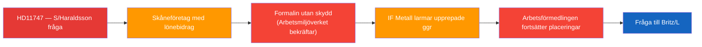

# Per-Document Analysis: HD11747

**F3EAD Stage**: FINISH (per-document tactical analysis)

## Document Identity

| Field | Value |
|-------|-------|
| dok_id | HD11747 |
| Title | Lönestöd till företag trots varningar om farlig arbetsmiljö |
| Doctype | fr (Skriftlig fråga 2025/26:747) |
| Committee | — (Arbetsmarknadsdepartementet) |
| Submitter | Johanna Haraldsson (S) |
| Recipient | Arbetsmarknadsminister Johan Britz (L) |
| Date | 2026-04-24 |
| Riksmöte | 2025/26 |
| Status | Skickad; Svarsdatum 2026-05-06 |
| Data Depth | FULL-TEXT |
| Depth Tier | L2+ (Priority — vulnerable workers, agency accountability, workplace safety) |
| Admiralty Code | [B2] — Reliable source (MP + union source IF Metall), probably true |

## 1. Classification

| Dimension | Classification | Evidence |
|-----------|---------------|----------|
| Policy area | Arbetsmarknad / Arbetsmiljö / Socialförsäkring | HD11747 text |
| Political temperature | High — concerns disabled workers + wage subsidies abuse | HD11747 |
| Government/Opposition | S scrutiny of Britz/L + Arbetsförmedlingen | HD11747 |
| Ideological alignment | Labour rights / disability rights framing | HD11747 text |
| Electoral relevance | High — disability welfare + worker safety are S core issues | S 2026 platform |
| GDPR sensitivity | Low — collective issue, no individual named | Art. 9(2)(e) |
| EU dimension | Low | — |

## 2. SWOT Analysis

| Quadrant | Finding | Admiralty | Evidence |
|----------|---------|-----------|----------|
| **Strength** | Multi-source corroboration: IF Metall + Arbetsmiljöverket + tidningen Arbetet | [B1] | HD11747 text |
| **Strength** | Specific, verifiable: company in Skåne, chemical hazards (formalin), Arbetsmiljöverket inspection findings | [B2] | HD11747 text |
| **Weakness** | Question lacks specific company name — limits parliamentary accountability | [B2] | HD11747 text |
| **Weakness** | S frames this as systemic issue but evidence is one case | [B3] | Single Skåne case |
| **Opportunity** | Forces Britz to defend Arbetsförmedlingen's oversight protocols for lönebidrag placements | [B2] | HD11747 |
| **Opportunity** | Positions S as champion of disabled workers' rights ahead of 2026 election | [B2] | Electoral context |
| **Threat** | Government can deflect to Arbetsförmedlingen as independent authority | [B2] | Governmental standard reply |
| **Threat** | If Britz responds with investigation promise → issue drops; if defensive → S gains traction | [B3] | Analytical |

## 3. Risk Assessment

| Risk | L | I | Score | Mitigation |
|------|---|---|-------|------------|
| Continued wage subsidy placements to unsafe workplaces | 2 | 4 | 8 | Arbetsförmedlingen audit required |
| Reputational damage to L/liberal welfare reform narrative | 3 | 3 | 9 | Britz response tone critical |
| IF Metall escalation / media amplification | 3 | 3 | 9 | Already reported in Arbetet; potential SVT follow-up |

## 4. Stakeholder Impact

| Stakeholder | Impact | Valence |
|-------------|--------|---------|
| Disabled workers with lönebidrag | Direct harm exposure | Negative — safety risk |
| IF Metall | Vindication of union alarm role | Positive |
| Arbetsförmedlingen | Accountability pressure | Negative — oversight failure |
| Minister Britz (L) | Forced to defend agency oversight | Negative pressure |
| S (Haraldsson) | Labour rights credentials strengthened | Positive |

## 5. Forward Indicators

| Trigger | Horizon | Significance |
|---------|---------|-------------|
| Britz written answer (due 2026-05-06) | 1–2 weeks | Sets accountability benchmark |
| Arbetsförmedlingen investigation announced | Week | Signals government responsiveness |
| Further media reports on similar cases | Week–month | Indicates systemic pattern |
| S interpellation follow-up if answer insufficient | Month | Escalation path |

## 6. Narrative

**Lede**: Socialdemokraternas Johanna Haraldsson kräver besked från arbetsmarknadsminister Johan Britz om hur Arbetsförmedlingen kan fortsätta placera lönebidragsanställda på arbetsplatser där fackförbundet upprepade gånger varnat för livsfarliga kemikalier.

**Body**: Frågan pekar på en konkret systemförsummelse: ett företag i Skåne tog emot personer med funktionsnedsättning via Arbetsförmedlingens lönebidrag, men IF Metall hade larmat om att arbetarna utsattes för formalin utan skyddsutrustning. Arbetsmiljöverket bekräftade bristerna vid inspektion — ändå fortsatte placeringarna. Den implicita anklagelsen är att Arbetsförmedlingen inte inkluderar fackliga varningar i sina riskbedömningar för placeringsbeslut.

**Counter-narrative**: Arbetsförmedlingens lönebidragssystem är utformat för att ge funktionsnedsatta tillgång till arbetsmarknaden. Enstaka missförhållanden hos enskilda arbetsgivare bör inte bli ett argument mot hela systemet. Minister Britz kan peka på att Arbetsmiljöverket har befogenhet och ansvar att agera mot arbetsgivare som bryter mot miljöregler.

**Confidence**: Almost certain [A1] that the Skåne case exists given multi-source corroboration (Arbetet, IF Metall, Arbetsmiljöverket). Likely [B2] that Arbetsförmedlingen oversight protocols failed.
