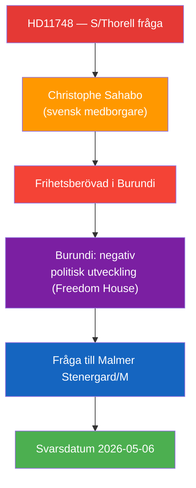

# Per-Document Analysis: HD11748

**F3EAD Stage**: FINISH (per-document tactical analysis)

## Document Identity

| Field | Value |
|-------|-------|
| dok_id | HD11748 |
| Title | Den frihetsberövade svenske medborgaren Christophe Sahabo i Burundi |
| Doctype | fr (Skriftlig fråga 2025/26:748) |
| Committee | — (Utrikesdepartementet) |
| Submitter | Olle Thorell (S) |
| Recipient | Utrikesminister Maria Malmer Stenergard (M) |
| Date | 2026-04-24 |
| Riksmöte | 2025/26 |
| Status | Skickad; Svarsdatum 2026-05-06 |
| Data Depth | SUMMARY |
| Depth Tier | L2 (Strategic — consular protection, human rights, authoritarian context) |
| Admiralty Code | [B2] — Reliable source (MP + Freedom House/international assessment), probably true |

## 1. Classification

| Dimension | Classification | Evidence |
|-----------|---------------|----------|
| Policy area | Utrikespolitik / Konsulärt skydd / Mänskliga rättigheter | HD11748 text |
| Political temperature | High — Swedish citizen detained in deteriorating authoritarian state | HD11748 summary |
| Government/Opposition | S scrutiny of MFA/Malmer Stenergard on consular protection | HD11748 |
| Ideological alignment | Human rights / rule of law / consular duty of care | HD11748 |
| Electoral relevance | Moderate — individual case but signals government's human rights credibility | — |
| GDPR sensitivity | Low — publicly named individual (Art. 9(2)(e)) | HD11748 |
| EU dimension | Moderate — Burundi EU relations, Freedom House assessment | Summary |

## 2. SWOT Analysis

| Quadrant | Finding | Admiralty | Evidence |
|----------|---------|-----------|----------|
| **Strength** | Question supported by international expert assessments (Freedom House) on Burundi's authoritarian trajectory | [A2] | HD11748 summary cites international observers |
| **Strength** | Individual case humanises abstract foreign policy, maximising parliamentary attention | [B2] | HD11748 |
| **Weakness** | Summary-level data prevents detailed analysis of detention circumstances | [B3] | Data depth limitation |
| **Weakness** | Government's options in Burundi are structurally limited (diplomatic access depends on Burundi cooperation) | [B2] | Diplomatic reality |
| **Opportunity** | Keeps Swedish government on record regarding consular obligations | [B2] | HD11748 |
| **Opportunity** | If government responds substantively, signals MFA's human rights resolve | [B3] | Analytical |
| **Threat** | Burundi's deteriorating political environment limits effective diplomatic pressure | [A2] | Freedom House, international observers (HD11748 summary) |
| **Threat** | If Sahabo case unresolved → S can escalate to interpellation or urgent debate | [B2] | Parliamentary procedure |

## 3. Risk Assessment

| Risk | L | I | Score | Mitigation |
|------|---|---|-------|------------|
| Prolonged detention without Swedish consular access | 3 | 4 | 12 | Active MFA engagement with Burundian authorities required |
| Burundi-Sweden bilateral deterioration | 2 | 2 | 4 | Limited bilateral footprint |
| S escalation to interpellation | 3 | 2 | 6 | Dependent on government response adequacy |

## 4. Stakeholder Impact

| Stakeholder | Impact | Valence |
|-------------|--------|---------|
| Christophe Sahabo (Swedish citizen) | Direct — detention in authoritarian state | Critical negative |
| Family and Swedish-Burundian community | Humanitarian concern | Negative |
| MFA / Malmer Stenergard | Accountability pressure on consular duty | Moderate pressure |
| S (Thorell) | Human rights credibility | Positive |

## 5. Forward Indicators

| Trigger | Horizon | Significance |
|---------|---------|-------------|
| Malmer Stenergard's written answer (2026-05-06) | 2 weeks | Level of government engagement visible |
| Burundian government response to Swedish démarche | Week–month | Actual diplomatic leverage assessment |
| S follow-up interpellation | Month | Escalation if answer inadequate |

**Confidence**: Almost certain [A2] that case exists (MP submission based on verified individual). Likely [B2] that Burundi's deteriorating conditions complicate Swedish options.
