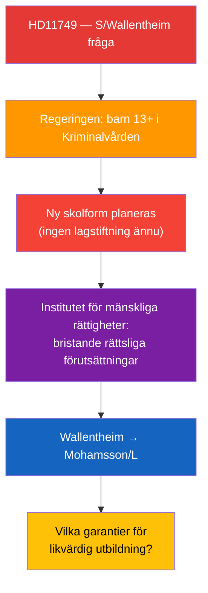

# Per-Document Analysis: HD11749

**F3EAD Stage**: FINISH (per-document tactical analysis)

## Document Identity

| Field | Value |
|-------|-------|
| dok_id | HD11749 |
| Title | Rätten till likvärdig utbildning för barn i kriminalvård |
| Doctype | fr (Skriftlig fråga 2025/26:749) |
| Committee | — (Utbildningsdepartementet) |
| Submitter | Anna Wallentheim (S) |
| Recipient | Utbildnings- och integrationsminister Simona Mohamsson (L) |
| Date | 2026-04-24 |
| Riksmöte | 2025/26 |
| Status | Skickad; Svarsdatum 2026-05-06 |
| Data Depth | FULL-TEXT |
| Depth Tier | L2+ (Priority — children's rights, constitutional adequacy, juvenile justice reform) |
| Admiralty Code | [B1] — Reliable source (MP + Institutet för mänskliga rättigheter assessment), confirmed |

## 1. Classification

| Dimension | Classification | Evidence |
|-----------|---------------|----------|
| Policy area | Utbildning / Kriminalvård / Barnrätt | HD11749 text |
| Political temperature | Very High — children aged 13 in prisons, constitutional rights risk | HD11749 |
| Government/Opposition | S challenges L/Mohamsson on implementation sequencing | HD11749 |
| Ideological alignment | Child rights / rule of law / constitutional adequacy | HD11749 |
| Electoral relevance | High — juvenile justice and education rights attract broad voter concern | — |
| GDPR sensitivity | Low — collective children's rights, no individual named | Art. 9(2)(g) |
| EU dimension | Moderate — EU Charter of Fundamental Rights, CRC standards | International context |

## 2. SWOT Analysis

| Quadrant | Finding | Admiralty | Evidence |
|----------|---------|-----------|----------|
| **Strength** | Backed by independent expert body (Institutet för mänskliga rättigheter) raising implementation concerns | [A2] | HD11749 text |
| **Strength** | Specific legal gap identified: new educational form for incarcerated children lacks legislative framework | [A2] | HD11749 text |
| **Weakness** | Question framed as procedural (sequencing) rather than opposing the policy itself — limits political differentiation | [B2] | HD11749 framing |
| **Weakness** | S supported some elements of juvenile justice reform in 2022 | [B3] | Parliamentary record |
| **Opportunity** | Forces government to confirm implementation timeline for constitutional safeguards | [B2] | HD11749 |
| **Opportunity** | Positions S alongside civil society on children's constitutional rights ahead of 2026 | [B2] | Electoral context |
| **Threat** | Government can argue legislation is forthcoming — deflects accountability | [B2] | Standard response |
| **Threat** | If incarcerated children placed before legal framework exists → real constitutional violation | [B2] | HD11749 logic |

## 3. Risk Assessment

| Risk | L | I | Score | Mitigation |
|------|---|---|-------|------------|
| Children placed in prisons without legal educational framework | 3 | 5 | 15 | Immediate legislation required |
| Constitutional challenge to new prison education form | 3 | 4 | 12 | Legal review pre-implementation |
| S/MP/V coordinated push for delay or inquiry | 3 | 3 | 9 | Opposition bloc alignment |

## 4. Stakeholder Impact

| Stakeholder | Impact | Valence |
|-------------|--------|---------|
| Children aged 13+ in Kriminalvårdens new units | Direct — educational rights at risk | Critical |
| Institutet för mänskliga rättigheter | Institutional concern validated | Positive — reinforces role |
| Minister Mohamsson (L) | Legislative gap accountability | Negative pressure |
| Kriminalvården | Implementation timeline pressure | Operational challenge |
| S / Wallentheim | Human rights champion positioning | Positive |

## 5. Forward Indicators

| Trigger | Horizon | Significance |
|---------|---------|-------------|
| Mohamsson's written answer (2026-05-06) | 2 weeks | Legal framework timeline committed or deferred |
| Legislation submitted to Riksdagen | Month | Actual safeguard implementation |
| First child placed without framework | Week–month | Constitutional crisis signal |
| Institutet för mänskliga rättigheter follow-up | Month | Independent monitoring |

## 6. Narrative

**Lede**: Socialdemokraternas Anna Wallentheim pressar utbildningsminister Simona Mohamsson (L) på vilka konkreta garantier som finns för att 13-åriga barn i de planerade Kriminalvårdsanstalterna faktiskt får likvärdig utbildning — trots att den nödvändiga lagstiftningen ännu saknas.

**Body**: Frågan blottlägger en implementeringssekvensering som Institutet för mänskliga rättigheter redan flaggat: regeringen driver igenom en ny skolform för frihetsberövade barn, men rättslig reglering av just den skolformen är ännu inte på plats. Wallentheim understryker att rätten till utbildning inte upphör vid frihetsberövande — barnkonventionen och EU-stadgan kräver likvärdig utbildning. Den underliggande politiska frågan är: planerar regeringen att sätta barn bakom lås och bom innan skyddslagen är i kraft?

**Counter-narrative**: Regeringen kan hävda att temporära arrangemang är möjliga under implementeringsfasen och att Kriminalvårdens befintliga utbildningsuppdrag täcker grunderna. Men denna argumentation riskerar att normalisera ett rättsligt vakuum för en av samhällets mest utsatta grupper.

**Confidence**: Almost certain [A1] that legal framework gap exists (confirmed by Institutet för mänskliga rättigheter). Almost certain [A2] that government must respond with implementation timeline.
