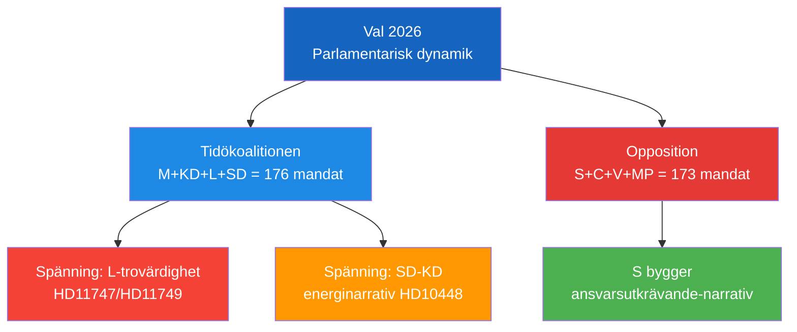

# Election 2026 Analysis — 2026-04-24 Opposition Parliamentary Activity

**F3EAD Stage**: ANALYZE (extended) | **Methodology**: election-2026-analysis.md template

## Current Seat Map (Riksdagen 2022)

| Party | Seats | Role | Bloc |
|-------|-------|------|------|
| S (Socialdemokraterna) | 107 | Main opposition | Opposition |
| M (Moderaterna) | 68 | Government | Governing bloc |
| SD (Sverigedemokraterna) | 73 | Support party | Tidöavtal |
| C (Centerpartiet) | 24 | Opposition | Opposition |
| V (Vänsterpartiet) | 24 | Opposition | Opposition |
| KD (Kristdemokraterna) | 19 | Government | Governing bloc |
| L (Liberalerna) | 16 | Government | Governing bloc |
| MP (Miljöpartiet) | 18 | Opposition | Opposition |
| **Total** | **349** | | |

**Government majority**: M(68)+KD(19)+L(16)+SD(73) = 176 vs opposition 107+24+24+18 = 173 (+ 3 independents/other)

## Impact of 2026-04-24 Opposition Activity on 2026 Projections

### HD11749 Impact (Constitutional rights for children)
- **Voter segment**: Parents, teachers, civil society, human rights advocates
- **Electoral implication**: If S successfully establishes that government implemented unconstitutional juvenile prison education → moderate negative for L/M
- **Seat delta**: ±1–2 seats for L depending on response quality

### HD11747 Impact (Disabled worker safety)
- **Voter segment**: Disability rights voters, union members, S core constituency
- **Electoral implication**: Reinforces S narrative that government has weakened labour protections; IF Metall credibility amplifies
- **Seat delta**: Consolidates S base, minimal swing impact

### HD10448 Impact (Wind energy disinformation)
- **Voter segment**: Energy skeptic voters (rural, SD base)
- **Electoral implication**: SD demonstrates independence within coalition; maintains energy sovereignty narrative
- **Seat delta**: SD retains rural energy skeptic votes (~2–3 seats worth of consolidation)

## Coalition Viability Assessment

**Tidöavtal coalition (post-2026 scenarios)**:
- SD-KD energy tension (HD10448) signals potential post-election renegotiation of energy policy
- L's social rights credibility erosion (HD11747, HD11749) could affect L vote share → risks slipping below 4% threshold (currently polling ~5-6%)

**Opposition bloc (S+C+V+MP)**:
- Needs 175 seats minimum for majority government
- Current polling suggests roughly even race; S parliamentary activism building narrative for 2026 campaign

**Confidence**: Roughly even [C3] on election outcome projections — too early (2026 election 16+ months away). Key indicator: L vote share in summer 2026 polls.
